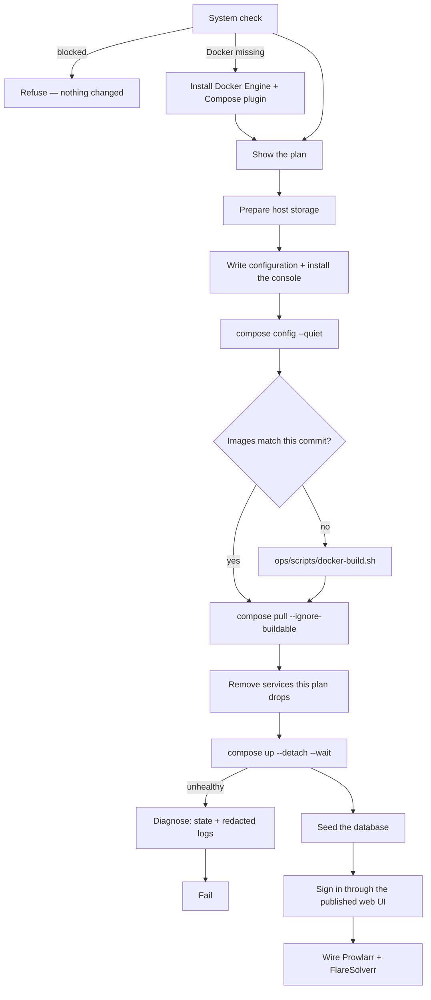

# UltraTorrent Installer (`ultratorrent-install`)

A single static binary that turns a bare Docker host into a running UltraTorrent
install: it inspects the machine, prints the exact plan it intends to apply,
generates every configuration file — secrets included — and then builds, starts,
seeds and verifies the stack.

It exists so that someone who does not want to read
[`INSTALL.md`](INSTALL.md) end to end still ends up with a **working** system,
rather than a stack that came up and a list of six things still to wire by hand.

- [What it is, and what it is not](#what-it-is-and-what-it-is-not)
- [Getting the binary](#getting-the-binary)
- [The three commands](#the-three-commands)
- [Flags](#flags)
- [The system check](#the-system-check)
- [The plan](#the-plan)
- [What it writes](#what-it-writes)
- [What `install` actually does](#what-install-actually-does)
- [Re-running it](#re-running-it)
- [Windows](#windows)
- [Troubleshooting](#troubleshooting)
- [Building it](#building-it)

---

## What it is, and what it is not

**It is** a deployer for the Compose stack this repository already defines. It
never forks the project's `docker-compose.yml`; it writes an `.env` and, only
when the installation genuinely needs to specialise something, a
`docker-compose.override.yml` beside it, then drives `docker compose` with both.

**It is not** a package manager, a service supervisor, or an updater. It does
not replace [`docs/OPERATIONS.md`](OPERATIONS.md) for the deployed hosts, and it
has no command that can delete data: the deploy path uses `stop`, never `down`,
and nothing in it passes `-v`.

**It is not yet interactive.** The wizard is unimplemented; flags stand in for
its answers and populate exactly the same plan object the wizard will, so
everything downstream is already exercised.

**The installer versions independently of UltraTorrent.** They move for
different reasons — a wizard fix is not a platform release — and one installer
has to work against several releases. `ultratorrent-install version` prints
both its own version and the plan schema it speaks.

---

## Getting the binary

**There is nothing to download.** `clients/installer/dist/` is gitignored, no
GitHub Release carries the binary, and no registry serves it. You build it from
the checkout you are about to install from — see
[Building it](#building-it) — which is one command and needs Go.

That is a deliberate consequence of where the project is, not a design
statement: the stack itself has no published images either, so a host that can
install UltraTorrent already needs the source tree. See
[Get UltraTorrent](https://docs.ultratorrent.co/install/download) for the whole
distribution picture.

The binary depends on nothing at runtime (`CGO_ENABLED=0`), so one file runs on
a current Debian and on a NAS whose glibc is years older.

**A terminal console rides along.** `utconsole` is embedded in the installer
binary and written next to the installation when it deploys, so an install ends
with a working console and no second download. `version` says whether the
console is aboard:

```
$ ultratorrent-install version
ultratorrent-install 0.85.9 (e4ebfccd), plan schema v1
console utconsole included (7.8 MB)
```

---

## The three commands

Each is a strict superset of the one above it, and each stops cleanly where it
says it does.

| Command | Touches the host? | What it does |
|---------|-------------------|--------------|
| `plan` | No | Runs the system check, prints the review screen. Changes nothing. |
| `generate` | Writes files | Everything `plan` does, then writes the configuration — and deploys nothing. |
| `install` | Deploys | Everything `generate` does, then builds, starts, seeds and verifies the stack. |

```bash
ultratorrent-install plan     --repo /path/to/checkout
ultratorrent-install generate --repo /path/to/checkout
ultratorrent-install install  --repo /path/to/checkout
ultratorrent-install install  --repo /path/to/checkout --dry-run   # full preview
```

`generate` is useful in its own right: an operator who prefers to run
`docker compose` themselves gets correct, complete configuration — including
generated secrets and a pre-seeded engine — without handing the installer
control of their stack. It ends by printing the two commands to run.

`--repo` is **not guessed**. Deriving the checkout directory is how an installer
attaches itself to a stack it did not create, so a missing or wrong `--repo` is
a refusal with the expected path named, not a best effort.

---

## Flags

Every flag is optional; the defaults are the ones this repository already
documents, so a default install and a documented hand-install produce the same
stack.

| Flag | Default | Notes |
|------|---------|-------|
| `--dry-run` | off | Produce and show everything, change nothing. On `install` this includes the **storage inspection**, which is the half of the preview that most often finds a problem. |
| `--output FILE` | — | Write the plan as JSON, mode `0600`. Never contains secrets. |
| `--json` | off | Print the plan as JSON instead of the review screen. |
| `--target OS` | this host | `linux` or `windows`. Authoring a Windows plan from Linux is supported — see [Windows](#windows). |
| `--install-dir PATH` | `/opt/ultratorrent` (`C:\ProgramData\UltraTorrent`) | Where `.env`, the override, state, the engine config and the console live. |
| `--repo PATH` | `.` | The checkout holding `docker-compose.yml`. |
| `--port N` | `8080` | Host port for the web UI. The only core port published. |
| `--engine NAME` | `qbittorrent` | `qbittorrent`, `rtorrent`, `external`, `none`. |
| `--external-url URL` | — | Required by `--engine external`. |
| `--media-root PATH` | — | Host path behind `/downloads`. Omit and a Docker `downloads` volume is used. |
| `--puid N` / `--pgid N` | unset | Ownership for downloaded files. Give one and the other mirrors it. |
| `--public-url URL` | — | The address people will type; becomes `CORS_ORIGIN`. |
| `--bundled-proxy` | off | Deploy the bundled Caddy proxy. Takes ports 80 and 443. |
| `--prowlarr` | off | Deploy the Prowlarr indexer manager, and wire it into UltraTorrent automatically. |
| `--flaresolverr` | off | Deploy FlareSolverr. Requires `--prowlarr`. |
| `--publish-prowlarr` | off | Publish Prowlarr's Web UI on the host. **It starts with no authentication** — see below. |
| `--no-publish-webui` | off | Keep the bundled engine's Web UI off the host network. Needs Compose ≥ 2.24 for the `!reset` tag. |
| `--rebuild` | off | Build the images even when they already match this checkout. |
| `--skip-checks` | off | Skip the system check. Planning only — `install` always checks. |

### `--puid` / `--pgid`

Set these to the **owner of your media directory**. They apply to the bundled
engine *and* to the backend, which writes into the same tree; setting only one
side leaves files the other cannot manage. Giving one flag without the other is
almost always a typo, so the installer mirrors it rather than half-applying it.

### `--publish-prowlarr`

Off by default on evidence, not caution. Measured against Prowlarr 2.4.0 there
is no authentication setting that is both safe and usable for a published UI:
"disabled for local addresses" serves it unauthenticated through a published
port, because every request that way arrives from the Docker gateway — a private
address — and enabling authentication redirects to a login page with no way to
create an account. On the internal Docker network the API key is the only
credential that matters, and UltraTorrent has it. Publishing stays a deliberate
choice, made with the consequence stated.

---

## The system check

Read-only, and it runs **before** the plan is printed on `install` — a plan is
not worth reviewing on a host that cannot run it.

```
System Check

  Operating system  Ubuntu 26.04 LTS       OK
  Architecture      amd64                  OK
  Privileges        dayala (sudo)          OK
  Docker            not installed          WILL INSTALL
  Docker Compose    not installed          WILL INSTALL
  Memory            7.2 GB                 OK
  CPU               4 core(s)              OK
  Disk free (/opt)  128 GB                 OK
  Docker registry   reachable              OK
  Port 8080         UltraTorrent web UI    OK
  Port 8081         qBittorrent web UI     OK
  Compose file      docker-compose.yml     OK
```

- **Ports come from the plan**, so the check tests what *this* installation will
  bind rather than a hard-coded list that drifts. A port held by *this*
  installation's own containers reads OK, not FAIL — re-running over a stack
  that is already up is the ordinary way to fix one.
- **Docker ≥ 20.10 and Compose v2 ≥ 2.0** are hard floors. Compose v1
  (`docker-compose`, hyphen) fails outright.
- **`WILL INSTALL` is a promise the installer keeps.** On a Debian or Ubuntu
  host it installs Docker Engine and the Compose plugin from Docker's own
  package repository, step by named step, falling back to `get.docker.com` for a
  release whose codename Docker has not published packages for yet. `apt` runs
  fully non-interactive, because an installer that stops at a conffile prompt
  hangs forever on an unattended run.
- **Memory, CPU and disk are advisory and never block.** The repository
  documents no minimum, and inventing one would refuse installs that work. The
  warnings fire below 2 GB RAM, below 2 cores, and below 10 GB free.
- **An unreachable Docker registry is fatal**, and the finding distinguishes
  "DNS did not resolve" from "DNS resolved but the connection did not complete",
  because the fixes are unrelated.

---

## The plan

The review screen is rendered from the same object the executor applies, so it
cannot describe something else.

```
Installation Plan

UltraTorrent
  Target        linux
  Install path  /opt/ultratorrent
  Web port      8080

Torrent engine
  qBittorrent (bundled)

Core services
  PostgreSQL  internal only
  Redis       internal only

Storage
  Media root  /srv/ultratorrent/media (host path)

Optional services
  Prowlarr       yes
  FlareSolverr   yes
  Bundled proxy  no

Security
  Database password  generated
  JWT secrets        generated
  Encryption key     generated
  Admin password     generated

Compose profiles
  qbittorrent, prowlarr, flaresolverr

Ports published on this host
  8080  UltraTorrent web UI
  8081  qBittorrent web UI
```

`--output plan.json` writes the same thing as JSON, and `--json` prints it.
**A plan never contains secrets** — every secret field is `json:"-"`, and a test
asserts it by marshalling a populated plan and searching for the values. It is
still written `0600`, because it describes the topology of someone's server.

Validation is pure: it answers *"is this plan internally coherent"* — port
collisions between services, an external engine with no URL, FlareSolverr
without Prowlarr, a relative install directory, a `publicUrl` with no scheme —
and reports **every** problem rather than the first, because an installer that
reports one mistake per run is one the operator runs five times. Whether port
8080 is free on this machine is the system check's question, not the plan's.

---

## What it writes

Everything lands in the installation directory (default `/opt/ultratorrent`),
never in the checkout. The repository's `docker-compose.yml` is left untouched.

| File | Mode | Written when |
|------|------|--------------|
| `.env` | `0600` | Always. Ports, database, Redis, the four generated secrets, the initial administrator, `COMPOSE_PROFILES`. |
| `docker-compose.override.yml` | `0644` | Only when the installation must specialise something — a bind-backed `downloads` volume, the bundled proxy, an unpublished Web UI. Removed again if a later run no longer needs it. |
| `qbittorrent/qBittorrent.conf` | `0644` | `--engine qbittorrent`. Pre-seeded credentials, so the engine never issues a temporary password. |
| `engine-credentials.txt` | `0600` | With the above. The engine's Web UI sign-in and the credentials to give UltraTorrent. |
| `prowlarr/config.xml` | `0644` | `--prowlarr`. Carries the API key the wiring step uses. |
| `Caddyfile` | `0644` | `--bundled-proxy`. |
| `installer-state.json` | `0644` | Always. The non-secret shape of the deployment, carried forward across runs. |
| `utconsole` + launcher | `0755` | When a console is embedded. |

**`COMPOSE_PROFILES` is written into `.env` deliberately.** Docker does not
remember `--profile` between commands, so a later plain `docker compose up -d`
in that directory would *stop* the profiled services. Setting it means every
ordinary Compose command brings up the same stack the installer deployed.

**The console goes beside the installation, not into `/usr/local/bin`.** That
directory is not durable everywhere — QTS runs its root filesystem from RAM, so
a binary there and a session in `$HOME` are both gone after a reboot — while the
installation directory is persistent by definition. The launcher written
alongside points the console's configuration at the same place.

**The administrator password is never printed.** It is in `.env` at `0600`;
echoing it would put it in scrollback, in a terminal recording, and in whatever
the operator pastes into an issue.

### Storage is prepared before anything else

A bind-backed volume whose device does not exist does not fail at
`compose config` and is not created on demand — the *container* fails to start,
with an error naming an internal Docker path and no hint that a host directory
is missing. So directories are inspected in full first (an operator with three
problems should see three), then created, then everything else happens.

---

## What `install` actually does



The ordering is not arbitrary:

- **`config --quiet` first.** It catches a malformed override or an
  unresolvable path in a second; the same failures cost minutes once half a
  stack is up.
- **The build is skipped only when it provably need not run**: the checkout is a
  git repository with a resolvable HEAD, the working tree is **clean**, the
  backend image records that same commit in its build stamp, and the frontend
  image exists. Any uncertainty resolves towards building. `--rebuild` forces it.
- **`pull --ignore-buildable`**, because the backend and frontend have no
  published image; asking a registry for them would fail every time. A pull
  failure is not fatal — images already present locally are enough.
- **Services the new plan drops are removed before `up`**, not after. Left
  alone, an engine from a previous plan keeps writing to the same `/downloads`
  volume and holds the Web UI port the new one is about to ask for. Their data
  is kept.
- **`up --detach --wait`**, letting each image's own `HEALTHCHECK` define
  healthy. On failure the installer *diagnoses* — service states plus the last
  40 log lines — because "something did not become healthy" is not a cause, and
  the real one (usually a failed migration) is only in the logs. Output is
  redacted with the **real** secret values, not a pattern guessing their shape.
- **Seeding is separate from starting.** The backend's `CMD` applies migrations
  and stops there, so without the seed the stack comes up with a complete schema
  and no users at all, and every sign-in fails.
- **Sign-in is verified through the published web UI**, not the backend's
  loopback. The earlier check proved only that the API could talk to itself, and
  it certified a deployment whose UI returned 502 to every request. A deployment
  is usable when its front door opens.
- **Companion wiring never fails the deployment.** "Now open Settings, paste
  this key, then add FlareSolverr as an indexer proxy" is the step that loses
  people, so the installer does it — but a stack that is running and signed into
  beats tearing one down over an indexer manager that still needs connecting by
  hand.

---

## Re-running it

Re-running over an existing installation is safe and is the normal way to change
something. Two behaviours make that true:

**Secrets are preserved, never regenerated.** Regenerating against a live
deployment is catastrophic and quiet: the database password stops matching the
volume that already holds the data, every session is invalidated, and a changed
`ENCRYPTION_KEY` makes every stored two-factor secret undecryptable. An existing
`.env` is read and its secrets reused — and the installer says so out loud:

```
Existing secrets found in .env and kept unchanged.
```

If those secrets are *unusable* (too short, not distinct — the constraints the
backend enforces at boot), the installer refuses rather than deploying a stack
that will fail to start for a reason the operator never chose. Move the file
aside to have a fresh set generated.

**`up` is a no-op when nothing changed.** No `--force-recreate`, no
`--renew-anon-volumes`, no `-V`.

Prowlarr's API key is recovered from its own `config.xml` when a re-run did not
generate one — including a key Prowlarr generated itself — which is what lets
you enable a companion on an installation whose secrets are being reused.

---

## Windows

`--target windows` **plans** but does not **generate**. The plan is a document:
authoring, printing, saving, diffing and reviewing a Windows installation from
any machine all work, and validation applies Windows path rules to it.

Generation refuses, with the reason. Every volume this installer writes binds a
host path through Docker's local driver:

```yaml
driver_opts: { type: none, o: bind, device: <host path> }
```

which is a Linux `mount(2)` performed *inside* the Docker VM. `D:\Media` is not
a path in there, and Docker Desktop's own mount root for host drives is an
implementation detail rather than a documented interface. Emitting that YAML for
a Windows host would produce a stack that comes up and silently stores
everything in the wrong place — the worst available outcome. Settling it is an
experiment on a real Docker Desktop host, not a design decision: see W3 in
[`WINDOWS_INSTALLER_GAP_ANALYSIS.md`](WINDOWS_INSTALLER_GAP_ANALYSIS.md).

The Windows binary is still built and shipped by the same command as every other
platform, so a change that breaks the Windows build breaks the build script
rather than being discovered on someone's laptop.

---

## Troubleshooting

| It says | What it means | Fix |
|---------|---------------|-----|
| `this host cannot run UltraTorrent yet` | The system check has a FAIL. Nothing was changed. | Resolve the named findings and re-run. |
| `Compose file: not found in <dir>` | `--repo` does not point at a checkout holding `docker-compose.yml`. | Pass the checkout directory. |
| `the generated configuration is not valid` | `docker compose config` rejected the merged file set. | Read the quoted first line; usually a hand-edited override. |
| `the stack did not become healthy` | A service never reached healthy within 5 minutes. | The diagnosis printed below it carries each unhealthy service's state and last 40 log lines. Migration failures show up here. |
| `the deployment is running but not usable` | The stack is healthy but sign-in through the web UI failed. `502` means the UI cannot reach the API. | Check the frontend's proxy configuration and the backend's health. |
| `the secrets in .env are not usable` | An existing `.env` holds secrets the backend would reject at boot. | Fix them in place, or move the file aside for a fresh set. |
| `a Compose project name is required` | Reachable only if the project name was cleared. | Leave it at the default — a derived name is how an installer adopts a stack it did not create. |
| `plan schema N is not supported` | The plan JSON came from a different installer. | Use the installer that wrote it, or re-plan. |
| `Prowlarr is deployed but its API key is unknown` | Wiring could not run. The deployment is fine. | Connect it under **Settings → Integrations**. |

The console installed alongside is the fastest way to see what a struggling
install is doing: run `<install-dir>/utconsole`. See
[`UTCONSOLE.md`](UTCONSOLE.md).

---

## Building it

```bash
cd clients/installer
./build.sh                       # writes dist/ for linux amd64/arm64 and windows amd64
```

`clients/` sits outside the `packages/*` and `apps/*` workspace globs, so
`npm install`, `npm test --workspaces` and the release tooling never see this
module — which is the point, since it ships independently of the server it
deploys.

`build.sh`:

- **vets both platforms before building either.** `go vet` is GOOS-sensitive and
  only checks the files that build for its target, so vetting Linux alone leaves
  every Windows-tagged file unchecked.
- runs the tests.
- **embeds the console for the matching platform.** Shipping an installer that
  writes a binary the host cannot execute is worse than shipping none: a missing
  console is reported, a foreign one just fails. Build `clients/console` first,
  or the installer ships without one.
- emits `dist/SHA256SUMS`.

`CGO_ENABLED=0` throughout. arm64 Windows is deliberately absent: shipping a
binary implies a claim nobody has tested.

`dist/` is gitignored — binaries are built, never committed.

---

## See also

- [`INSTALL.md`](INSTALL.md) — the hand-install this automates
- [`DOCKER.md`](DOCKER.md) — the Compose services, volumes and profiles it drives
- [`UTCONSOLE.md`](UTCONSOLE.md) — the console it installs
- [`PROWLARR.md`](PROWLARR.md) — the companion it wires
- [`OPERATIONS.md`](OPERATIONS.md) — deploying the *existing* hosts, which is a different procedure
- [`INSTALLER_GAP_ANALYSIS.md`](INSTALLER_GAP_ANALYSIS.md) · [`WINDOWS_INSTALLER_GAP_ANALYSIS.md`](WINDOWS_INSTALLER_GAP_ANALYSIS.md) — the evidence behind the decisions above
