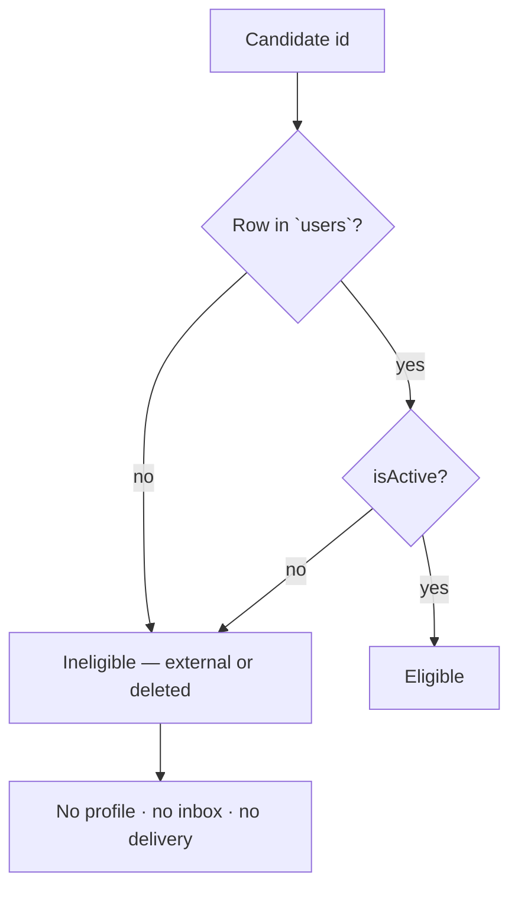
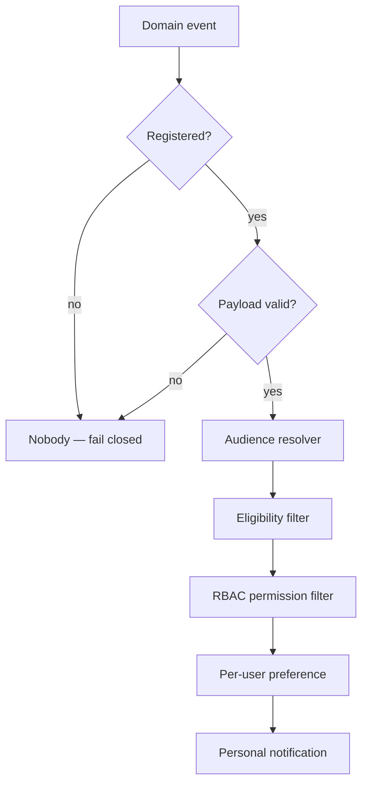
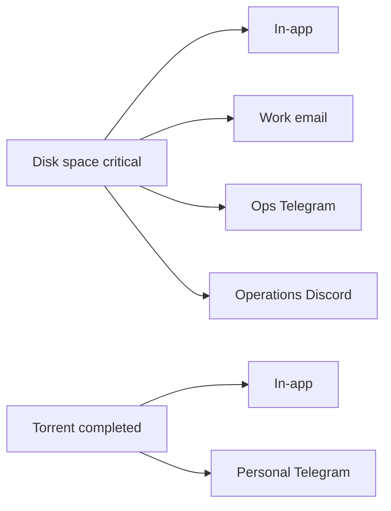
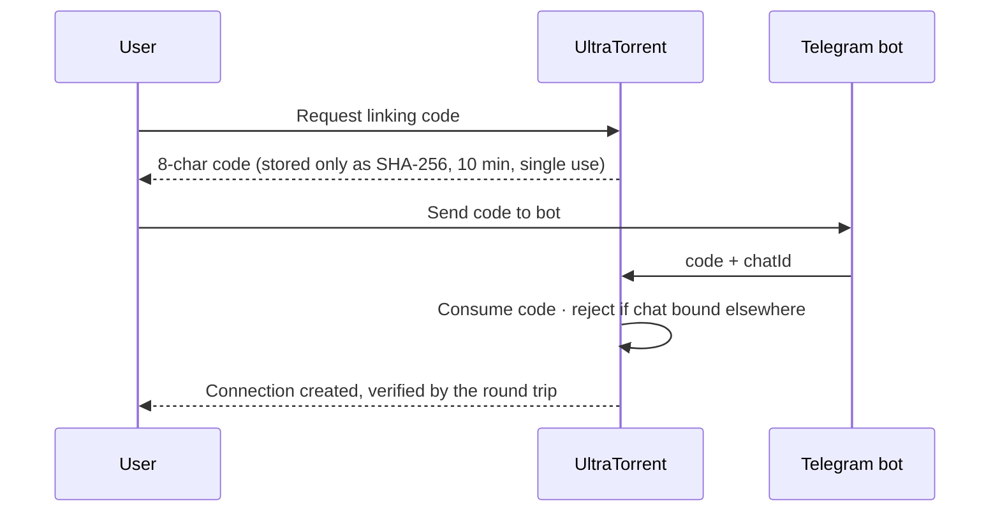
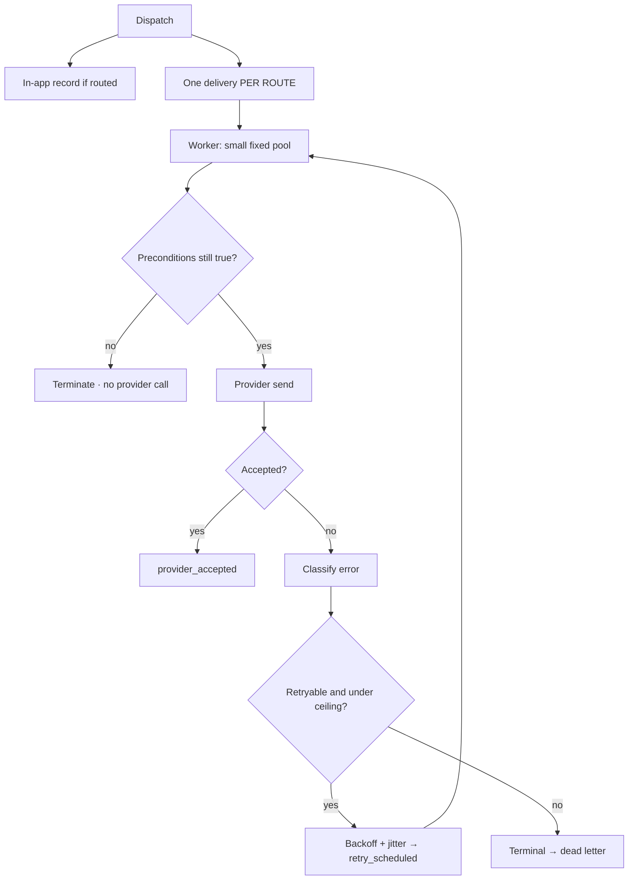
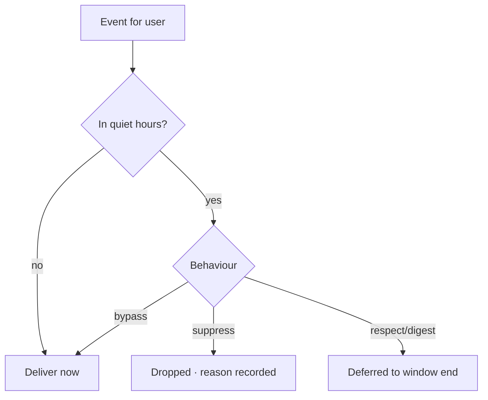
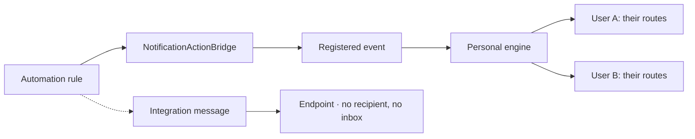
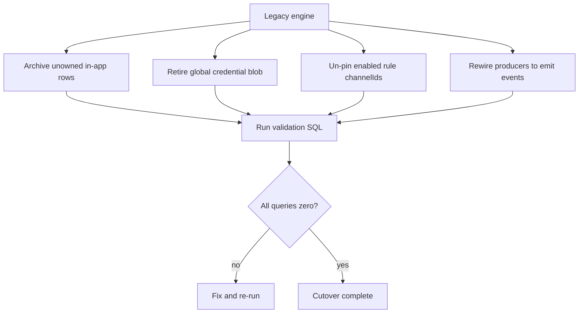

# Personal Notification Engine

**Status:** phases 1–9 implemented; Phase 10 cutover in progress (see §14).
**Security model:** [NOTIFICATION_ENGINE_SECURITY.md](NOTIFICATION_ENGINE_SECURITY.md).
**Audit + gap analysis:** [NOTIFICATION_ENGINE_GAP_ANALYSIS.md](NOTIFICATION_ENGINE_GAP_ANALYSIS.md).

---

## 1. The ownership model

> Notifications are **personal to each locally authenticated UltraTorrent user**.

There is no global notification destination and no global event-to-channel routing.
Each user controls which events they receive, on which of *their own* connections,
whether it appears in-app, whether it is immediate or batched, and how quiet hours
treat it.

**What this replaced.** The previous engine had none of that: in-app notifications had
a nullable owner and were null for every row on a live install (1,729 of 1,729 —
broadcasts to whoever was connected); recipient resolution did no permission,
resource or eligibility check; and external delivery used one shared credential set
for the entire install. Full measurements in the gap analysis.

---

## 2. Who may own a notification

Eligible = a row in `users` with `isActive = true`. That table holds only local,
password-authenticating accounts, so **no `origin` column was added** — a redundant
discriminator can drift. `NotificationRecipientEligibilityService` is the single
authority and fails closed.

Never eligible: `MediaServerUser` (Plex/Jellyfin/Emby viewers), Trakt links, API keys,
service identities.



⚠️ `User.isSystem` means "seeded, cannot be deleted" — **not** "service identity".
Filtering on it would silence the primary operator.

---

## 3. The event catalogue

Code-defined, **69 events across 9 namespaces**. Each declares category, severity,
i18n keys, required payload fields, supported channels, new-user defaults, required
permission, audience, deduplication, aggregation, sensitivity and an optional
deep-link template.

The catalogue is **not** a preference system: it says what events exist and how they
behave, plus what a brand-new user starts from. It never names a destination.

Categories are chosen for how the matrix is *read*, not to mirror namespaces —
`media`/`media_server`/`subtitle`/`library_cleanup` are four namespaces but one mental
category, while `system` mixes security with infrastructure.

**No default enables an external channel.** A connection the user has not created
cannot deliver, so defaulting one on would promise delivery that silently never
happens.

---

## 4. Recipient resolution

```
event audience ∩ eligible local users ∩ active ∩ RBAC permission ∩ personal preference
```



Eligibility runs **before** permissions, so an id from another namespace never reaches
the permission tables. An unregistered event, invalid payload or empty audience
reaches **nobody, never everybody** — the failure mode of a broadcast system is
telling the wrong people, and that cannot be taken back.

---

## 5. Preferences

Storage is **lazy**: only deviations from the catalogue are stored, so a user with no
rows still has a complete deterministic answer and adding an event is not a migration
across every account.

`routesOverridden` distinguishes two states that both have zero route rows:
*inherit the default* (the user changed only the delivery mode) versus *send nowhere*
(they deliberately cleared every channel). Without it, one silently becomes the other.

---

## 6. Multiple connections per channel type

The deliberate improvement over the UniFi model: one event can fan out to several
connections of the same type.



Every route is validated to reference a connection owned by the **same user** — the
security boundary of the whole feature.

---

## 7. Channel connections

`email`, `telegram`, `whatsapp`, `discord`. In-app needs no connection. **`sms` is
retired** as a personal channel; Slack and generic webhooks are *integration
messages*, not personal notifications.

Config is AES-GCM encrypted and never returned. Listings render from a
`destinationMask` computed on write.

**Email** uses the shared platform SMTP transport with a **personal destination
address** — no user supplies SMTP credentials, so there is no per-user secret to leak.

**Telegram** is bound by a linking code, never a typed chat id:



**Discord** requires an https URL on an allow-listed Discord host with a
`/api/webhooks/` path — checked against the host **the user supplied**, since a
resolve-then-fetch check is defeated by DNS rebinding.

Health is derived, never stored: `disabled` → `unverified` → `failing` (≥3 consecutive
failures) → `degraded` → `healthy`.

---

## 8. Delivery



One delivery row **per route**, so two Telegram destinations retry independently and
one broken destination never silences the other.

Success is recorded as **`provider_accepted`, never `delivered`** — a provider taking
a message is not a person receiving one.

Concurrency is deliberately low: these are third-party APIs with per-app rate limits,
and the failure mode of parallelism is a rate-limited integration that stops
delivering for everybody.

### Retries

Retryable: timeout, rate limit, provider 5xx, network, and **unknown** (a blip is
likelier than a permanent rejection). Terminal: invalid credentials, forbidden,
invalid destination, malformed payload.

Backoff is exponential with **±25% jitter** — without it an outage failing a hundred
deliveries retries all hundred at once and re-creates the herd. `Retry-After` always
wins.

---

## 9. Quiet hours

Computed in the **recipient's** timezone via `Intl`, so DST is handled by the platform
tz database.



Overnight windows wrap midnight: `22:00–07:00` under a naive `start <= t < end` is an
*empty* window, which would silently disable quiet hours for everyone with a normal
night. The day-of-week test uses the day the window **started** on, so
"Friday 22:00–07:00" stays quiet through Saturday morning.

---

## 10. Digests and aggregation

**Aggregation happens at assembly, not dispatch.** Two identical events an hour apart
are separate notifications — either might be worth opening — but in a summary they are
one line reading "×2". Collapsing at dispatch would lose the records.

The period is claimed *before* assembly (unique on `userId, kind, periodEnd`), so a
crash cannot duplicate a digest. An empty period is recorded as `empty` and sends
nothing. The rendered body is capped, and the omitted count is stated so the summary
never under-states what happened.

A digest is delivered **only to destinations the user already chose** for the events it
contains — anything else would be a new global routing decision.

---

## 11. In-app inbox and bell

One owner per notification. Filters (unread/read/all/archived), search, paging, and
per-channel delivery outcomes fetched in one query per page. Archiving also marks read,
so the bell does not stay lit for something deliberately filed away.

Realtime uses the per-user room joined from the JWT subject; nothing subscribes by a
client-supplied id.

---

## 12. Automation and Workflow

An action names a **registered event**, never a destination. The engine resolves
eligibility, permission and personal preference.



Explicit recipients are validated, never trusted. `assertNoDirectChannel` refuses any
action naming a channel, chat, webhook, address or phone.

**Integration messages** (Slack, generic webhooks) address an endpoint rather than a
person and are kept deliberately separate: no recipient, no inbox, no preference.

---

## 13. API

All under `/api/account/notifications`, with the acting user taken from the JWT. There
is **no `:userId` parameter anywhere** — stronger than checking ownership on a supplied
id, because it cannot be forgotten on a route added later.

| Area | Routes |
|---|---|
| Profile | `GET/PATCH profile`, `POST pause`, `POST resume` |
| Events | `GET events`, `GET/PUT preferences/:eventKey`, `PUT preferences/:eventKey/routes`, `POST preferences/:eventKey/reset`, `POST preferences/bulk`, `POST preferences/reset` |
| Channels | `GET/POST channels`, `GET/PATCH/DELETE channels/:id`, `POST channels/:id/{enable,disable,default}`, `POST channels/telegram/link` |
| Inbox | `GET inbox`, `GET inbox/unread-count`, `POST inbox/{mark-all-read,archive-read}`, `POST inbox/:id/{read,unread,archive}` |

Static routes are declared before parameterised ones (verified in the boot log).

**RBAC:** `notifications.view_own`, `manage_own`, `channels.manage_own`,
`deliveries.view_own`, `deliveries.retry_own` — granted to ordinary roles, because
managing your own notifications is not a privilege an admin grants. Admin diagnostics
are separate, and `notifications.admin.view_user_summary` is `NEVER_INHERITED`.

---

## 14. Migration and cutover



**Rules:** never copy one global destination to every user; never duplicate a shared
secret into user rows; never create profiles for external identities; archive rather
than infer ownership of legacy in-app rows.

**Validation:** `ops/scripts/notification-engine-validate.sql` — twelve queries,
1–11 must return zero rows. It is the definition of "cutover complete", not a
formality: run today it correctly reports 1,729 unowned legacy rows and the enabled
rules still pinning channels.

**Remaining before cutover** — see §15.

---

## 15. Known gaps

1. **External message rendering.** Bodies currently send the event key rather than
   localized text. Must be fixed before external channels are switched on.
2. **Producers not rewired.** `automation.module.ts`, `torrent-sync.service.ts` and
   `rss-automation.actions.ts` still call the legacy dispatcher. Each free-text call
   needs a registered event chosen deliberately — guessing would re-point a rule at a
   different audience.
3. **No settings UI** for quiet hours and digests (API exists).
4. **No channel test/verify endpoint**, so connections stay `unverified` and external
   delivery is gated off until it exists.
5. **Legacy engine still running in parallel.**

---

## 16. Operations

- **Delivery worker:** every 30s, batch 25, concurrency 4.
- **Digest worker:** every 5 min; each user's own schedule decides what is due.
- **Retention:** not yet implemented for `user_notifications`, deliveries, attempts,
  digests or dead letters.
- **Troubleshooting "I didn't get notified":** check the delivery row's
  `suppressedReason` — every suppression is recorded (`preference_disabled`,
  `below_min_severity`, `paused`, `no_route`, `no_verified_connection`,
  `quiet_hours`) precisely so this question has an answer.
