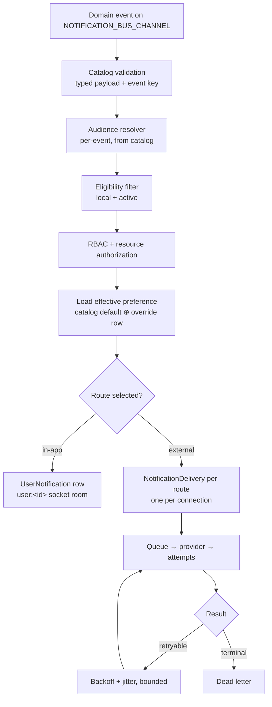

# Personal Notification Engine — Phase 1: Audit, Gap Analysis & Target Architecture

> ## ⚠️ Removed — historical record
>
> **The system described below no longer exists.** The entire notification engine
> was torn out on **2026-07-25** (released as v0.47.0) for a rebuild from scratch:
> code, 23 database tables, permissions, UI and the shared domain-event bus it
> consumed. Nothing here describes running software.
>
> This document is kept deliberately, because the reasoning in it — the threat
> model, the ownership rules, the failure modes found on a live install — is the
> most useful input the rebuild has. Treat every "is"/"does" below as "did".
>
> Live credentials from the removed install (encrypted SMTP transport, Telegram
> bot token) are in `notification-teardown-backups/`, not in this repository.
> See the 2026-07-25 entry in [ARCHITECTURE.md](ARCHITECTURE.md#change-log).


**Status:** design only — no implementation changes.
**Date:** 2026-07-25 · **Baseline:** v0.45.0 (`8d3cc47`)

This is the Phase 1 deliverable required before any schema or code change. It records
what the repository *actually* does today (measured, not assumed), what the target
model requires, and the decisions that must be settled before Phase 2.

---

## 1. Executive summary

UltraTorrent today runs **three overlapping notification systems**, only one of which
is personal, and **no in-app notification has an owner**.

| # | System | Location | Personal? | Live state |
|---|---|---|---|---|
| 1 | **Legacy global dispatch** | `modules/notifications/` | ❌ global | in-app active; external fan-out **dormant** (unconfigured) |
| 2 | **Notification Center** | `modules/notification-center/` | ❌ global rules → recipients | 59 rules (34 enabled), 1 recipient |
| 3 | **Per-user routing** (v0.45.0) | `NotificationRouting` | ✅ personal | live, **0 rows** (nothing configured yet) |

The measured headline: **1,729 / 1,729 in-app notifications on synoplex have
`userId = NULL`** — 100% unowned. There is no personal inbox; every in-app
notification is a broadcast to the shared `authenticated` socket room.

---

## 2. Identity model — the eligibility question

### 2.1 What exists

`User` (schema.prisma:17) has **no origin/type discriminator**:

```
id, username, email, displayName, passwordHash,
isActive, isSystem, lastLoginAt, failedLoginAttempts, lockedUntil,
totpSecret, totpEnabled, recoveryCodes
```

**`isSystem` does NOT mean "service identity."** It means *protected seeded account*:
`UsersService.remove()` throws `"System users cannot be deleted"` on it. Using it for
eligibility would be exactly the misreading the brief warns against.

**Finding: the `User` table already contains only local, password-authenticating
accounts.** Every row has a `passwordHash`; there is no federated/imported user path
into it. Per the brief ("If the existing `User` model already represents only local
accounts, do not add redundant fields"), **no `origin` column is required.**

### 2.2 External identities (must never receive notifications)

| Model | What it is | Can authenticate? |
|---|---|---|
| `MediaServerUser` (1316) | Plex/Jellyfin/Emby viewer synced from a media server | ❌ no credential |
| `MediaServerSession` (1223) | live playback session, carries `userName` | ❌ |
| `TraktAccount` (54) | a **local user's** linked Trakt account (`userId` FK) | n/a — not a principal |
| `ApiKey` (219) | machine credential owned by a local user | acts *as* its owner |

`MediaServerUser` is keyed `@@unique([connectionId, userName])` and has an optional
`email` — deliberately *not* a link to `User`. It is a separate identity namespace.

### 2.3 🔴 Latent identity-confusion defect

`NotificationRecipientService.resolve()` (recipient.service.ts:113-119):

```ts
if (sel.mapEventUser) {
  const uid = payload.userId ?? payload.recipientId;
  const mapped = await this.prisma.notificationRecipient.findFirst({
    where: { userId: String(uid) },
  });
}
```

`media-server-session.service.ts:121` emits:

```ts
userDisplayName: s.userName, userId: s.userId ?? null,   // ← PLEX/JELLYFIN user id
```

The same `payload.userId` field carries a **local user UUID** for some events and a
**media-server provider user id** for others, and `resolve()` does an unvalidated
cross-namespace lookup on it. There is also **no RBAC, permission, resource, or
eligibility check anywhere** in `resolve()`.

**Exploitability today: dormant.** Measured live: `0` of 59 rules have
`mapEventUser = true` (the seed sets it `false`). This is a latent design fault, not
an active breach — but it is precisely threat #6 and must not survive the redesign.

### 2.4 Decision

Introduce **`NotificationRecipientEligibilityService`** as the single authority. No new
column. Eligibility = `User` row exists ∧ `isActive = true`. (There is no `deletedAt`
on `User`; deletion is hard-delete with cascade.) Every dispatcher, worker, retry, API
route and socket subscription must call it — fail closed.

---

## 3. Global configuration inventory (must be retired)

| Global surface | Where | Live state |
|---|---|---|
| `notifications.channels` settings blob — `webhookUrl`, `discordUrl`, `slackUrl`, `telegram{botToken,chatId}` | `notifications.module.ts:92` | **unset on synoplex** (dormant) |
| `NotificationRule.channelIds` — global event→channel routing | schema 2161 | 59 rules; some pinned by hand |
| `NotificationRule.forced` (added v0.45.0) | schema | 0 rules |
| `NotificationRule.recipients` `{recipientIds, groupIds, mapEventUser}` | schema 2159 | all 59 rules |
| `NotificationRecipient` standalone rows | schema 2073 | 1 (now user-linked) |
| `NotificationRecipientGroup` / `Member` | schema 2097/2109 | admin group |
| `notification_center.seeded_rule_events` | settings | present |
| Shared `authenticated` socket room for in-app | `realtime.gateway.ts:65` | active |

**Legacy external fan-out uses one shared credential set for the whole install** — the
single most important thing to delete, since it cannot express personal ownership at
all.

---

## 4. Channel provider inventory

Registry (`provider-registry.ts`) implements **4** kinds:

| Kind | Exists | Target | Action |
|---|---|---|---|
| `email` | ✅ | ✅ | make personal (transport decision below) |
| `telegram` | ✅ | ✅ | add per-user link/verify flow |
| `whatsapp` | ✅ | ✅ | add per-user destination + verification |
| `sms` | ✅ | ❌ not in brief | **decision needed** — retain or retire |
| `discord` | ❌ **absent** | ✅ | **build from scratch** |
| in-app | n/a (not a provider) | ✅ | first-class route type |

Discord/Slack/generic-webhook exist **only** in the legacy global blob as raw URLs —
never as user-ownable connections. Per the brief these become **integration messages**,
not personal channels (Slack/webhook), while **Discord must be built** as a real
personal channel.

---

## 5. Event catalog

`NOTIFICATION_EVENTS` (packages/shared/src/events.ts:128) — **69 events, 9 namespaces**:

| Namespace | Events | | Namespace | Events |
|---|---:|---|---|---:|
| `media` | 14 | | `subtitle` | 6 |
| `media_server` | 13 | | `job` | 4 |
| `system` | 12 | | `library_cleanup` | 4 |
| `download` | 7 | | `workflow` | 3 |
| `rss` | 6 | | | |

> **Correction (Phase 3).** An earlier pass reported 62 events / 7 namespaces. That
> count came from a pattern requiring exactly one dot, which silently dropped the
> three-segment keys — `workflow.execution.failed`, `library_cleanup.plan.*`. The
> figures above are the corrected ones and are what the catalogue is built against.

It is a **flat string-constant map** — no category, severity, payload schema, supported
channels, defaults, required permission, audience resolver, dedupe, aggregation,
sensitivity, template, or deep-link builder. All of that metadata must be added.

The brief's category list (Account, Security, Automation, Workflow, Infrastructure,
Storage, Providers, Users, Health) does **not** match the 7 real namespaces. Categories
must be derived from the actual catalog, with events re-categorised deliberately.

**Known dead events:** `media_server.user_paused`, `user_resumed`, `user_stopped` have
seeded rules but **no producer** — they can never fire. Verified by source search.

---

## 6. Gap analysis against the 37 Definition-of-Done items

| # | Requirement | Today | Gap |
|---|---|---|---|
| 1–6 | Personal ownership of profile/prefs/channels/in-app | ❌ | in-app 100% unowned; channels are global |
| 7 | No global event→destination routing | ❌ | `rule.channelIds` + legacy blob |
| 8–12 | UniFi event profile page, filters, bulk, drawer | ❌ | no page exists |
| 13 | Multiple connections per channel type | ❌ | one recipient row, one address per kind |
| 14 | In-app independently selectable | ❌ | in-app is unconditional broadcast |
| 15–18 | Personal email/Telegram/WhatsApp/Discord | ⚠️/❌ | 3 exist but global; Discord absent |
| 19 | Same event routed differently per user | ⚠️ | `NotificationRouting` (v0.45.0) partially covers |
| 20 | Secrets encrypted, never returned | ✅ | `SecretCipher` + redaction already correct |
| 21 | Every event has a recipient resolver | ❌ | no resolvers; rules carry static recipients |
| 22 | RBAC + resource authorization | ❌ | **none** in resolution path |
| 23 | Personal socket rooms | ⚠️ | `user:<sub>` room exists but in-app uses shared room |
| 24–25 | Async isolated delivery, bounded retries | ⚠️ | queue exists; needs per-user isolation audit |
| 26–28 | Personal quiet hours / digests / dedupe | ⚠️ | `quietHours` on recipient; no digests |
| 29–30 | Automation cannot bypass; integration split | ❌ | automation calls **legacy global** dispatch |
| 31 | Legacy migrated/removed | ❌ | not started |
| 32–34 | Account UI, health summary, bell | ❌ | `/account` is a single ProfilePage; **no bell** |
| 35 | en-US + es-PR | ⚠️ | parity test exists and passes; new keys needed |
| 36–37 | Security/audit/metrics/docs, full regression | ⚠️ | audit exists; threat model absent |

**Already-correct foundations to preserve:** `SecretCipher` (AES-GCM) with
`secretFieldsFor()` redaction; JWT-derived socket rooms; `AuditService`; the
`NOTIFICATION_BUS_CHANNEL` single bus; provider registry/factory seam; the i18n parity
gate; `NotificationDelivery`/`Queue`/`Attachment`/`Statistics` tables.

---

## 7. What v0.45.0 already contributes

Shipped hours before this audit, and it partially anticipates the target:

- `NotificationRouting(recipientId, event, channelIds)` — **positive** per-recipient
  routing with namespace wildcards (`system.*`) and most-specific-wins resolution.
- Precedence `forced rule → recipient routing → rule channels → preferred → defaults`.
- `RecipientProvisioningService` — recipients auto-derived from `User`, adopting
  pre-existing rows by email (verified live on both hosts: `1 adopted, 0 created`).

**However it conflicts with the target on two points:**

1. It keeps `rule.channelIds` as a *global* routing layer (DoD #7 says remove).
2. `NotificationRule.forced` lets an admin override personal choice — the brief
   forbids "administrative overrides that silently replace personal preferences."
   `forced` is *not* silent (it is visible and locked in the UI), so this is a genuine
   product decision, not an outright violation. **Needs a ruling** (§9).

Routing keys are `recipientId`-scoped, and recipients are now 1:1 with users, so the
data model migrates forward cleanly rather than being thrown away.

---

## 8. Migration risks

| Risk | Mitigation |
|---|---|
| 1,729 unowned in-app rows | Ownership is **unambiguous only where** a rule targeted one recipient. Otherwise **archive, do not guess** — the brief forbids copying a global destination to every user. |
| Global Telegram/Discord/webhook creds → per-user | **Never duplicate a shared secret into user rows.** Retire; require users to re-connect personally. |
| `MediaServerUser` mistaken for a recipient | Eligibility service; assert no `NotificationRecipient.userId` matches a `MediaServerUser`. |
| Automation/RSS/torrent-sync call legacy dispatch | 3 call sites (`torrent-sync.service.ts`, `automation.module.ts`, `rss-automation.actions.ts`) must move to event emission before legacy removal. |
| Dead events with seeded rules | Map or delete `user_paused`/`user_resumed`/`user_stopped`. |
| Rollback | Migration must be additive-then-cutover; legacy tables retained read-only for one release. |

**Validation queries** (must all return 0 before Phase 10 completes) will assert: no
external user owns a profile; no active global route remains; every connection has one
eligible owner; every in-app item has one eligible owner; every route references a
connection owned by the same user; every preference references a valid event key.

---

## 9. Decisions required before Phase 2

These change the schema, so they cannot be deferred:

1. **`sms`** — retain as a personal channel (it exists and works) or retire it? The
   brief's list omits it.
2. **`NotificationRule.forced`** — keep an admin's ability to pin a security alert past
   personal preference, or delete it for a purely personal model? (I recommend keeping;
   without it any user can mute a breach notice.)
3. **Email transport** — personal SMTP per user, or shared infrastructure transport with
   a personal destination address? The repo has a shared-transport email provider today,
   so shared-transport + personal address is the smaller, safer extension.
4. **Preference storage** — eager rows (69 events × N users) vs lazy defaults with
   override rows only. **Recommend lazy** (the brief prefers it; 62 × users is wasteful
   and makes catalog changes a migration).
5. **Legacy in-app history** — archive all 1,729 unowned rows, or attempt ownership
   inference? **Recommend archive**; inference would fabricate ownership.

---

## 10. Target architecture (proposed)



Recipient selection is the intersection:

```
event audience ∩ eligible local users ∩ active ∩ RBAC ∩ resource auth ∩ personal preference
```

Proposed entities (names per brief, adapted to repo conventions):
`UserNotificationProfile`, `UserNotificationChannel`, `UserNotificationPreference`,
`UserNotificationEventRoute`, `UserNotification`, `NotificationDelivery`,
`NotificationDeliveryAttempt`, `NotificationDigest`, `NotificationSuppression`,
`NotificationDeadLetter`.

`UserNotificationEventRoute` supersedes `NotificationRouting` — same idea, but
normalized per channel type with an optional `channelConnectionId`, enabling multiple
connections of one type per event (the improvement over UniFi).

---

## 11. Phase 1 status

**Complete:** architecture read; all three notification systems inventoried; global
configuration enumerated and measured live; local vs external identity established;
provider gap identified; event catalog counted and characterised; latent
identity-confusion defect found and its exploitability measured; migration risks and
validation queries defined; target architecture drafted.

**Blocked on:** the five decisions in §9.

**No implementation has been performed.**
