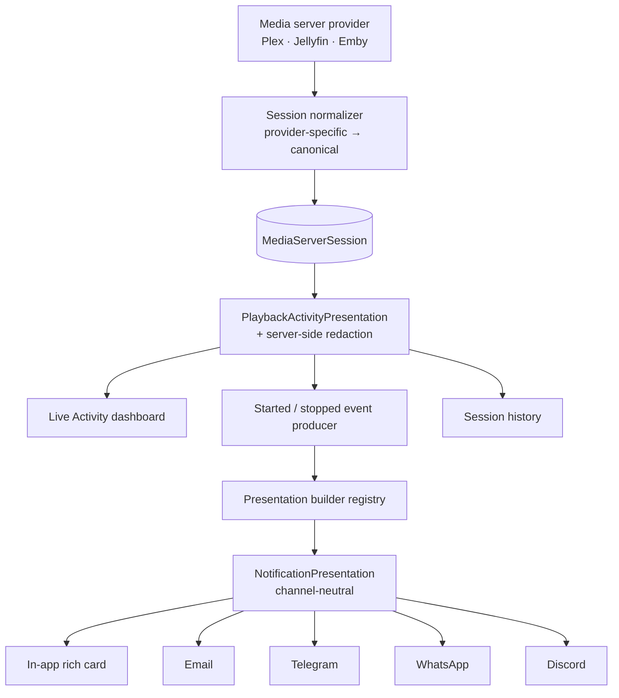

# Rich Playback Presentation — Phase 1: Audit, Architecture & Gap Analysis

**Status:** Phase 1 complete (this document). Phases 2–4 implemented — see §8.
**Date:** 2026-07-25 · **Baseline:** `3170862` (Personal Notification Engine complete)

> **The concept image arrived after this document was written**, and confirmed the
> design in §4 with two refinements now built: the headline is **two-tone** (accent
> lead + neutral trail), and the fact table's second row is labelled **Media** for a
> film but **Episode** for an episode. Everything in §0.1 below stands as the record
> of designing without it.

Phase 1 deliverable per the brief: audit the existing code, define the presentation
architecture, and report the gaps *before* modifying anything.

---

## 0. Two blockers found before design

### 0.1 The concept image is not available

`/mnt/data/a_dark_ui_design_mockup_image_showing_two_side_by.png` does not exist on this
machine, and no file matching it exists anywhere on the filesystem. I have **not seen
the mockup.**

The brief describes it in enough detail to design against — dark premium cards, green
start / red stop, avatar, poster, title hierarchy, facts, progress, single primary
action, condensed Email/Telegram/Discord variants — so the architecture below is built
from that written description. **Anything the image conveys that the prose does not
(exact spacing, type scale, gradient treatment, corner radii) is not reflected here**
and will need either the image or a design review.

### 0.2 🔴 The event keys in the brief do not exist

The brief specifies:

```
media.user_started_watching
media.user_stopped_watching
```

Neither is registered. The real catalogue (`packages/shared/src/events.ts:130`) has:

| Brief | Reality | State |
|---|---|---|
| `media.user_started_watching` | `media_server.user_started_watching` | ✅ live, has a producer |
| `media.user_stopped_watching` | `media_server.user_stopped` | ❌ **no producer — can never fire** |
| — | `media_server.user_finished_watching` | ✅ live, has a producer |

`media_server.user_stopped` is registered **deprecated** in the catalogue precisely
because nothing emits it (verified by source search during the notification-engine
work; `media-server-session.service.ts` emits `user_started_watching` at :128 and
`user_finished_watching` at :175).

**Consequence:** the brief's "User Stopped Watching" maps to
**`media_server.user_finished_watching`**, which is the event that actually fires when
a session ends. Building against `media.user_stopped_watching` would produce a
beautiful card that never renders.

**Recommendation:** implement for the two events that fire, and treat the brief's key
names as descriptive rather than literal. Alternative — add a producer for
`user_stopped` distinguishing "stopped early" from "finished" — is a behavioural
change to session reconciliation and should be a separate decision.

---

## 1. What already exists and must be reused

| Capability | Where | Verdict |
|---|---|---|
| Session artwork proxy | `GET media-server-analytics/live/:id/artwork` — injects provider auth server-side, `Cache-Control: private` | ✅ **reuse**; the correct precedent for in-app artwork |
| `LivePoster` | `pages/media-server-analytics/LivePoster.tsx` — fetches the proxy into a blob URL | ✅ reuse / generalise |
| `MediaPoster` | `components/media/MediaPoster.tsx` | ✅ reuse |
| Media Manager artwork | `GET media/items/:id/artwork` + `MediaArtwork` model | ✅ reuse for matched items |
| Session model | `MediaServerSession` — carries `playbackState`, `progressPercent`, `playbackMethod`, `videoCodec`, `audioCodec`, `resolution`, `bitrateKbps`, `device`, `client`, `libraryName` | ✅ **already rich enough**; no new columns needed for the card |
| Notification presentation | `NotificationCard` + `cardToText/Markdown/Sms` + `renderEmailHtml` | ⚠️ exists but is flat (title/subtitle/badges); needs the richer model |
| Message rendering | `render/message-renderer.ts` (locale-aware, allow-listed fields) | ✅ extend rather than replace |
| Realtime | `wsClient` + `media_server.session.started/ended` | ✅ reuse; **no second gateway** |
| Personal engine | catalogue, eligibility, preferences, delivery, providers | ✅ the presentation layer plugs into this |

---

## 2. 🔴 Privacy defect in the current Live Activity endpoint

`MediaServerSessionService.liveActivity()` is:

```ts
liveActivity() {
  return this.prisma.mediaServerSession.findMany({ orderBy: { updatedAt: 'desc' } });
}
```

An unfiltered `findMany()` — **every column of every session goes to the browser**,
including **`ipAddress`**. Measured on synoplex: **1 of 1** live sessions carries one.

The frontend TypeScript type happens not to declare `ipAddress`, so it is invisible in
the client code — but it is in the JSON on the wire, and a TS type is not a security
boundary. This is exactly the brief's requirement that "the frontend must not receive
fields the user cannot view", and it is currently violated.

It also means the dashboard renders **raw DB rows**, with no normalization layer — the
second thing the brief forbids.

**Both are fixed by the same change:** a server-side normalizer that projects sessions
into a presentation model, redacting per permission. That normalizer is the foundation
of everything else here.

---

## 3. 🔴 No avatar storage exists anywhere

`grep -n "avatar" schema.prisma` → **no matches**. Neither `User` nor
`MediaServerUser` has an avatar field, and no artwork table covers people.

So of the brief's four-step avatar resolution, steps 1 and 2 (system-user avatar,
mapped media-server avatar) **have no data source**. Only steps 3 and 4 are reachable.

**Recommendation:** implement the **initials avatar** as the primary path, rendered in
CSS with deterministic hue from the display name — which the brief explicitly prefers
("avoid storing generated images where CSS rendering is sufficient"). Adding real
avatars is a separate feature (upload, storage, validation, moderation) and should not
be smuggled in here.

For **external channels** an initials avatar cannot be a CSS div, so those fall back to
omitting the avatar rather than generating and hosting an image — consistent with
"do not create permanent unauthenticated access".

---

## 4. Target architecture

The brief's central rule — dashboard and notifications must be projections of one
model, not two implementations — drives the shape:



Two models, deliberately:

- **`PlaybackActivityPresentation`** — live session state. Continuously updating,
  dashboard-facing, may carry more detail (bandwidth, transcode decision, buffering).
- **`NotificationPresentation`** — channel-neutral, point-in-time, concise, built
  *from* the former by an event-specific builder.

Collapsing them into one would force the notification model to carry live-only fields
it must never send, and the dashboard model to carry channel concerns it does not have.

**Shared primitives** sit below both, so nothing is duplicated: title formatter
(movie vs `Series — S01E03`), artwork resolver, initials-avatar resolver, progress
formatter, quality-badge formatter, semantic state tokens.

### Redaction happens server-side, once

Per-recipient permission decides what the model even contains — the frontend never
receives a field it may not display. Candidate granular permissions
(`media_server.activity.view_user` / `_device` / `_location` / `_technical`) are
justified here because playback reveals personal behaviour; but they should be added
only if the existing `view_live_activity` is genuinely too coarse — the brief itself
warns against permission proliferation.

---

## 5. Gap analysis against the Definition of Done

| # | Requirement | Today | Gap |
|---|---|---|---|
| 1–3 | Premium started/stopped presentation, distinct states | ❌ | flat text card only |
| 4 | Media artwork | ⚠️ | proxy + `MediaPoster` exist, unused by notifications |
| 5 | Avatar | ❌ | **no storage anywhere**; initials only |
| 6–8 | Facts, progress, now-playing/resumed | ❌ | card model has no facts/progress |
| 9–11 | Themes, compact bell card, responsive | ⚠️ | bell exists; renders plain text |
| 12–15 | Email / Telegram / WhatsApp / Discord rich rendering | ⚠️/❌ | senders exist; **Discord has no renderer**, WhatsApp has no transport |
| 16 | Intentional fallbacks | ❌ | none |
| 17–18 | No path/secret exposure; privacy checks | ❌ | **`ipAddress` currently shipped** |
| 19 | Preview without sending | ❌ | no preview surface |
| 20 | en-US + es-PR | ⚠️ | parity gate exists; new keys needed |
| 21–23 | Accessibility, provider limits, failure isolation | ⚠️ | delivery isolation done; rendering limits not enforced |
| **Dashboard 1–17** | Shared visual language, normalization, RBAC, no flicker | ❌ | dashboard renders raw rows; no shared primitives |

---

## 6. Risks and sequencing notes

1. **WhatsApp cannot be completed.** `PersonalTransmitter` reports "whatsapp transport
   not configured" because no provider is wired. The renderer can be built and tested,
   but end-to-end delivery cannot be demonstrated.
2. **Heartbeat spam.** The dashboard polls every 30s; started/stopped events must fire
   only on genuine transitions. The existing reconciliation already does this (events
   emit on session create and on vanish), so the risk is in *not regressing* it.
3. **Artwork on external channels** is the hardest security surface: private artwork
   must not become publicly fetchable. Email CID attachment is the safest; Telegram
   accepts uploaded bytes; Discord requires a URL, so it should fall back to **no
   thumbnail** rather than minting a public link.
4. **Scope.** This brief is six phases on top of a ten-phase engine. Phases 3 and the
   dashboard work are large frontend efforts; I would not expect to land them in one
   pass without review points.

---

## 7. Recommended decisions before Phase 2

1. **Event keys** — build for `media_server.user_started_watching` +
   `media_server.user_finished_watching` (recommended), or add a producer for a
   distinct `user_stopped`?
2. **Avatars** — initials-only (recommended), or add avatar storage as part of this?
3. **Permissions** — reuse `media_server_analytics.view_live_activity`, or add the four
   granular ones?
4. **Discord artwork** — omit the thumbnail for private artwork (recommended), or
   introduce signed short-lived URLs?
5. **Scope for this pass** — the notification presentation only, or notifications *and*
   the dashboard rebuild together?

All five were answered: build for the two that fire · initials-only · reuse
`view_live_activity` · omit the Discord thumbnail · **notifications only**.

---

## 8. What was built (Phases 2–4)

| Phase | Delivered |
|---|---|
| 2 | `NotificationPresentation` in `@ultratorrent/shared`; builder registry; playback builder for both events; producer payloads enriched; `year` added to the session model and the Plex/Jellyfin/Emby maps; ownership-checked notification artwork proxy |
| 3 | `RichNotificationCard` + `PresentationArtwork` + accent/icon token tables; inbox renders the card; `InboxItem.presentation` exposed (presentation only — never the rest of the stored payload) |
| 4 | `presentationToText` / `Telegram` (HTML mode) / `Discord` (embed, accent as colour) / `EmailHtml` (inline styles, light palette); wired through the transmitter and delivery worker |
| 3b | **Bell dropdown** (DoD #10): `NotificationBell` becomes a panel listing the eight most recent notifications as compact cards, with mark-all-read, per-row open, and a link to the full inbox. 12 tests. |

### Deliberately not built
- **Artwork on external channels.** No token-free URL exists, and minting one was
  ruled out. Discord omits the thumbnail per decision 4; Telegram and email omit
  it for the same reason rather than reaching into the media-server integration
  to upload bytes. A real limitation, recorded rather than papered over.
- **WhatsApp.** Renderers apply, but no transport is configured on this install,
  so end-to-end delivery still cannot be demonstrated.
- **Preview surface** (DoD #19) and the **dashboard rebuild** (excluded by
  decision 5).
- **The `liveActivity()` `ipAddress` leak (§2) is still open.** It is a dashboard
  endpoint, and decision 5 scoped this pass to notifications. The *notification*
  path no longer carries an IP at all. Worth fixing on its own.
