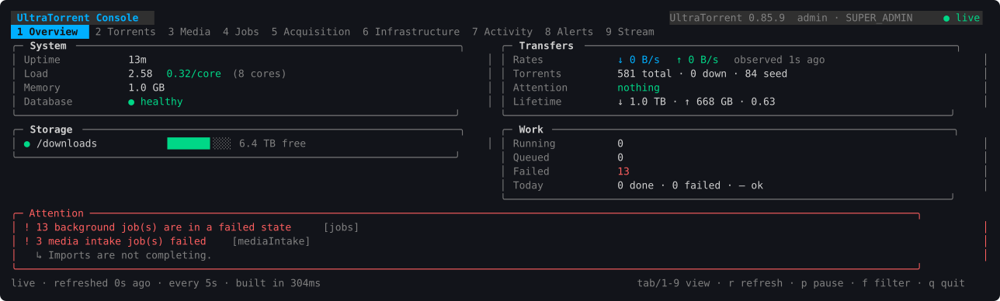
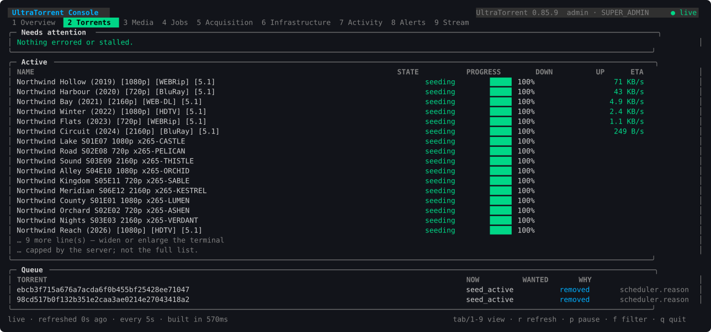
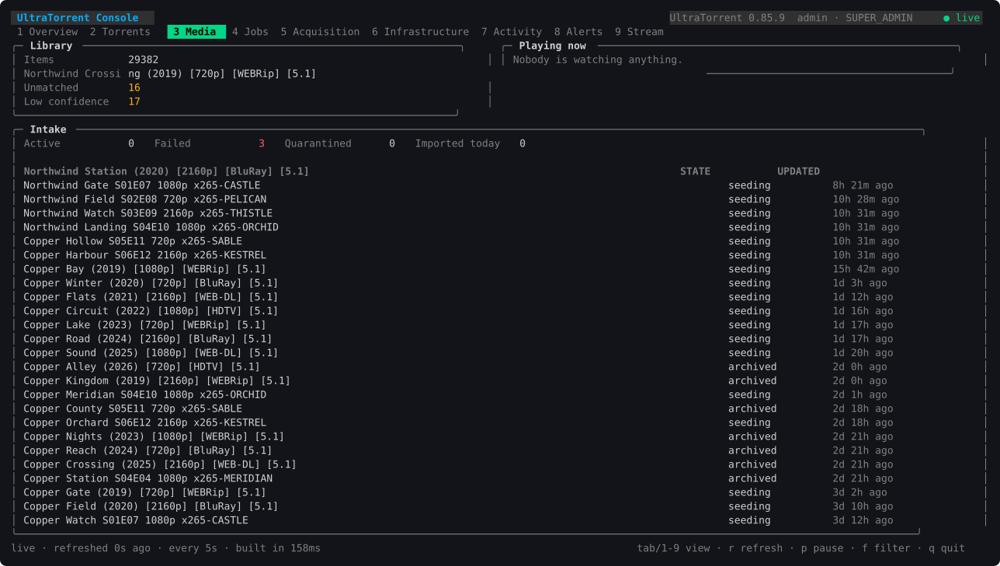
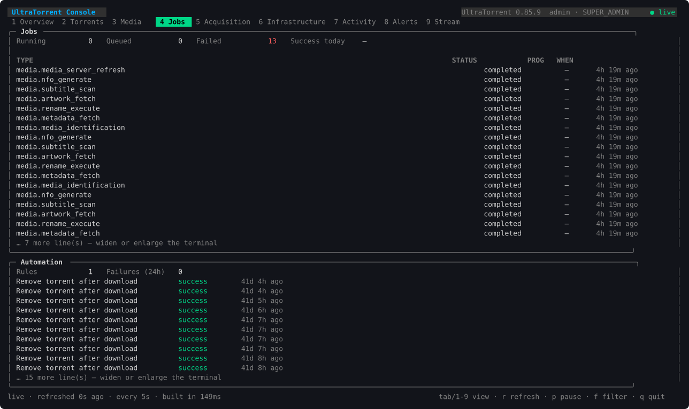
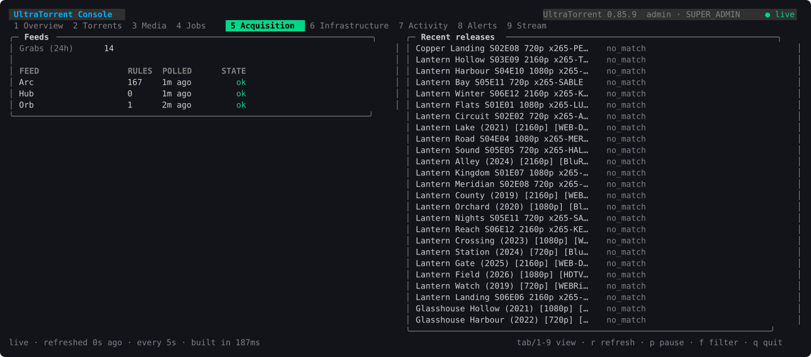
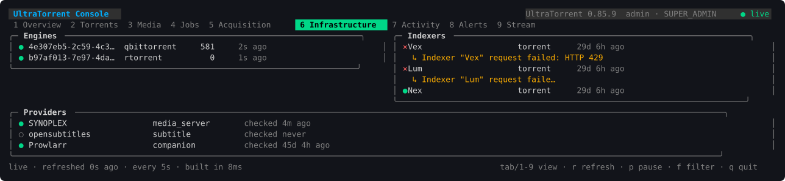
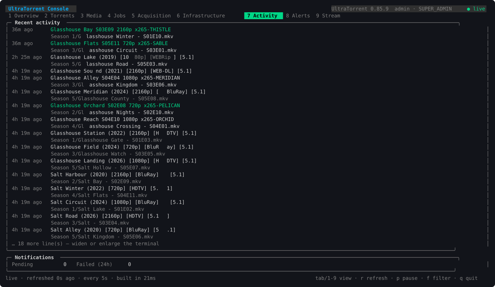
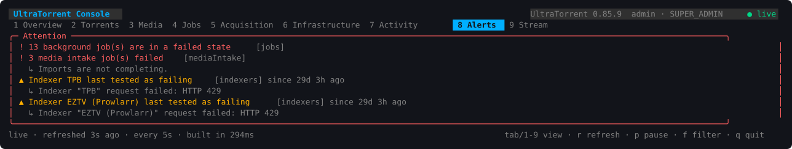
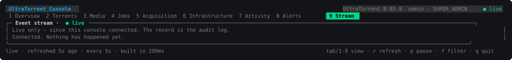

# UltraTorrent Console (`utconsole`)

A read-only terminal view of a running UltraTorrent install: one static binary, no
runtime, no configuration beyond a server URL and an account.



It **observes and never manages**. Every request it makes is a `GET` against
`/api/operations`, authenticated as an ordinary account. That is not a promise
the binary makes about itself — the server has no mutating route on that surface
and refuses everything else regardless of what a client asks for, so read-only-ness
comes from the API and the account's role. The console being incapable of writing
is defence in depth, not the mechanism.

---

## Why it exists

The web app answers "what is happening" beautifully and needs a browser, a session
and a screen. An operator on an SSH connection to a NAS at 2am has a terminal.
The console is for that: the same facts, the same permissions, over the same API,
rendered where the operator already is.

It is also the answer to a question the web app cannot answer cheaply — *"is this
install healthy right now?"* — because it asks the backend for one aggregate
reading rather than thirteen separate endpoints.

---

## Install

The binary is built from `clients/console/` and depends on nothing at runtime:

```bash
cd clients/console
./build.sh                                    # writes dist/ for linux, darwin, windows
scp dist/utconsole-linux-amd64 host:/usr/local/bin/utconsole
ssh host chmod 755 /usr/local/bin/utconsole
```

`CGO_ENABLED=0` throughout, which is what lets **one** binary run on both a current
Ubuntu and a QNAP whose glibc is years older. A dynamically linked build fails on
the older one with a link error that says nothing about the real cause.

`build.sh` also emits `dist/SHA256SUMS`. `dist/` is gitignored: binaries are built,
never committed.

---

## First run

```bash
utconsole login --server http://127.0.0.1:8888   # once; stores a rotating token
utconsole                                        # the console
```

**Point `--server` at the application root, not the backend port.** The backend
container publishes no port on either deployed host; the frontend proxies `/api`
and `/ws/` through to it. On the build host that is `http://127.0.0.1:8888`, on the
QNAP `http://127.0.0.1:18888`, and from anywhere else it is whatever public URL the
app is served at.

| Command | What it does |
|---|---|
| `utconsole` | The interactive console |
| `utconsole login --server URL [--user NAME] [--totp CODE]` | Authenticate; stores a rotating refresh token |
| `utconsole logout` | Forget the stored session |
| `utconsole snapshot [--domains a,b]` | Print one reading as JSON and exit |
| `utconsole version` | Build and contract version |

`snapshot` exists so the console is useful in a pipeline and in a bug report, not
only on a screen — and because it is the smallest thing that proves a deployment
works end to end.

### Keys

| Key | Action |
|---|---|
| `tab` / `1`–`9` | Switch view |
| `r` | Refresh now |
| `p` | Pause polling entirely |
| `f` | Cycle the stream's category filter |
| `q` | Quit |

---

## What an account needs

The **`console.view`** permission, which grants *access to the client and nothing
else*. Every panel is still gated by that domain's own view permission, so a console
user sees exactly what the same account sees in the web app — no more. `READ_ONLY`,
`USER` and `POWER_USER` hold it out of the box; `ADMINISTRATOR` inherits it.

There is deliberately no `console.admin` and no all-monitoring shortcut. A grant that
bypassed domain permissions would make the console the one client where RBAC does not
apply, which is the opposite of the point.

An account holding `console.view` and no domain permissions is refused at startup
with a message saying so, rather than opening onto nine empty views.

A panel the account may not read says so in its own frame, dimmed rather than
coloured like a fault — a permission boundary is not an incident, and colouring it
like one teaches an operator to ignore the colour that means something is wrong.

---

## The views

### 1 · Overview

The host on the left, the work on the right, so *"is the machine sick or is the
workload sick"* is answered by looking at one side. Attention runs full width
underneath.


Load is shown **per core**, because a raw load average means nothing without knowing
how many cores it is spread across — `6.0` is an emergency on two cores and an idle
afternoon on sixty-four.

### 2 · Torrents



`Needs attention` comes first and holds anything errored or stalled — a torrent
downloading with no peers and no throughput. `Active` is capped by the server, and
the console says so rather than letting a list that stops at 25 read as "that is all
of them".

Transfer figures carry an **`observed`** age. The server reads them from what its
engine poller last saw rather than asking the engines again on your behalf, so the
data is deliberately up to two seconds old and says so.

### 3 · Media



### 4 · Jobs



### 5 · Acquisition



A feed's state is **staleness against its own refresh interval**, not an error
column. RSS poll failures are logged and never persisted, so a `lastError` field
could only ever be empty — and a column that is structurally always empty reads as
"no feed has ever failed", which is worse than not offering it. A feed is `overdue`
after twice its interval; once would flag every poll that lands a moment late.

Release results use the vocabulary the platform can actually derive:
`downloaded`, `skipped_duplicate`, `matched`, `no_match`. **`matched` is kept
distinct on purpose** — it means a rule wanted a release and it was not taken, which
is the state worth an operator's attention and the one a plain "rejected" would bury.

### 6 · Infrastructure



Health is carried by a **glyph as well as a colour** (`●` healthy, `◐` degraded,
`✕` down, `○` never reached). Colour alone excludes anyone with a colour vision
deficiency and disappears entirely through a pipe.

### 7 · Activity



A line marked `(N events)` is a collapsed burst. The console shows the count and
cannot expand it — the snapshot carries a number, not the constituents — and
pretending otherwise would be a lie about what it holds.

### 8 · Alerts



**Alerts are a projection, not an entity.** They are computed from health, job,
intake, storage and provider state each time a snapshot is built. They have no
identity that survives a restart, they cannot be acknowledged, and there is no
dismiss key — the way to make one go away is to fix what it reports. A dismiss key
would promise something the server cannot honour.

The pane is framed in the worst severity it holds, so a critical alert is visible
before a word of it has been read.

### 9 · Stream



A live narrative over a websocket, not polling. **It is not history**: it holds the
last 200 events that arrived while this console was open, it does not backfill, and
the view says so every time it renders. The record of what happened is the audit
log.

`f` cycles the filter through whichever categories are actually in the buffer,
rather than a fixed list of every category the platform can emit — a filter offering
twelve options on an install that only ever produces three is a worse tool.

---

## How it treats the server

A console is watched *by* people and points *at* a machine that may be having a bad
day, so it is deliberately cheap:

- **Each view requests only the domains it displays**, never all sixteen. A console
  showing one panel must not make the backend build sixteen.
- **The refresh interval is clamped up** to the floor the server advertises in
  `capabilities.limits.minSnapshotIntervalSeconds`, so a misconfigured console
  cannot become load.
- **`p` stops polling entirely** rather than freezing a copy, so a paused console
  costs the server nothing at all.
- **A failed refresh leaves the last good reading on screen** with the failure and
  its age in the status bar. A console that quits when the server hiccups is useless
  exactly when it is needed.
- **Nothing is measured locally.** No CPU sampling, no disk probing, no direct
  database, Redis, engine, media-server or filesystem access. It talks to one HTTP
  API and reports what that API says.

---

## Configuration

`~/.config/utconsole/config.json`, mode `0600`, holding the server URL, display
preferences and a **rotating** refresh token. **No password is ever stored.**
Override the location with `UTCONSOLE_CONFIG`.

```json
{
  "serverUrl": "http://127.0.0.1:8888",
  "refreshToken": "…",
  "username": "operator",
  "refreshSeconds": 5
}
```

The token lives in a file rather than an OS keyring because these run on headless
servers where no keyring daemon exists, and a keyring that silently falls back to a
file is worse than a file that says so. The console warns once if the file is group-
or world-readable, but does not refuse to start — a umask is not always the
operator's fault, and refusing would strand someone on a machine that may well be
single-user.

The file is written to a temporary path and renamed, so an interrupted write cannot
leave a truncated config that locks you out of your own console.

---

## Colour and terminals

The palette is ANSI-256 rather than truecolor, because this runs over SSH into
whatever terminal an operator happens to have, and a theme that assumes 24-bit
colour renders as mud on a basic one. Lip Gloss degrades automatically — on a Linux
virtual console the same screen renders in the 16 ANSI colours.

**`TERM` must be set.** With no `TERM` at all the library concludes it is not
talking to a colour terminal and renders monochrome. This bites when launching the
console from a context that does not inherit an environment:

```bash
# Wrong — inherits no TERM, renders flat
openvt -s -- /usr/local/bin/utconsole

# Right
openvt -s -- env TERM=linux /usr/local/bin/utconsole
```

---

## Compatibility

The console checks the operations contract version at startup:

| Server contract | Result |
|---|---|
| Same major | Compatible |
| Newer minor | Compatible; fields this build does not know are ignored |
| Different major | Refused, naming **both** versions |

Refusing beats rendering nonsense from a shape the client is guessing at. The
contract is `OPERATIONS_CONTRACT_VERSION` in `packages/shared/src/operations.ts`.

---

## Screenshots

The screenshots above are captured from a live install and regenerated rather than
hand-made:

```bash
ssh host 'tmux new-session -d -s shot -x 150 -y 44 "env TERM=xterm-256color utconsole"'
ssh host 'tmux send-keys -t shot 2; sleep 4; tmux capture-pane -p -e -t shot' > page.ansi
python3 ops/scripts/ansi-to-svg.py page.ansi docs/images/utconsole/02-torrents.svg
```

`capture-pane` needs **`-e`** or it strips every escape sequence and the result is
silently monochrome. SVG rather than PNG so the colours are real, the text stays
selectable and searchable, and the file is a few KB of diffable source instead of a
binary blob in git history.

---

## Building and testing

```bash
cd clients/console
go test ./...          # unit + protocol + layout
go vet ./...
./build.sh             # five platforms + SHA256SUMS
```

`clients/` sits outside the repo's `packages/*` and `apps/*` npm workspace globs, so
`npm install`, `npm test --workspaces` and the release tooling never see a Go module.
The console versions and ships independently of the server, which is the point: one
console has to work against several installs.

The tests target what breaks quietly rather than what is easy to assert: a refresh
happening *before* a 401 rather than after, a revoked session failing once instead of
looping, an incompatible contract being refused, a forbidden panel explaining itself
rather than rendering a zero value as data, the config file being written owner-only,
and — the one that cannot be eyeballed — **no rendered line exceeding the terminal
width**, across every view at 72/100/120/150/200 columns. A pane that overflows wraps,
and a wrapped border tears every box below it.

---

## Architecture

The server half is the `operations` module; see
[ARCHITECTURE.md](ARCHITECTURE.md) and the Phase 1 audit in
[CONSOLE_GAP_ANALYSIS.md](CONSOLE_GAP_ANALYSIS.md).

```
clients/console/
  cmd/utconsole/      CLI entry point and subcommands
  internal/api/       contract types + the read-only HTTP client
  internal/config/    the two things worth persisting
  internal/realtime/  the Socket.IO subset needed to listen
  internal/ui/        Bubble Tea model, views, layout, formatting, theme
```

### The realtime path

The gateway speaks Socket.IO v4 over Engine.IO v4. The console implements the subset
it needs — framing, one handshake, a heartbeat — rather than taking a dependency on a
full client whose server-oriented surface is far larger than anything used here. The
parser is a pure function of a text frame, so every protocol case is tested without a
server, including the malformed ones a proxy can produce. An unrecognised packet type
is ignored rather than fatal, because a server upgrade that adds one must not knock
the console off.

**After the handshake the only frame it ever sends is a pong.** Read-only holds on
the realtime path exactly as it does over REST.

The access token travels in the Socket.IO `CONNECT` payload rather than the query
string, which the gateway also accepts. The difference is operational: the console
reaches the API through nginx, and nginx writes request URLs to its access log — a
query-string token would be written to disk in plain text on every reconnect, on the
very host being monitored.

A refused identity is reported distinctly from a dropped connection. Different
problems, different fixes: one is an account, the other is a network. Reconnects back
off exponentially to a cap and mint a fresh token each attempt, so a console left open
overnight is still streaming in the morning.

---

## Known gaps

- **English only.** The web app's i18n is `i18next` and React-coupled; the console
  needs its own embedded catalogs. Tracked as G7 in the gap analysis.
- **No packaging or CI.** `build.sh` cross-compiles five platforms with checksums;
  nothing publishes them yet.
- **API keys authenticate nothing.** `ApiKey` rows are created, listed and revoked,
  and no guard consults them. The console therefore uses the ordinary JWT login and
  refresh rotation, exactly as the web app does. Making `ApiKey` actually
  authenticate is a platform decision that belongs to its own change — see G4.
