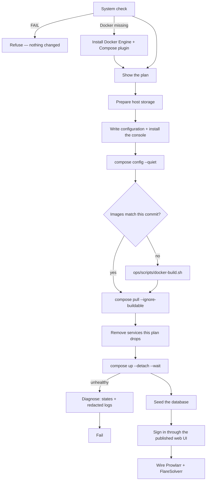

# Guided installer (`ultratorrent-install`)

## Overview

`ultratorrent-install` is a single static binary that does the whole
[Docker Compose install](/install/docker-compose) for you: it inspects the host,
prints the exact plan it intends to apply, generates every configuration file —
secrets included — and then builds, starts, **seeds** and **verifies** the stack.

It exists because a stack that came up is not the same as a working system. The
manual route ends with a list of things still to do: generate five secrets, seed
the database, fetch the engine's first-run password, paste Prowlarr's API key
into Settings, add FlareSolverr as an indexer proxy. Those steps are where
people stop. The installer does them.

:::info It is optional, and it is not magic
Everything it does is documented and doable by hand — that is the
[Docker Compose guide](/install/docker-compose). Nothing here is a different
stack: the installer never forks the project's `docker-compose.yml`. It writes an
`.env` and, only when your choices genuinely need it, a small
`docker-compose.override.yml`, then drives `docker compose` with both.
:::

:::warning The interactive wizard does not exist yet
This build takes its answers from **flags**, not questions. They populate the same
plan object the wizard will, so nothing downstream changes when it lands — but
today an install is a command line, not a conversation.
:::

## Get the binary

**There is nothing to download.** `clients/installer/dist/` is gitignored, no
GitHub Release carries the binary, and no registry serves it. Build it from the
checkout you are about to install from — see [Get UltraTorrent](/install/download).

```bash
cd clients/console   && ./build.sh     # build the console first — the installer embeds it
cd ../installer      && ./build.sh     # → dist/ + dist/SHA256SUMS
./dist/ultratorrent-install-linux-amd64 version
```

```
ultratorrent-install 0.85.9 (e4ebfccd), plan schema v1
console utconsole included (7.8 MB)
```

Building needs [Go](https://go.dev/dl/); running needs nothing at all
(`CGO_ENABLED=0`), so one binary works on a current Debian and on a NAS whose
glibc is years older. Cross-compile on any machine and copy the file across.

:::tip A terminal console rides along
[`utconsole`](/operate/console) is embedded in the installer and written beside
the installation when it deploys — so an install ends with a working read-only
console and no second download. `version` tells you whether one is aboard.
:::

## The three commands

Each is a strict superset of the one above it, and each stops cleanly where it
says it does.

| Command | Touches the host? | What it does |
| --- | --- | --- |
| `plan` | **No** | Runs the system check and prints the review screen. Changes nothing. |
| `generate` | Writes files | Everything `plan` does, then writes the configuration — and deploys nothing. |
| `install` | Deploys | Everything `generate` does, then builds, starts, seeds and verifies the stack. |

```bash
ultratorrent-install plan     --repo /opt/src/ultratorrent
ultratorrent-install generate --repo /opt/src/ultratorrent
ultratorrent-install install  --repo /opt/src/ultratorrent
ultratorrent-install install  --repo /opt/src/ultratorrent --dry-run   # full preview
```

`generate` is genuinely useful on its own: you get correct, complete
configuration — generated secrets, a pre-seeded engine, the right Compose
profiles — without handing the installer control of your stack. It ends by
printing the two commands to run yourself.

:::warning `--repo` is never guessed
Deriving the checkout directory is how an installer attaches itself to a stack it
did not create. A missing or wrong `--repo` is a refusal that names the file it
expected, not a best effort.
:::

## The shortest real install

```bash
# on the host, from anywhere
ultratorrent-install install \
  --repo /opt/src/ultratorrent \
  --media-root /srv/ultratorrent/media \
  --puid 1000 --pgid 1000 \
  --prowlarr --flaresolverr
```

That gives you: the core stack, bundled qBittorrent with credentials already
seeded, a host media directory owned by uid/gid 1000, Prowlarr and FlareSolverr
deployed **and wired into UltraTorrent**, the database seeded, and a sign-in
proven through the published web UI before it claims success.

Run it with `--dry-run` first. It costs seconds and shows you the storage
inspection, which is where most surprises live.

## Flags

| Flag | Default | Notes |
| --- | --- | --- |
| `--dry-run` | off | Produce and show everything, change nothing. |
| `--output FILE` | — | Write the plan as JSON (mode `0600`, never contains secrets). |
| `--json` | off | Print the plan as JSON instead of the review screen. |
| `--target OS` | this host | `linux` or `windows` — see [Windows](#windows). |
| `--install-dir PATH` | `/opt/ultratorrent` | Where `.env`, the override, state, engine config and the console live. |
| `--repo PATH` | `.` | The checkout holding `docker-compose.yml`. |
| `--port N` | `8080` | Host port for the web UI — the only core port published. |
| `--engine NAME` | `qbittorrent` | `qbittorrent`, `rtorrent`, `external`, `none`. |
| `--external-url URL` | — | Required by `--engine external`. |
| `--media-root PATH` | — | Host path behind `/downloads`. Omit for a Docker `downloads` volume. |
| `--puid N` / `--pgid N` | unset | Ownership for downloaded files. Give one and the other mirrors it. |
| `--public-url URL` | — | The address people will type; becomes `CORS_ORIGIN`. |
| `--bundled-proxy` | off | Deploy the bundled Caddy proxy. Takes ports 80 and 443. |
| `--prowlarr` | off | Deploy Prowlarr **and connect it** to UltraTorrent. |
| `--flaresolverr` | off | Deploy FlareSolverr. Requires `--prowlarr`. |
| `--publish-prowlarr` | off | Publish Prowlarr's Web UI. It starts with **no authentication**. |
| `--no-publish-webui` | off | Keep the engine's Web UI off the host network. Needs Compose ≥ 2.24. |
| `--rebuild` | off | Build the images even when they already match this checkout. |
| `--skip-checks` | off | Skip the system check. Planning only — `install` always checks. |

### `--puid` / `--pgid`

Set these to the **owner of your media directory**. They apply to the bundled
engine *and* to the backend, which writes into the same tree — set only one side
and files land where the other cannot manage them. Passing one flag without the
other mirrors it, because a half-set pair is almost always a typo.

### `--publish-prowlarr`

:::danger Prowlarr's Web UI has no authentication when published
This is off by default on evidence, not caution. Measured against Prowlarr 2.4.0
there is no authentication setting that is both safe and usable for a published
UI: *disabled for local addresses* serves it unauthenticated through the
published port, because every request that way arrives from the Docker gateway —
a private address — and enabling authentication redirects to a login page with
no way to create an account.

On the internal Docker network the API key is the only credential that matters,
and UltraTorrent has it. Publish only if you understand that anyone who can reach
that port owns your indexer configuration.
:::

## The system check

Read-only, and on `install` it runs **before** the plan is printed — a plan is
not worth reviewing on a host that cannot run it.

```
System Check

  Operating system  Ubuntu 26.04 LTS       OK
  Architecture      amd64                  OK
  Privileges        dayala (sudo)          OK
  Docker            not installed          WILL INSTALL
  Docker Compose    not installed          WILL INSTALL
  Memory            7.2 GB                 OK
  CPU               4 core(s)              OK
  Disk free (/opt)  128 GB                 OK
  Docker registry   reachable              OK
  Port 8080         UltraTorrent web UI    OK
  Port 8081         qBittorrent web UI     OK
  Compose file      docker-compose.yml     OK
```

- **The ports come from your plan**, so the check tests what *this* installation
  will bind rather than a hard-coded list. A port held by this installation's own
  containers reads OK, not FAIL — re-running over a stack that is already up is
  the ordinary way to fix one.
- **`WILL INSTALL` is a promise it keeps.** On Debian or Ubuntu it installs
  Docker Engine and the Compose plugin from Docker's own repository, step by
  named step, falling back to `get.docker.com` for a release whose codename
  Docker has not packaged yet. `apt` runs fully non-interactive — an installer
  that stops at a conffile prompt hangs forever unattended.
- **Docker ≥ 20.10 and Compose v2 ≥ 2.0** are hard floors. Compose v1
  (`docker-compose`, hyphen) fails outright.
- **Memory, CPU and disk are advisory and never block** — warnings below 2 GB
  RAM, 2 cores, or 10 GB free. The project documents no minimum, and inventing
  one would refuse installs that work.
- **An unreachable registry is fatal**, and the finding distinguishes "DNS did
  not resolve" from "DNS resolved, connection did not complete", because the
  fixes are unrelated.

Anything at `FAIL` stops the run with *nothing changed*.

## The plan

The review screen is rendered from the same object the executor applies, so it
cannot describe something else.

```
Installation Plan

UltraTorrent
  Target        linux
  Install path  /opt/ultratorrent
  Web port      8080

Torrent engine
  qBittorrent (bundled)

Core services
  PostgreSQL  internal only
  Redis       internal only

Storage
  Media root  /srv/ultratorrent/media (host path)

Optional services
  Prowlarr       yes
  FlareSolverr   yes
  Bundled proxy  no

Security
  Database password  generated
  JWT secrets        generated
  Encryption key     generated
  Admin password     generated

Compose profiles
  qbittorrent, prowlarr, flaresolverr

Ports published on this host
  8080  UltraTorrent web UI
  8081  qBittorrent web UI
```

`--output plan.json` saves the same thing as JSON for review, diffing or version
control. **A plan never contains secrets** — a test asserts it by marshalling a
populated plan and searching for the values — and it is still written `0600`,
because it describes the topology of your server.

Validation is *pure*: it answers "is this plan internally coherent" — colliding
ports, an external engine with no URL, FlareSolverr without Prowlarr, a relative
install directory, a `--public-url` with no scheme — and reports **every**
problem rather than the first.

## What it writes

Everything lands in the installation directory (default `/opt/ultratorrent`),
never in your checkout. The repository's `docker-compose.yml` is untouched.

| File | Mode | Written when |
| --- | --- | --- |
| `.env` | `0600` | Always — ports, database, Redis, four generated secrets, the initial administrator, `COMPOSE_PROFILES` |
| `docker-compose.override.yml` | `0644` | Only when your choices need it (a bind-backed media root, the bundled proxy, an unpublished Web UI). Removed again when a later run no longer needs it |
| `qbittorrent/qBittorrent.conf` | `0644` | `--engine qbittorrent` — credentials pre-seeded, so no temporary password is ever issued |
| `engine-credentials.txt` | `0600` | With the above — the engine's sign-in, and what to give UltraTorrent |
| `prowlarr/config.xml` | `0644` | `--prowlarr` — carries the API key the wiring step uses |
| `Caddyfile` | `0644` | `--bundled-proxy` |
| `installer-state.json` | `0644` | Always — the non-secret shape of the deployment, carried forward across runs |
| `utconsole` + launcher | `0755` | When a console is embedded |

:::tip `COMPOSE_PROFILES` is written into `.env` on purpose
Docker does **not** remember `--profile` between commands, so a later plain
`docker compose up -d` in that directory would *stop* your engine and companions.
Setting it in `.env` means every ordinary Compose command brings up the same stack
the installer deployed.
:::

:::danger The administrator password is never printed
It is in `.env` at mode `0600`. Echoing it would put it in your scrollback, in a
terminal recording, and in whatever you paste into an issue. Read it from the
file, and change it after the first sign-in.
:::

**Storage is prepared before anything else.** A bind-backed volume whose device
does not exist does not fail at `compose config` and is not created on demand —
the *container* fails to start, with an error naming an internal Docker path and
no hint that a host directory is missing. So directories are inspected in full
first (three problems should surface as three, not one failed run at a time),
then created, then everything else happens.

## What `install` actually does



The ordering is not arbitrary:

- **`config --quiet` first** catches a malformed override or an unresolvable path
  in a second; the same failures cost minutes once half a stack is up.
- **The build is skipped only when it provably need not run**: the checkout is a
  git repository with a resolvable HEAD, the working tree is **clean**, the
  backend image records that same commit, and the frontend image exists. Every
  uncertainty resolves towards building. `--rebuild` forces it.
- **`pull --ignore-buildable`**, because the backend and frontend have no
  published image — asking a registry for them would fail every time. A pull
  failure is not fatal; images already present locally are enough.
- **Services your new plan drops are removed before `up`**, not after. Left
  alone, an engine from a previous plan keeps writing to the same `/downloads`
  volume and holds the Web UI port the new one is about to ask for. Their data is
  kept.
- **`up --detach --wait`** lets each image's own `HEALTHCHECK` define healthy. On
  failure the installer *diagnoses* — service states plus the last 40 log lines —
  because "something did not become healthy" is not a cause, and the real one
  (usually a failed migration) lives only in the logs. Output is redacted with
  the **real** secret values, not a pattern guessing their shape.
- **Seeding is separate from starting.** The backend's `CMD` applies migrations
  and stops there; without the seed you get a complete schema, no users at all,
  and every sign-in failing.
- **Sign-in is verified through the published web UI**, not the backend's
  loopback. Checking the API against itself once certified a deployment whose UI
  returned 502 to every request. A deployment is usable when its front door opens.
- **Companion wiring never fails the deployment.** A running stack you can sign
  into beats tearing one down over an indexer manager that still needs connecting
  by hand — so a wiring failure is reported with enough detail to finish it in
  **Settings → Integrations**.

## Re-running it

Re-running over an existing installation is safe, and is the normal way to change
something — turn on Prowlarr, move the media root, change the port.

:::danger Secrets are preserved, never regenerated
Regenerating against a live deployment is catastrophic and quiet: the database
password stops matching the volume that already holds your data, every session is
invalidated, and a changed `ENCRYPTION_KEY` makes every stored two-factor secret
undecryptable. An existing `.env` is read and its secrets reused — and the
installer says so out loud: `Existing secrets found in .env and kept unchanged.`
:::

If those secrets are *unusable* — too short, or not distinct, the constraints the
backend enforces at boot — the installer refuses rather than deploying a stack
that will fail to start for a reason you never chose. Move the file aside for a
fresh set.

`up` is a no-op when nothing changed: no `--force-recreate`, no
`--renew-anon-volumes`, no `-V`. And nothing in the deploy path can delete data —
it uses `stop`, never `down`, and never passes `-v`.

Prowlarr's API key is recovered from its own `config.xml` when a re-run did not
generate one, which is what lets you enable a companion on an installation whose
secrets are being reused.

## Windows

`--target windows` **plans** but does not **generate**.

A plan is a document, so authoring, printing, saving, diffing and reviewing a
Windows installation from any machine all work, and validation applies Windows
path rules to it. Generation refuses, with the reason: every volume this
installer writes binds a host path through Docker's local driver
(`driver_opts: { type: none, o: bind, device: … }`), which is a Linux `mount(2)`
performed *inside* the Docker VM. `D:\Media` is not a path in there. Emitting
that YAML for a Windows host would produce a stack that comes up and silently
stores everything in the wrong place — the worst available outcome, and the
reason it refuses instead.

The Windows binary is still built by the same command as every other platform, so
a change that breaks the Windows build breaks the build script rather than being
discovered on someone's laptop.

## Troubleshooting

| It says | What it means | Fix |
| --- | --- | --- |
| `this host cannot run UltraTorrent yet` | The system check has a FAIL. Nothing was changed. | Resolve the named findings and re-run. |
| `Compose file: not found in <dir>` | `--repo` does not point at a checkout holding `docker-compose.yml`. | Pass the checkout directory. |
| `the generated configuration is not valid` | `docker compose config` rejected the merged file set. | Read the quoted first line — usually a hand-edited override. |
| `the stack did not become healthy` | A service never reached healthy within 5 minutes. | The diagnosis below it carries each unhealthy service's state and last 40 log lines. Migration failures surface here. |
| `the deployment is running but not usable` | Healthy, but sign-in through the web UI failed. `502` means the UI cannot reach the API. | Check the frontend proxy and the backend's health. |
| `the secrets in .env are not usable` | An existing `.env` holds secrets the backend would reject at boot. | Fix them in place, or move the file aside. |
| `plan schema N is not supported` | The plan JSON came from a different installer version. | Use the installer that wrote it, or re-plan. |
| `Prowlarr is deployed but its API key is unknown` | Wiring could not run. The deployment itself is fine. | Connect it under **Settings → Integrations**. |

The console installed alongside is the fastest way to see what a struggling
install is doing — run `<install-dir>/utconsole`, and see
[Terminal console](/operate/console).

## Checklist

- [ ] `ultratorrent-install version` runs and reports a console aboard
- [ ] `plan --repo <checkout>` shows a system check with no `FAIL`
- [ ] The review screen's ports, media root and profiles are what I intended
- [ ] `install --dry-run` shows the storage actions I expect
- [ ] `install` ended with `sign-in verified through …`
- [ ] I read the administrator password out of `<install-dir>/.env` and changed it
- [ ] `<install-dir>/engine-credentials.txt` exists (bundled qBittorrent)
- [ ] Prowlarr shows as connected under **Settings → Integrations** (if deployed)
- [ ] `<install-dir>/utconsole` starts

## FAQ

**Do I have to use it?**
No. The [Docker Compose guide](/install/docker-compose) is the authoritative
install and always will be.

**Can I run it unattended?**
Yes — it never prompts. Every answer is a flag, and `apt` runs non-interactive
when it installs Docker.

**Will it overwrite my hand-tuned `.env`?**
It rewrites `.env` from the plan, but **reuses the secrets already in it**.
Non-secret values you edited by hand are regenerated from the plan, so pass them
as flags instead of editing the file.

**Can I use it against an install I created by hand?**
Point `--install-dir` at the directory holding that `.env` and it will adopt the
secrets. But note the installer always uses the Compose project name
`ultratorrent`, with no flag to change it — if your hand-made stack runs under a
different project name (Compose derives it from the folder you ran it in), you
will get a *second* stack rather than the one you have. Check `docker compose ls`
first.

**Does it prune images or clean up disk?**
No. It removes containers for services your new plan drops (keeping their data)
and nothing else. Pruning is yours: `docker image prune -f`.

**Does it upgrade an install?**
Re-running it against a newer checkout rebuilds and restarts, which is most of an
upgrade — but read [Upgrading & rollback](/install/upgrading) first for the
backup and migration story.

**Does it work on Synology, QNAP or Unraid?**
It is a Linux binary that needs Docker, a shell, and a persistent directory — so
yes in principle, and the console-beside-the-installation design exists because of
QTS's RAM-backed root filesystem. Your [platform page](/install/platforms/linux)
still owns the host-specific deltas.

## See also

- [Get UltraTorrent](/install/download) — how to obtain the source it installs from
- [Docker Compose install](/install/docker-compose) — the same install, by hand
- [Choose your install method](/install/) — which route fits your host
- [Terminal console](/operate/console) — `utconsole`, which it installs for you
- [Prowlarr](/modules/prowlarr) — the companion it wires
- [Upgrading & rollback](/install/upgrading)
- [Troubleshooting](/operate/troubleshooting)
