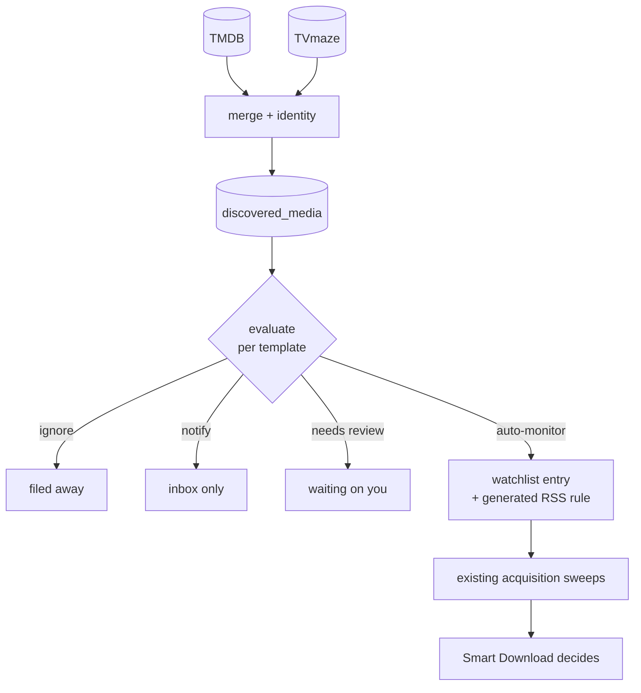

# Media Discovery

## Overview

Media Discovery answers one question: **what should UltraTorrent be monitoring?**

It finds upcoming films and new or returning series from metadata providers, decides which of them are worth watching for, and turns the qualifying ones into a **watchlist entry** plus a **generated RSS rule**. Everything after that belongs to systems that already existed — the acquisition sweeps monitor the watchlist, and [Smart Download](/modules/smart-download) decides whether any particular release is worth taking.

:::danger Discovery never downloads anything
It does not score releases, does not talk to an indexer, and has no opinion about whether a given file is good enough. There is exactly **one** match engine and **one** acquisition decision engine in this product, and Media Discovery is neither of them. If it ever appears to need one, the answer is to call the existing engine — not to grow a second.
:::

## Why / when to use it

The rest of the acquisition stack is **reactive**: something must appear in a feed before anything happens. That works well for a show you already follow, and not at all for a film that comes out in three months.

Use Media Discovery when you want to stop finding out about releases after the fact. Typical shapes:

- *"Monitor every new Sci-Fi series in English, but only tell me about documentaries."*
- *"Follow films once they reach **digital** release, not when they hit cinemas."*
- *"Show me what is coming, and let me pick — automate nothing."* (A perfectly good configuration; see the `notify` decision.)

If you would rather add every title by hand, you can leave this module off forever and lose nothing else.

## Prerequisites

- **[Media Manager](/modules/media-manager)** and **[Smart Download](/modules/smart-download)** enabled — Discovery declares both as hard dependencies, along with `media_intake` and `rss`.
- **At least one RSS feed**, because a generated rule must belong to one.
- **A storage profile**, which decides where matched media is staged and filed.
- **A TMDB API key** if you want film coverage. It is the same key Media Manager uses; TVmaze needs no credentials.

## Nothing happens until you say so

There are **three doors** between a fresh install and an automatic download, and all three are shut:

1. **The module is disabled.** Media Discovery is the only module that ships `enabledByDefault: false`. Enabling it is you saying the system may acquire media on its own, and a module that arrived switched on would make that an accident rather than a decision.
2. **Providers are silent.** No third-party call is made until you enable a provider. A fresh install contacts nobody.
3. **Templates are disabled.** A template is saved off and must be explicitly enabled, after you have previewed what it would do.

:::info "Disabled by an administrator"? No.
Because this module ships off, a fresh install shows it disabled with the reason **"off by default — never enabled on this installation"**. That is the intended resting state, not a fault, and not something an administrator did. See [Module state](/modules/#module-state).
:::

## Concepts

| Term | Meaning |
|------|---------|
| **Discovered title** | A merged record of one work, assembled from every provider that reported it. |
| **Discovery template** | A standing instruction deciding *what to monitor*. |
| **Acquisition rule template** | An ordered ladder deciding *which release characteristics* are preferred, once something is monitored. |
| **Decision** | What the evaluator concluded for one title under one template: `auto_monitor`, `notify`, `needs_review`, `ignore`, or `not_applicable`. |
| **Identity confidence** | How sure the engine is about *what a title is* — measured from external ids, not from how rich the metadata looks. |
| **Generated rule** | An RSS rule Discovery created, stamped with the template and title it came from. |

The two kinds of template are separate because the questions are separate. *"Is this show worth following"* and *"which of these six releases do I want"* have different answers and different audiences.

## How it works



Two schedules drive it, both on the platform's existing scheduler:

| Job | Interval | What it does |
|-----|----------|--------------|
| `media_discovery_provider_sync` | hourly tick; refreshes a given provider every 6 h | Pulls catalogues, merges, stores. **Decides nothing.** |
| `media_discovery_evaluate` | hourly | Runs enabled templates over stored titles and acts on the results. |

A catalogue refresh writes rows and updates counters. It cannot, by itself, cause an acquisition — that separation is why a sync can run on a schedule without anyone worrying about what it might start.

### Identity, and why it gates everything

Titles arrive from more than one provider and must be merged into one record. The merge treats **a shared external id as proof**, a **contradicted id as proof of the opposite**, and **title + year as a hint** that may only join records from *different* providers.

Confidence measures identity, **not** metadata richness. A record with a full synopsis, a poster and 5,000 votes but no external id scores `0.1`, because it is still unidentified.

You can lower the confidence floor. You **cannot** configure past an *ambiguous* identity — two works genuinely sharing a title and year are held for review no matter what. TMDB carries three separate 2026 films called *The Odyssey*; a wrong external id would propagate into duplicate detection and every downstream lookup, while an unmonitored title merely waits for you.

## Configuration

### Enable the module

**System → Modules → Media Discovery.**

### Enable a provider

**Media Acquisition → Discover → Providers.**

| Provider | Covers | Credentials |
|----------|--------|-------------|
| **TVmaze** | Television | None |
| **TMDB** | Films and television | Reuses the Media Manager API key |

Providers report three states, and only one is a fault:

| State | Meaning | What to do |
|-------|---------|-----------|
| **Not configured** | No credential on this installation | Follow the hint on the card |
| **Configured but off** | Silent by choice — the normal fresh-install state | Nothing |
| **On and unhealthy** | The catalogue refresh failed | Read the failure reason on the card |

Health comes from what the last sync recorded, **not** from probing when you open the page. A page load must never wait on a third party, and a transient blip is not a provider's condition.

**A failed refresh keeps the previous catalogue.** "We could not ask" and "nothing is coming out" are very different claims.

### Build a template

The full field-by-field guide is in the repository at `docs/MEDIA_DISCOVERY_TEMPLATES.md`. The parts worth knowing before you start:

**The category policy is four lists, not one.** A single allow-list cannot express *"tell me about Drama but never add it on its own"*, which is what most people actually want.

| List | Effect |
|------|--------|
| **Monitor automatically** | Watchlist entry + acquisition rule, unasked |
| **Tell me only** | Appears in the inbox. Nothing is created. |
| **Hide** | Filed away so the same unwanted title stops reappearing |
| **Never automatically** | **Beats every list above** |

A title tagged *Sci-Fi + Documentary* is not auto-monitored when Documentary is on the "never" list, however well Sci-Fi qualifies — but it is still shown, so you can add it by hand.

Two rules the form enforces: **Monitor and Hide may not overlap** (opposite verdicts, no defensible reading), and **a title with no categories at all never matches under any mode** — much of the TVmaze schedule is untagged daily news and talk, and "every category qualifies" is vacuously true of an empty list.

**Release types matter more than they look.** "Films once they reach streaming" is a different query from "films in cinemas", and the digital date is often a year after the theatrical one. Scoping by region matters for the same reason: release dates are per-country, and without a region a single foreign TV airing can qualify a five-year-old film.

**Thresholds demote, they do not drop.** A title below your popularity or rating floor becomes `notify` rather than vanishing — it is the right kind of title, just not one to add automatically. **An unknown value fails a threshold**; treating unknown as satisfied would let every title with thin metadata through the one gate set to hold things back.

**Filter by where a show airs.** Networks, streaming services and studios are **alternatives, not requirements** — a title carries at most one or two of the three, so requiring all of them would match nothing. A title qualifies if *any* named source carries it, and leaving all three empty accepts any source.

The form suggests the values your catalogue actually holds, and that matters: these are matched against what a **provider wrote**, so typing `AppleTV` when TMDB says `Apple TV` produces a filter that silently matches nothing. Matching is case-insensitive, and a title with no network at all cannot satisfy a list that names specific ones.

**Automation is optional.** Switch off *"monitor matching titles automatically"* and every qualifying title is held in **Needs review** instead, where you decide. Importing one from there runs the **same** creation path an automatic monitor takes — watchlist entry, generated rule with its full ladder and target path, intake directory — so an approved title is configured identically to one the engine acted on itself.

### Preview before enabling

Preview runs the **real evaluator** — not a copy of the rules, which would drift from them invisibly — over the catalogue you already have, and writes nothing.

```
If this template ran now, over 870 discovered titles:
   50 would be automatically monitored
   24 would generate notifications
  233 would be ignored
   13 would need review
  550 are outside this template

20 of these would be held for review — your weekly limit is 30.
```

That last line is the reason to preview before enabling rather than after. Limits are **projected, not applied** in a preview: folding the budget into the evaluation would make every title past the tenth read as "needs review" and hide the shape of the policy you are actually tuning.

## Managing the catalogue

### Removing a title

Every card carries a **Remove** action, and the dialog asks what you mean — because "remove this show" means three different things:

| Scope | Removes |
|-------|---------|
| **From the catalogue only** | The discovered title and its evaluations. Monitoring keeps running. |
| **…and stop monitoring it** | Also the generated RSS rule, and archives the watchlist entry. |
| **…and delete the library media** | Also the media items, their artwork, subtitles and NFO sidecars — optionally the torrent and its data. |

The dialog shows **what each scope would actually take** before you confirm, from the server's own plan. The least destructive scope is the default; escalating is a deliberate second click.

:::danger Library media is matched by external id only
Title-and-year is good enough to group a listing and nowhere near good enough to delete by — two films genuinely share a title and year. A title carrying no external id reports that it cannot be identified, and its files are left alone.

Files are moved to **Trash** through the same path-safe service the File Manager uses, not unlinked. There is no second deletion path.
:::

**A removed title does not come back.** Its identity is recorded as a *suppression* and checked on every sync — otherwise the next catalogue refresh re-creates it within six hours and the deletion reads as a bug.

### Editing a template re-decides the catalogue

An edit that changes **policy** — categories, thresholds, scope, or the destination a rule is built from — clears that template's decisions, so every stored title is judged again. Renaming a template, or merely enabling and disabling it, does not.

**Refresh catalogues** fetches from the providers *and* re-evaluates everything, then reports what changed. That is the button you press after an edit.

### Titles that stop matching

When a re-evaluation finds an auto-monitored title no longer qualifies, its monitoring is **withdrawn**: the generated rule deleted, the watchlist entry archived, and — if the title is now out of scope or explicitly ignored — it leaves the catalogue. Every retraction notifies you, because it undoes something done on your behalf.

Four things retraction never does:

- **It never deletes media or torrents.** It runs from a background sweep that fired because somebody edited a genre list; deleting 40 GB of episodes as a side effect of that would be unrecoverable and invisible.
- **It never touches a rule you edited.**
- **It never overrules a watchlist entry you paused, archived or completed.**
- **It never tears down a show that is already downloading.** Such a title has outgrown the catalogue anyway, so it *graduates* instead — see below.

:::note Time passing is never a reason to stop monitoring
The release window, the premiere gate and the automatic-monitoring switch are **admission** controls. They decide whether to *start* following a show, and are not re-applied to one already monitored.

A monitored show's premiere moves into the past on its own. Re-asking then answers "no" for the one thing guaranteed to happen to every show — and that answer reaches the retraction path, deleting the rule of a series that was downloading correctly, mid-season. Read as a retention test the automation switch is worse still: unchecking *"monitor matching titles automatically"* would return every monitored title to review and dismantle everything the template ever created.

Everything else about a template **is** re-applied. A category you removed, a network you dropped or a language that no longer qualifies are real answers about the title, and monitoring ends.
:::

### A show that starts downloading leaves the catalogue

**Once a monitored show grabs its first release, it leaves Media Discovery.** The discovery record goes; its acquisition rule and watchlist entry are untouched, and it keeps downloading exactly as before. From that point it is an ordinary acquisition, managed from **RSS Feeds**.

This is the catalogue answering its own question. Discovery exists to decide *what to start following*; once a show is downloading that is settled, and keeping the row would make the monitored list a mix of two different things — shows waiting to begin, and shows already running. Only the first kind is still a decision anybody has to make.

| What goes | What stays |
|---|---|
| The discovery record, its evaluations and release dates | The generated RSS rule, enabled and unchanged |
| Its place in the catalogue | The watchlist entry |
| | Every downloaded file and torrent |

"Grabbed its first release" means the rule actually pulled something — evidence, not an inference from a date.

The title is also **suppressed**, with the reason `graduated`. Without that, the next provider refresh re-lists the show and a series you are already downloading reappears as a fresh find. It is not a rejection, and the distinct reason is what lets the suppressions list say *you already have this* rather than *you said no to this*.

Graduations are announced, because a show quietly vanishing from Discover otherwise reads as a fault.

## Match preferences are required for auto-monitoring

A discovery template that auto-monitors anything **must** reference a match preference profile with at least one enabled rung. The generated rule then carries the whole ladder — every rung in order, the template-wide required and excluded terms merged into each, quality and size rules intact — enabled and staged through managed intake, ready to acquire the moment an acceptable release appears.

:::danger A rule with no match preferences matches nothing
An RSS rule is filtered by its match candidates if it has any, and by its include/exclude regex otherwise. A rule with **neither** is treated as matching nothing — deliberately, so a filterless rule cannot grab an entire feed. Discovery never sets a regex.

A template without match preferences therefore used to produce a rule that was enabled, auto-downloading, and permanently inert, with nothing indicating a fault. It is now validated when the template is enabled and again when the rule is written, and a template that cannot build a working rule holds its titles for review instead of creating monitoring that looks complete and does nothing.
:::

:::note Languages are matched canonically
Providers disagree about what a language is called — TMDB stores `en`, TVmaze stores `English` — and both end up in the same catalogue. Template languages are compared through a canonical form, so naming either matches a title stored as the other. A language nothing recognises still matches itself, and a title whose provider gave no language cannot satisfy a list that names specific ones.

A title a template judged and found out of scope reads **Outside this template**, with the reason. Only a title no template has reached yet reads *Not evaluated*.
:::

## The inbox

Every card carries **the reason it is there**. A discovery engine that silently monitors things is one you can neither trust nor correct.

| State | Meaning |
|-------|---------|
| **Monitored** | A watchlist entry and an acquisition rule exist, and nothing has been grabbed yet. Acquisition is now the existing engine's job. |
| **Notify** | Surfaced for you. Nothing was created. |
| **Needs review** | The engine *would* have acted and could not safely — an unresolved identity, an ambiguous one, providers disagreeing about a premiere date, the automatic-add limit already spent, or automatic monitoring switched off for the template. |
| **Ignored** | Not what the template is looking for. Filed so it stops reappearing. |

A monitored title leaves this list for good once it grabs its first release — see [A show that starts downloading leaves the catalogue](#a-show-that-starts-downloading-leaves-the-catalogue).

**Needs review is not notify.** One says "you might want this"; the other says "we nearly did something and stopped." They are triaged differently, which is why they are separate.

**Monitored reads chronologically.** The Monitored view is sorted soonest release first and grouped under month headings — *September 2026*, *October 2026* — so you can see what is premiering when. Titles without an announced date come last. The month is taken from the same date shown on the card, in your own time zone. The other views stay newest-discovery first.


## What it tells you

**One notification per run, not one per title.** An evaluation that monitors fifteen shows sends a single message listing all fifteen — every one of them answered by the same visit to the inbox, so fifteen separate mails would be noise rather than information.

Each title in that message carries enough to be judged without opening the app: **poster, synopsis, network, premiere date, rating and genres**. A digest that named no titles would send you to the app to find out what it was about, which defeats the point of sending it.

| Notification | When |
|---|---|
| **Now monitoring** | Titles were monitored automatically this run. |
| **Needs your review** | Titles were held. Each carries *its own* reason — an unresolved identity and an exhausted allowance are different problems with different answers. |
| **Stopped monitoring** | Titles stopped matching and were withdrawn. It names every one, because a show quietly no longer being acquired is a question waiting to be asked. |
| **Now downloading on its own** | Titles grabbed a first release and left the catalogue. |

At most 20 titles are listed in one message; the count is always the run's real total, and the message says how many it did not list. Showing the first twenty of two hundred as though that were everything would be a lie of omission.

Where these arrive — in-app, email, Telegram, Discord — is per-recipient and set in **Notifications**. Posters render in email; other surfaces show the same titles and text.

## Limits

`autoAddLimitPerDay` (default 10) and `autoAddLimitPerWeek` (default 30) pace acquisition. They use **rolling windows**, not calendar days: "10 per day" means no more than ten in any 24 hours, because a calendar boundary lets twenty land across midnight — the exact burst the limit exists to prevent.

**The limit paces new acquisition, and only new acquisition.** A title this template already monitors does not compete for the allowance again, and the budget is spent only when a watchlist entry is actually *created* — not when an existing one is found and left alone.

Both halves matter because a policy edit clears every decision, so a re-evaluation re-judges the whole catalogue. Without them, an install with 17 monitored shows and a limit of 10 pushed the seven that came last into **Needs review** reading *"Automatic-add threshold reached"* while they were still being monitored.

- **An over-budget title is held for review, never dropped.** The limit paces acquisition; losing the title would be a different and worse feature.
- **Only additions that actually happened count.** A decision whose rule generation then failed produced no monitoring, so it does not spend budget — otherwise a run of failures would silently exhaust the allowance.
- **A limit of `0` means none**, not unlimited.
- A weekly cap below the daily cap is refused: the daily allowance would be exhausted first every time.

## What protects your work

- **A rule you edit becomes yours.** The first time a person edits a generated rule, `userModifiedAt` is stamped and never cleared. Template re-application only touches generated rules where it is null.
- **Name collisions are never resolved by adoption.** If a generated rule's name would collide with one you made, Discovery skips generation, links the watchlist entry to *your* rule, and reports why.
- **It will not reactivate something you paused.** A `paused`, `archived` or `completed` watchlist entry is a decision you made, and a background sweep that undid it would be indistinguishable from a bug.
- **Rules a person has taken over are listed, not hidden**, so a template change can tell you what it deliberately did not touch.

## Permissions

| Permission | Grants |
|------------|--------|
| `media_discovery.view` | Read the inbox, templates and provider status |
| `media_discovery.manage` | Act on the inbox; run an evaluation |
| `media_discovery.templates.manage` | Author templates; run previews |
| `media_discovery.providers.manage` | Enable providers; request a sync |

Read-only and ordinary users get `view`; power users add `manage`; administrators get all four. Seeing what was discovered and deciding that the system may acquire media on its own are deliberately different privileges.

## API

Base path `/api/media-discovery`. **No endpoint calls a provider** — a sync is queued against the background service and the inbox reads the database, so a page load never waits on TMDB.

| Method | Path | Permission |
|--------|------|-----------|
| `GET` | `/providers` | `view` |
| `POST` | `/providers/:name/enable` | `providers.manage` |
| `GET` | `/inbox` | `view` |
| `GET` | `/items/:id` | `view` |
| `GET` | `/items/:id/removal-plan` | `view` |
| `DELETE` | `/items/:id` | `manage` |
| `GET` | `/suppressions` | `view` |
| `DELETE` | `/suppressions/:dedupeKey` | `manage` |
| `GET` `POST` `PATCH` `DELETE` | `/templates` | `view` / `templates.manage` |
| `GET` `POST` `PATCH` `DELETE` | `/acquisition-templates` | `view` / `templates.manage` |
| `GET` | `/template-options` | `templates.manage` |
| `POST` | `/preview` | `templates.manage` |
| `POST` | `/sync` | `providers.manage` |
| `POST` | `/evaluate` | `manage` |

## Troubleshooting

| Symptom | Cause | Fix |
|---------|-------|-----|
| Nothing appears in the inbox | No provider is enabled, or no sync has run yet | Check the **Providers** tab; use **Refresh catalogues** |
| TMDB says *Not configured* | Discovery reuses the Media Manager TMDB key | Set one there; the provider registers on the next backend start |
| Everything is in **Needs review** | Weak identities (TVmaze-only shows often carry no IMDb or TVDB id, capping confidence below the 0.8 floor), or the add limit is spent | The reason on each card says which |
| A template monitors nothing | The category policy does not match the genres your providers emit — and a title with **no** categories never matches | Compare against the inbox's actual genre tags |
| A title I wanted was ignored | A template only monitors what it names | Add the category, or add the title by hand |
| It found a film I already have | Discovery does not check your library — it reports what is being *released* | Nothing; the watchlist and Smart Download handle ownership |
| A show I was monitoring vanished from the catalogue | It grabbed its first release and **graduated** — this is normal | Manage it from **RSS Feeds** now; its rule and watchlist entry are untouched |
| Shows that were monitored yesterday are in **Needs review** today | An older build re-charged the daily add limit for titles it already monitored, so a policy edit made them compete again | Update; already-monitored titles no longer consume the allowance |
| Unchecking a template box appears to do nothing | An older build discarded five fields on save — automatic monitoring, premiere eligibility, grace period, past-release and returning-series behaviour | Update; the fix also stops the switch from retracting what is already monitored |
| Monitored shows appear under **Missing Episodes** | An older build scanned unreleased series, and the year-granularity fallback recorded their episodes as `missing` | Update; unreleased shows are no longer scanned, and their episodes arrive through the generated RSS rule |

## Best practices

- **Preview every template before enabling it**, and read the limit projection line.
- **Start with a notify-only template.** Watch what it surfaces for a week before letting anything auto-monitor.
- **Scope films by region and release type.** Without them, a single foreign airing can qualify a five-year-old film.
- **Leave the confidence floor at 0.8** unless you have a reason. Below it you are asking the system to guess at identity.

## Common mistakes

- **Treating "off by default" as a bug.** It is the third of three deliberate doors.
- **Expecting Discovery to grab something.** It creates monitoring. If nothing downloads, the question is for [Smart Download](/modules/smart-download).
- **Putting a category in both Monitor and Hide.** Refused — they are opposite verdicts.
- **Setting a weekly limit below the daily one.** Refused — the weekly figure would never do anything.
- **Assuming a threshold filters.** It demotes to `notify`.

## FAQ

**Does this replace my RSS rules?**
No. It *creates* RSS rules, using the same model a hand-made rule uses. There is one match engine.

**Will it overwrite a rule I changed?**
No. The first edit you make stamps the rule as yours, permanently.

**Can it download a film that has not been released?**
It can create monitoring for one. Whether anything is ever grabbed is Smart Download's decision, against real releases in a real feed.

**Why is a title with a great poster and a full synopsis at 0.1 confidence?**
Because confidence measures *identity*, not metadata. No external id means unidentified.

**Does enabling a provider send it my library?**
No. Providers are read-only catalogue sources; Discovery pulls upcoming-release data and sends nothing about your installation.

**A show disappeared from Discover. Did something break?**
Almost certainly not — it graduated. Once a monitored show grabs its first release the discovery record is removed and the show carries on downloading through its rule, which is untouched. You will have had a *Now downloading on its own* notification saying so.

**Will monitoring stop when a show finally premieres?**
No. The premiere gate decides whether to *start* following something and is never re-applied to a title already monitored — otherwise every show would eventually fail it, for the one reason guaranteed to happen to all of them.

**Why do my monitored shows have no missing episodes listed?**
Because they have not aired. A missing-episode scan asks *"what aired that I do not have?"*, and for an unreleased series the answer is nothing; the episodes arrive through the generated RSS rule as they are released. A part-aired series you import by hand from review **is** scanned, because there the question has a real answer.

**Why one email instead of one per show?**
Because a run that monitors fifteen shows raises one thing to act on, not fifteen. The digest lists every title with its poster and synopsis, so consolidating costs you nothing.

## Checklist

- [ ] Enable the module at **System → Modules**. Expected: the Discover entry appears under Media Acquisition.
- [ ] Enable TVmaze and press **Refresh catalogues**. Expected: the inbox populates within a few seconds; nothing is monitored.
- [ ] Create a template with **Tell me only** categories and preview it. Expected: a non-zero `notify` count, zero `auto_monitor`.
- [ ] Save it enabled and wait for one evaluation. Expected: inbox cards in the `notify` state, no new RSS rules.
- [ ] Switch one category to **Monitor automatically**, preview again. Expected: the projection moves, and the limit line reports what would be held.

## See also

- [Smart Download](/modules/smart-download) — what actually decides on a release.
- [RSS automation](/modules/rss) — the rules Discovery generates, and the feeds they belong to.
- [Media Manager](/modules/media-manager) — libraries, identity and the TMDB key.
- [Module reference](/reference/modules) — the generated manifest entry.
- [Permissions reference](/reference/permissions) — every permission string.
