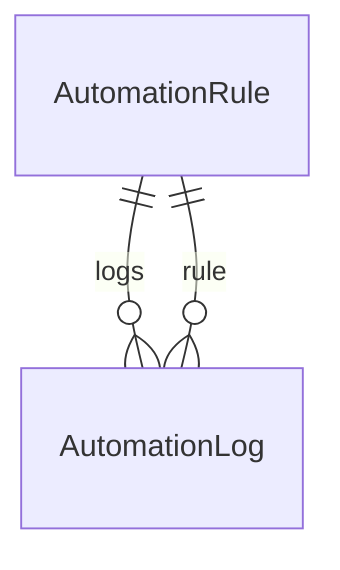
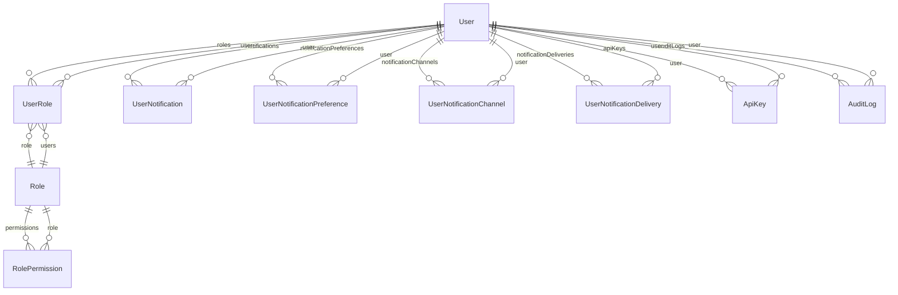
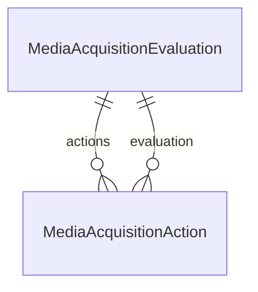
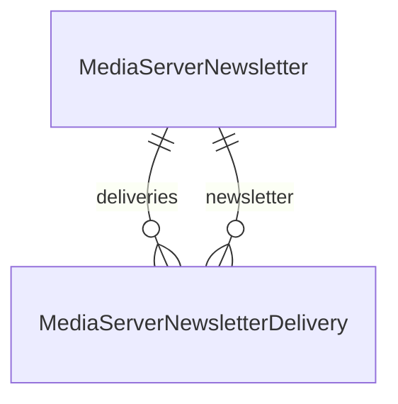
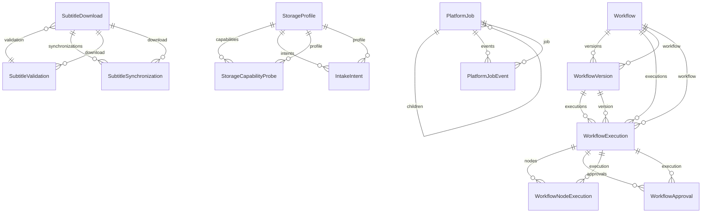
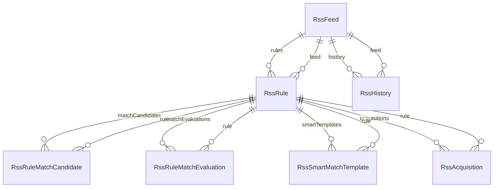
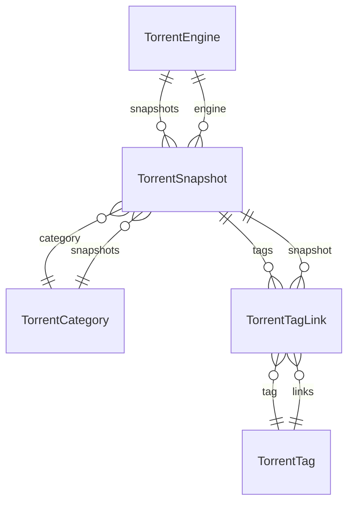

# Database Schema

:::info Auto-generated
This page is generated from `apps/backend/prisma/schema.prisma` at build time. **Do not edit it by hand** — change the source and rebuild. This guarantees the reference always matches the code that ships.
:::

UltraTorrent stores everything in **PostgreSQL**, managed by **Prisma**. There are
**130 models**. A single ER diagram of all of them would be unreadable, so they are
grouped by domain below.

:::tip Never hand-edit the database
Schema changes go through a Prisma migration so every install converges on the same shape.
See [Database & Prisma](/develop/database).
:::

## Automation

_2 models._



### `AutomationRule`

Table: `automation_rules`

| Column | Type |
| --- | --- |
| `id` | `String` |
| `name` | `String` |
| `description` | `String?` |
| `trigger` | `String` |
| `conditions` | `Json` |
| `actions` | `Json` |
| `isEnabled` | `Boolean` |
| `priority` | `Int` |
| `createdAt` | `DateTime` |
| `updatedAt` | `DateTime` |

### `AutomationLog`

Table: `automation_logs`

| Column | Type |
| --- | --- |
| `id` | `String` |
| `ruleId` | `String` |
| `status` | `String` |
| `context` | `Json` |
| `message` | `String?` |
| `createdAt` | `DateTime` |

## IMDb catalogue

_8 models._

```mermaid
erDiagram
```

### `IMDbTitle`

Table: `imdb_titles`

| Column | Type |
| --- | --- |
| `id` | `String` |
| `tconst` | `String` |
| `titleType` | `String` |
| `primaryTitle` | `String` |
| `originalTitle` | `String` |
| `isAdult` | `Boolean` |
| `startYear` | `Int?` |
| `endYear` | `Int?` |
| `runtimeMinutes` | `Int?` |
| `genres` | `String[]` |
| `createdAt` | `DateTime` |
| `updatedAt` | `DateTime` |

### `IMDbAka`

Table: `imdb_akas`

| Column | Type |
| --- | --- |
| `id` | `String` |
| `titleId` | `String` |
| `title` | `String` |
| `region` | `String?` |
| `language` | `String?` |
| `types` | `String?` |
| `attributes` | `String?` |
| `ordering` | `Int?` |
| `isOriginalTitle` | `Boolean` |

### `IMDbCrew`

Table: `imdb_crew`

| Column | Type |
| --- | --- |
| `id` | `String` |
| `titleId` | `String` |
| `directors` | `String[]` |
| `writers` | `String[]` |

### `IMDbEpisode`

Table: `imdb_episodes`

| Column | Type |
| --- | --- |
| `id` | `String` |
| `episodeTitleId` | `String` |
| `parentTitleId` | `String` |
| `seasonNumber` | `Int?` |
| `episodeNumber` | `Int?` |

### `IMDbPrincipal`

Table: `imdb_principals`

| Column | Type |
| --- | --- |
| `id` | `String` |
| `titleId` | `String` |
| `ordering` | `Int` |
| `personId` | `String` |
| `category` | `String?` |
| `job` | `String?` |
| `characters` | `String?` |

### `IMDbPerson`

Table: `imdb_persons`

| Column | Type |
| --- | --- |
| `id` | `String` |
| `nconst` | `String` |
| `primaryName` | `String` |
| `birthYear` | `Int?` |
| `deathYear` | `Int?` |
| `primaryProfession` | `String[]` |
| `knownForTitles` | `String[]` |

### `IMDbRating`

Table: `imdb_ratings`

| Column | Type |
| --- | --- |
| `id` | `String` |
| `titleId` | `String` |
| `averageRating` | `Float` |
| `numVotes` | `Int` |

### `IMDbDatasetImport`

Table: `imdb_dataset_imports`

| Column | Type |
| --- | --- |
| `id` | `String` |
| `status` | `String` |
| `sourcePath` | `String` |
| `startedAt` | `DateTime?` |
| `completedAt` | `DateTime?` |
| `failedAt` | `DateTime?` |
| `errorMessage` | `String?` |
| `filesImported` | `Json` |
| `recordsImported` | `Int` |
| `stats` | `Json?` |
| `strategy` | `String?` |
| `datasetDate` | `DateTime?` |
| `createdAt` | `DateTime` |
| `updatedAt` | `DateTime` |

## Identity & audit

_10 models._



### `User`

Table: `users`

| Column | Type |
| --- | --- |
| `id` | `String` |
| `username` | `String` |
| `email` | `String` |
| `displayName` | `String?` |
| `timezone` | `String?` |
| `passwordHash` | `String` |
| `isActive` | `Boolean` |
| `isSystem` | `Boolean` |
| `lastLoginAt` | `DateTime?` |
| `failedLoginAttempts` | `Int` |
| `lockedUntil` | `DateTime?` |
| `totpSecret` | `String?` |
| `totpEnabled` | `Boolean` |
| `recoveryCodes` | `String[]` |
| `createdAt` | `DateTime` |
| `updatedAt` | `DateTime` |

### `Role`

Table: `roles`

| Column | Type |
| --- | --- |
| `id` | `String` |
| `name` | `String` |
| `description` | `String?` |
| `isSystem` | `Boolean` |
| `createdAt` | `DateTime` |
| `updatedAt` | `DateTime` |

### `UserRole`

Table: `user_roles`

| Column | Type |
| --- | --- |
| `userId` | `String` |
| `roleId` | `String` |

### `RolePermission`

Table: `role_permissions`

| Column | Type |
| --- | --- |
| `roleId` | `String` |
| `permissionId` | `String` |

### `ApiKey`

Table: `api_keys`

| Column | Type |
| --- | --- |
| `id` | `String` |
| `userId` | `String` |
| `name` | `String` |
| `prefix` | `String` |
| `keyHash` | `String` |
| `scopes` | `String[]` |
| `lastUsedAt` | `DateTime?` |
| `expiresAt` | `DateTime?` |
| `revokedAt` | `DateTime?` |
| `createdAt` | `DateTime` |

### `AuditLog`

Table: `audit_logs`

| Column | Type |
| --- | --- |
| `id` | `String` |
| `userId` | `String?` |
| `action` | `String` |
| `objectType` | `String?` |
| `objectId` | `String?` |
| `result` | `String` |
| `ipAddress` | `String?` |
| `userAgent` | `String?` |
| `metadata` | `Json?` |
| `createdAt` | `DateTime` |

### `UserNotificationPreference`

Table: `user_notification_preferences`

| Column | Type |
| --- | --- |
| `id` | `String` |
| `userId` | `String` |
| `eventKey` | `String` |
| `enabled` | `Boolean` |
| `inAppEnabled` | `Boolean` |
| `emailEnabled` | `Boolean` |
| `telegramEnabled` | `Boolean` |
| `discordEnabled` | `Boolean` |
| `createdAt` | `DateTime` |
| `updatedAt` | `DateTime` |

### `UserNotification`

Table: `user_notifications`

| Column | Type |
| --- | --- |
| `id` | `String` |
| `userId` | `String` |
| `eventId` | `String` |
| `eventKey` | `String` |
| `category` | `String` |
| `severity` | `String` |
| `title` | `String` |
| `body` | `String?` |
| `deepLink` | `String?` |
| `presentation` | `Json?` |
| `artConnectionId` | `String?` |
| `artPath` | `String?` |
| `resourceType` | `String?` |
| `resourceId` | `String?` |
| `readAt` | `DateTime?` |
| `archivedAt` | `DateTime?` |
| `createdAt` | `DateTime` |

### `UserNotificationChannel`

Table: `user_notification_channels`

| Column | Type |
| --- | --- |
| `id` | `String` |
| `userId` | `String` |
| `type` | `String` |
| `enabled` | `Boolean` |
| `verifiedAt` | `DateTime?` |
| `encryptedConfig` | `Json` |
| `maskedDestination` | `String?` |
| `lastTestedAt` | `DateTime?` |
| `lastSuccessAt` | `DateTime?` |
| `lastFailureAt` | `DateTime?` |
| `lastError` | `String?` |
| `consecutiveFailures` | `Int` |
| `createdAt` | `DateTime` |
| `updatedAt` | `DateTime` |
| `deletedAt` | `DateTime?` |

### `UserNotificationDelivery`

Table: `user_notification_deliveries`

| Column | Type |
| --- | --- |
| `id` | `String` |
| `userId` | `String` |
| `notificationId` | `String?` |
| `eventKey` | `String` |
| `channelType` | `String` |
| `channelId` | `String?` |
| `status` | `String` |
| `attempts` | `Int` |
| `nextAttemptAt` | `DateTime?` |
| `lastError` | `String?` |
| `suppressedReason` | `String?` |
| `createdAt` | `DateTime` |
| `sentAt` | `DateTime?` |
| `completedAt` | `DateTime?` |

## Indexers

_1 model._

```mermaid
erDiagram
```

### `Indexer`

Table: `indexers`

| Column | Type |
| --- | --- |
| `id` | `String` |
| `name` | `String` |
| `implementation` | `String` |
| `protocol` | `String` |
| `baseUrl` | `String` |
| `config` | `Json` |
| `enabled` | `Boolean` |
| `priority` | `Int` |
| `categories` | `Int[]` |
| `capabilities` | `Json?` |
| `minSeeders` | `Int?` |
| `timeoutMs` | `Int` |
| `status` | `String` |
| `statusMessage` | `String?` |
| `lastTestedAt` | `DateTime?` |
| `createdAt` | `DateTime` |
| `updatedAt` | `DateTime` |

## Media Manager

_39 models._

```mermaid
erDiagram
  MediaLibrary ||--o{ MediaItem : "items"
  MediaLibrary ||--o{ MediaShow : "shows"
  MediaShow }o--|| MediaLibrary : "library"
  MediaShow ||--o{ MediaArtwork : "artwork"
  MediaShow }o--|| MediaShowMetadata : "metadata"
  MediaShow ||--o{ MediaSeason : "seasons"
  MediaItem }o--|| MediaLibrary : "library"
  MediaItem ||--o{ MediaFile : "files"
  MediaItem }o--|| MediaMetadata : "metadata"
  MediaItem ||--o{ MediaArtwork : "artwork"
  MediaItem ||--o{ MediaSubtitle : "subtitles"
  MediaItem ||--o{ MediaExternalId : "externalIds"
  MediaItem ||--o{ MediaNfoFile : "nfoFiles"
  MediaItem ||--o{ MediaCollectionItem : "collections"
  MediaItem }o--|| MediaDuplicateGroup : "duplicateGroup"
  MediaItem ||--o{ MediaDuplicateCandidate : "duplicateCandidates"
  MediaItem }o--|| MediaPlaybackAggregate : "playbackAggregate"
  MediaFile }o--|| MediaItem : "item"
  MediaMetadata }o--|| MediaItem : "item"
  MediaShowMetadata }o--|| MediaShow : "show"
  MediaSeason }o--|| MediaShow : "show"
  MediaArtwork }o--|| MediaItem : "item"
  MediaArtwork }o--|| MediaShow : "show"
  MediaSubtitle }o--|| MediaItem : "item"
  MediaExternalId }o--|| MediaItem : "item"
  MediaCollection ||--o{ MediaCollectionItem : "items"
  MediaCollectionItem }o--|| MediaCollection : "collection"
  MediaCollectionItem }o--|| MediaItem : "item"
  MediaDuplicateGroup ||--o{ MediaItem : "items"
  MediaDuplicateGroup ||--o{ MediaDuplicateCandidate : "candidates"
  MediaDuplicateGroup ||--o{ MediaDuplicateResolution : "resolutions"
  MediaDuplicateCandidate }o--|| MediaDuplicateGroup : "group"
  MediaDuplicateCandidate }o--|| MediaItem : "item"
  MediaDuplicateResolution }o--|| MediaDuplicateGroup : "group"
  MediaDuplicateResolution ||--o{ MediaDuplicateResolutionAction : "actions"
  MediaDuplicateResolutionAction }o--|| MediaDuplicateResolution : "resolution"
  MediaAnalyticsImportSource ||--o{ MediaAnalyticsImportJob : "jobs"
  MediaAnalyticsImportJob }o--|| MediaAnalyticsImportSource : "source"
  MediaNfoFile }o--|| MediaItem : "item"
  MediaRenameJob ||--o{ MediaRenameFile : "files"
  MediaRenameFile }o--|| MediaRenameJob : "job"
  MediaCleanupPolicy ||--o{ MediaCleanupPolicyVersion : "versions"
  MediaCleanupPolicy ||--o{ MediaCleanupRun : "runs"
  MediaCleanupPolicyVersion }o--|| MediaCleanupPolicy : "policy"
  MediaCleanupPolicyVersion ||--o{ MediaCleanupRun : "runs"
  MediaCleanupRun }o--|| MediaCleanupPolicy : "policy"
  MediaCleanupRun }o--|| MediaCleanupPolicyVersion : "version"
  MediaCleanupRun ||--o{ MediaCleanupCandidate : "candidates"
  MediaCleanupRun ||--o{ MediaCleanupPlan : "plans"
  MediaCleanupCandidate }o--|| MediaCleanupRun : "run"
  MediaCleanupPlan }o--|| MediaCleanupRun : "run"
  MediaCleanupPlan ||--o{ MediaCleanupAction : "actions"
  MediaCleanupAction }o--|| MediaCleanupPlan : "plan"
  MediaPlaybackAggregate }o--|| MediaItem : "item"
  MediaIntakeJob ||--o{ MediaIntakeEvent : "events"
  MediaIntakeEvent }o--|| MediaIntakeJob : "job"
```



### `MediaUserWatch`

Table: `media_user_watches`

| Column | Type |
| --- | --- |
| `id` | `String` |
| `userId` | `String` |
| `key` | `String` |
| `mediaType` | `String` |
| `imdbId` | `String?` |
| `tmdbId` | `String?` |
| `tvdbId` | `String?` |
| `showTitle` | `String?` |
| `title` | `String?` |
| `year` | `Int?` |
| `season` | `Int?` |
| `episode` | `Int?` |
| `watchedAt` | `DateTime` |
| `source` | `String` |
| `syncedAt` | `DateTime?` |
| `createdAt` | `DateTime` |

### `MediaUserRating`

Table: `media_user_ratings`

| Column | Type |
| --- | --- |
| `id` | `String` |
| `userId` | `String` |
| `key` | `String` |
| `mediaType` | `String` |
| `imdbId` | `String?` |
| `tmdbId` | `String?` |
| `tvdbId` | `String?` |
| `showTitle` | `String?` |
| `title` | `String?` |
| `season` | `Int?` |
| `episode` | `Int?` |
| `rating` | `Int` |
| `ratedAt` | `DateTime` |
| `source` | `String` |
| `syncedAt` | `DateTime?` |
| `createdAt` | `DateTime` |
| `updatedAt` | `DateTime` |

### `MediaLibrary`

Table: `media_libraries`

| Column | Type |
| --- | --- |
| `id` | `String` |
| `name` | `String` |
| `kind` | `String` |
| `path` | `String` |
| `preset` | `String` |
| `template` | `String?` |
| `mode` | `String` |
| `autoOrganize` | `Boolean` |
| `isEnabled` | `Boolean` |
| `scanIntervalMinutes` | `Int?` |
| `lastScanAt` | `DateTime?` |
| `watchEnabled` | `Boolean` |
| `scanOnStartup` | `Boolean` |
| `nfoEnabled` | `Boolean` |
| `artworkEnabled` | `Boolean` |
| `createdAt` | `DateTime` |
| `updatedAt` | `DateTime` |

### `MediaShow`

Table: `media_shows`

| Column | Type |
| --- | --- |
| `id` | `String` |
| `libraryId` | `String` |
| `mediaType` | `String` |
| `title` | `String` |
| `year` | `Int?` |
| `path` | `String` |
| `imdbId` | `String?` |
| `canonicalKey` | `String` |
| `episodeCount` | `Int` |
| `createdAt` | `DateTime` |
| `updatedAt` | `DateTime` |
| `tmdbId` | `String?` |

### `MediaItem`

Table: `media_items`

| Column | Type |
| --- | --- |
| `id` | `String` |
| `libraryId` | `String` |
| `mediaType` | `String` |
| `title` | `String` |
| `sortTitle` | `String?` |
| `year` | `Int?` |
| `season` | `Int?` |
| `episode` | `Int?` |
| `episodeEnd` | `Int?` |
| `matchStatus` | `String` |
| `confidence` | `Float` |
| `locked` | `Boolean` |
| `path` | `String` |
| `duplicateGroupId` | `String?` |
| `seriesImdbId` | `String?` |
| `createdAt` | `DateTime` |
| `updatedAt` | `DateTime` |

### `MediaFile`

Table: `media_files`

| Column | Type |
| --- | --- |
| `id` | `String` |
| `itemId` | `String` |
| `path` | `String` |
| `size` | `BigInt` |
| `modifiedAt` | `DateTime?` |
| `container` | `String?` |
| `videoCodec` | `String?` |
| `audioCodec` | `String?` |
| `resolution` | `String?` |
| `hdr` | `String?` |
| `language` | `String?` |
| `releaseGroup` | `String?` |
| `quality` | `String?` |
| `width` | `Int?` |
| `height` | `Int?` |
| `bitrateKbps` | `Int?` |
| `durationSec` | `Int?` |
| `audioChannels` | `Int?` |
| `frameRate` | `Float?` |
| `videoBitDepth` | `Int?` |
| `chromaSubsampling` | `String?` |
| `colorPrimaries` | `String?` |
| `colorTransfer` | `String?` |
| `colorSpace` | `String?` |
| `hdrFormat` | `String?` |
| `techSource` | `String?` |
| `probedAt` | `DateTime?` |
| `probeError` | `String?` |
| `probeAttempts` | `Int` |
| `createdAt` | `DateTime` |

### `MediaMetadata`

Table: `media_metadata`

| Column | Type |
| --- | --- |
| `id` | `String` |
| `itemId` | `String` |
| `title` | `String?` |
| `originalTitle` | `String?` |
| `sortTitle` | `String?` |
| `overview` | `String?` |
| `releaseDate` | `DateTime?` |
| `year` | `Int?` |
| `runtime` | `Int?` |
| `genres` | `Json` |
| `studios` | `Json` |
| `cast` | `Json` |
| `crew` | `Json` |
| `directors` | `Json` |
| `writers` | `Json` |
| `rating` | `Float?` |
| `certification` | `String?` |
| `tags` | `Json` |
| `providerName` | `String?` |
| `fieldSources` | `Json?` |
| `updatedAt` | `DateTime` |

### `MediaShowMetadata`

Table: `media_show_metadata`

| Column | Type |
| --- | --- |
| `id` | `String` |
| `showId` | `String` |
| `title` | `String?` |
| `originalTitle` | `String?` |
| `sortTitle` | `String?` |
| `overview` | `String?` |
| `firstAiredAt` | `DateTime?` |
| `year` | `Int?` |
| `status` | `String?` |
| `networks` | `Json` |
| `genres` | `Json` |
| `studios` | `Json` |
| `cast` | `Json` |
| `crew` | `Json` |
| `rating` | `Float?` |
| `certification` | `String?` |
| `tags` | `Json` |
| `providerName` | `String?` |
| `fieldSources` | `Json?` |
| `updatedAt` | `DateTime` |

### `MediaSeason`

Table: `media_seasons`

| Column | Type |
| --- | --- |
| `id` | `String` |
| `showId` | `String` |
| `seasonNumber` | `Int` |
| `title` | `String?` |
| `overview` | `String?` |
| `firstAiredAt` | `DateTime?` |
| `providerName` | `String?` |
| `updatedAt` | `DateTime` |
| `createdAt` | `DateTime` |

### `MediaArtwork`

Table: `media_artwork`

| Column | Type |
| --- | --- |
| `id` | `String` |
| `itemId` | `String?` |
| `showId` | `String?` |
| `type` | `String` |
| `url` | `String?` |
| `localPath` | `String?` |
| `source` | `String?` |
| `selected` | `Boolean` |
| `width` | `Int?` |
| `height` | `Int?` |
| `seasonNumber` | `Int?` |
| `createdAt` | `DateTime` |

### `MediaSubtitle`

Table: `media_subtitles`

| Column | Type |
| --- | --- |
| `id` | `String` |
| `itemId` | `String` |
| `path` | `String` |
| `language` | `String` |
| `forced` | `Boolean` |
| `sdh` | `Boolean` |
| `source` | `String?` |
| `createdAt` | `DateTime` |

### `MediaExternalId`

Table: `media_external_ids`

| Column | Type |
| --- | --- |
| `id` | `String` |
| `itemId` | `String` |
| `provider` | `String` |
| `externalId` | `String` |
| `url` | `String?` |

### `MediaCollection`

Table: `media_collections`

| Column | Type |
| --- | --- |
| `id` | `String` |
| `name` | `String` |
| `overview` | `String?` |
| `artworkPath` | `String?` |
| `createdAt` | `DateTime` |
| `updatedAt` | `DateTime` |

### `MediaCollectionItem`

Table: `media_collection_items`

| Column | Type |
| --- | --- |
| `collectionId` | `String` |
| `itemId` | `String` |

### `MediaRenameTemplate`

Table: `media_rename_templates`

| Column | Type |
| --- | --- |
| `id` | `String` |
| `name` | `String` |
| `mediaType` | `String` |
| `template` | `String` |
| `isDefault` | `Boolean` |
| `createdAt` | `DateTime` |
| `updatedAt` | `DateTime` |

### `MediaProcessingJob`

Table: `media_processing_jobs`

| Column | Type |
| --- | --- |
| `id` | `String` |
| `type` | `String` |
| `status` | `String` |
| `libraryId` | `String?` |
| `itemId` | `String?` |
| `payload` | `Json` |
| `result` | `Json?` |
| `error` | `String?` |
| `progress` | `Int` |
| `startedAt` | `DateTime?` |
| `finishedAt` | `DateTime?` |
| `createdAt` | `DateTime` |
| `updatedAt` | `DateTime` |

### `MediaDuplicateGroup`

Table: `media_duplicate_groups`

| Column | Type |
| --- | --- |
| `id` | `String` |
| `groupKey` | `String` |
| `groupType` | `String` |
| `reason` | `String` |
| `status` | `String` |
| `confidence` | `Int` |
| `requiresReview` | `Boolean` |
| `potentialSavingsBytes` | `BigInt` |
| `recommendedItemId` | `String?` |
| `recommendation` | `Json?` |
| `warnings` | `Json?` |
| `version` | `Int` |
| `ignoredReason` | `String?` |
| `ignoredById` | `String?` |
| `ignoredAt` | `DateTime?` |
| `resolvedById` | `String?` |
| `resolvedAt` | `DateTime?` |
| `createdAt` | `DateTime` |
| `updatedAt` | `DateTime` |

### `MediaDuplicateScanState`

Table: `media_duplicate_scan_state`

| Column | Type |
| --- | --- |
| `id` | `String` |
| `inputDigest` | `String` |
| `updatedAt` | `DateTime` |
| `createdAt` | `DateTime` |

### `MediaDuplicateCandidate`

Table: `media_duplicate_candidates`

| Column | Type |
| --- | --- |
| `id` | `String` |
| `groupId` | `String` |
| `itemId` | `String` |
| `path` | `String` |
| `fileSize` | `BigInt` |
| `hash` | `String?` |
| `qualityScore` | `Int` |
| `recommendationRank` | `Int` |
| `recommendationReasons` | `Json?` |
| `selectedAction` | `String` |
| `createdAt` | `DateTime` |
| `updatedAt` | `DateTime` |

### `MediaDuplicateResolution`

Table: `media_duplicate_resolutions`

| Column | Type |
| --- | --- |
| `id` | `String` |
| `scope` | `String` |
| `groupId` | `String?` |
| `status` | `String` |
| `keepItemId` | `String?` |
| `canonicalShowId` | `String?` |
| `inputFingerprint` | `String?` |
| `preview` | `Json?` |
| `groupVersion` | `Int` |
| `expectedSavingsBytes` | `BigInt` |
| `actualSavingsBytes` | `BigInt` |
| `errorSummary` | `String?` |
| `createdById` | `String?` |
| `startedAt` | `DateTime?` |
| `completedAt` | `DateTime?` |
| `failedAt` | `DateTime?` |
| `createdAt` | `DateTime` |

### `MediaDuplicateResolutionAction`

Table: `media_duplicate_resolution_actions`

| Column | Type |
| --- | --- |
| `id` | `String` |
| `resolutionId` | `String` |
| `actionType` | `String` |
| `status` | `String` |
| `sourcePath` | `String?` |
| `destinationPath` | `String?` |
| `errorMessage` | `String?` |
| `metadata` | `Json?` |
| `createdAt` | `DateTime` |
| `updatedAt` | `DateTime` |

### `MediaAnalyticsImportSource`

Table: `media_analytics_import_sources`

| Column | Type |
| --- | --- |
| `id` | `String` |
| `name` | `String` |
| `type` | `String` |
| `baseUrl` | `String` |
| `encryptedApiKey` | `String?` |
| `enabled` | `Boolean` |
| `syncEnabled` | `Boolean` |
| `lastConnectionTestAt` | `DateTime?` |
| `lastImportAt` | `DateTime?` |
| `lastIncrementalSyncAt` | `DateTime?` |
| `importCursor` | `Json?` |
| `sourceVersion` | `String?` |
| `status` | `String?` |
| `notes` | `String?` |
| `createdAt` | `DateTime` |
| `updatedAt` | `DateTime` |

### `MediaAnalyticsImportJob`

Table: `media_analytics_import_jobs`

| Column | Type |
| --- | --- |
| `id` | `String` |
| `sourceId` | `String` |
| `status` | `String` |
| `mode` | `String` |
| `selectedSections` | `Json?` |
| `progress` | `Int` |
| `totalRecords` | `Int` |
| `processedRecords` | `Int` |
| `importedRecords` | `Int` |
| `skippedRecords` | `Int` |
| `failedRecords` | `Int` |
| `warnings` | `Json?` |
| `errors` | `Json?` |
| `startedAt` | `DateTime?` |
| `completedAt` | `DateTime?` |
| `createdById` | `String?` |
| `createdAt` | `DateTime` |
| `updatedAt` | `DateTime` |

### `MediaNfoFile`

Table: `media_nfo_files`

| Column | Type |
| --- | --- |
| `id` | `String` |
| `itemId` | `String` |
| `type` | `String` |
| `path` | `String` |
| `generatedAt` | `DateTime` |

### `MediaRenameOperation`

Table: `media_rename_operations`

| Column | Type |
| --- | --- |
| `id` | `String` |
| `source` | `String` |
| `destination` | `String?` |
| `action` | `String` |
| `kind` | `String` |
| `mode` | `String` |
| `status` | `String` |
| `message` | `String?` |
| `torrentHash` | `String?` |
| `runId` | `String?` |
| `undoneAt` | `DateTime?` |
| `createdAt` | `DateTime` |

### `MediaRenameJob`

Table: `media_rename_jobs`

| Column | Type |
| --- | --- |
| `id` | `String` |
| `torrentHash` | `String?` |
| `engineId` | `String?` |
| `status` | `String` |
| `mode` | `String` |
| `sourcePath` | `String` |
| `destinationPath` | `String?` |
| `mediaType` | `String?` |
| `parsedMetadata` | `Json?` |
| `providerMetadata` | `Json?` |
| `confidenceScore` | `Int?` |
| `dryRunResult` | `Json?` |
| `executedBy` | `String?` |
| `createdAt` | `DateTime` |
| `completedAt` | `DateTime?` |

### `MediaRenameFile`

Table: `media_rename_files`

| Column | Type |
| --- | --- |
| `id` | `String` |
| `jobId` | `String` |
| `originalPath` | `String` |
| `proposedPath` | `String?` |
| `finalPath` | `String?` |
| `fileType` | `String?` |
| `action` | `String` |
| `status` | `String` |
| `errorMessage` | `String?` |
| `createdAt` | `DateTime` |
| `updatedAt` | `DateTime` |

### `MediaNamingTemplate`

Table: `media_naming_templates`

| Column | Type |
| --- | --- |
| `id` | `String` |
| `name` | `String` |
| `mediaType` | `String` |
| `serverPreset` | `String` |
| `template` | `String` |
| `enabled` | `Boolean` |
| `createdAt` | `DateTime` |
| `updatedAt` | `DateTime` |

### `MediaCleanupPolicy`

Table: `media_cleanup_policies`

| Column | Type |
| --- | --- |
| `id` | `String` |
| `name` | `String` |
| `description` | `String?` |
| `status` | `String` |
| `enabled` | `Boolean` |
| `mode` | `String` |
| `scheduleCron` | `String?` |
| `freeSpaceTriggerPercent` | `Int?` |
| `currentDraftVersionId` | `String?` |
| `publishedVersionId` | `String?` |
| `createdById` | `String?` |
| `updatedById` | `String?` |
| `lastRunAt` | `DateTime?` |
| `createdAt` | `DateTime` |
| `updatedAt` | `DateTime` |
| `archivedAt` | `DateTime?` |

### `MediaCleanupPolicyVersion`

Table: `media_cleanup_policy_versions`

| Column | Type |
| --- | --- |
| `id` | `String` |
| `policyId` | `String` |
| `versionNumber` | `Int` |
| `status` | `String` |
| `document` | `Json` |
| `checksum` | `String` |
| `requiredPermissions` | `String[]` |
| `factKeys` | `String[]` |
| `changeNotes` | `String?` |
| `createdById` | `String?` |
| `createdAt` | `DateTime` |
| `publishedAt` | `DateTime?` |
| `archivedAt` | `DateTime?` |

### `MediaCleanupRun`

Table: `media_cleanup_runs`

| Column | Type |
| --- | --- |
| `id` | `String` |
| `policyId` | `String` |
| `policyVersionId` | `String` |
| `trigger` | `String` |
| `status` | `String` |
| `simulate` | `Boolean` |
| `jobId` | `String?` |
| `inputDigest` | `String?` |
| `filesScanned` | `Int` |
| `itemsEvaluated` | `Int` |
| `candidatesMatched` | `Int` |
| `candidatesExcluded` | `Int` |
| `candidatesEligible` | `Int` |
| `estimatedReclaimBytes` | `BigInt` |
| `actualReclaimBytes` | `BigInt` |
| `exclusionBreakdown` | `Json?` |
| `scopeItemIds` | `Json?` |
| `errorSummary` | `String?` |
| `createdById` | `String?` |
| `startedAt` | `DateTime?` |
| `completedAt` | `DateTime?` |
| `failedAt` | `DateTime?` |
| `cancelledAt` | `DateTime?` |
| `createdAt` | `DateTime` |
| `updatedAt` | `DateTime` |

### `MediaCleanupCandidate`

Table: `media_cleanup_candidates`

| Column | Type |
| --- | --- |
| `id` | `String` |
| `runId` | `String` |
| `policyVersionId` | `String` |
| `mediaItemId` | `String?` |
| `mediaFileId` | `String?` |
| `mediaLibraryId` | `String?` |
| `path` | `String` |
| `fileSizeBytes` | `BigInt` |
| `status` | `String` |
| `exclusionReason` | `String?` |
| `fingerprint` | `String` |
| `reasonSnapshot` | `Json` |
| `rankScore` | `Float?` |
| `rankReasons` | `Json?` |
| `replacementFileId` | `String?` |
| `replacementReasons` | `Json?` |
| `protectionState` | `Json?` |
| `estimatedReclaimBytes` | `BigInt` |
| `createdAt` | `DateTime` |
| `updatedAt` | `DateTime` |

### `MediaCleanupPlan`

Table: `media_cleanup_plans`

| Column | Type |
| --- | --- |
| `id` | `String` |
| `runId` | `String` |
| `policyVersionId` | `String` |
| `status` | `String` |
| `action` | `String` |
| `retentionDays` | `Int?` |
| `candidateCount` | `Int` |
| `estimatedReclaimBytes` | `BigInt` |
| `actualReclaimBytes` | `BigInt` |
| `executionJobId` | `String?` |
| `createdById` | `String?` |
| `approvedById` | `String?` |
| `approvedAt` | `DateTime?` |
| `rejectedById` | `String?` |
| `rejectedAt` | `DateTime?` |
| `rejectionReason` | `String?` |
| `expiresAt` | `DateTime?` |
| `executedAt` | `DateTime?` |
| `errorSummary` | `String?` |
| `createdAt` | `DateTime` |
| `updatedAt` | `DateTime` |

### `MediaCleanupAction`

Table: `media_cleanup_actions`

| Column | Type |
| --- | --- |
| `id` | `String` |
| `planId` | `String` |
| `candidateId` | `String` |
| `mediaItemId` | `String?` |
| `mediaFileId` | `String?` |
| `actionType` | `String` |
| `status` | `String` |
| `sourcePath` | `String` |
| `destinationPath` | `String?` |
| `pinnedFingerprint` | `String` |
| `fileSizeBytes` | `BigInt` |
| `reclaimedBytes` | `BigInt` |
| `skipReason` | `String?` |
| `errorCode` | `String?` |
| `errorMessage` | `String?` |
| `startedAt` | `DateTime?` |
| `completedAt` | `DateTime?` |
| `createdAt` | `DateTime` |
| `updatedAt` | `DateTime` |

### `MediaCleanupProtection`

Table: `media_cleanup_protections`

| Column | Type |
| --- | --- |
| `id` | `String` |
| `targetType` | `String` |
| `mediaItemId` | `String?` |
| `mediaFileId` | `String?` |
| `mediaShowId` | `String?` |
| `mediaLibraryId` | `String?` |
| `seasonNumber` | `Int?` |
| `episodeNumber` | `Int?` |
| `externalIdentityKey` | `String?` |
| `pathPrefix` | `String?` |
| `tagValue` | `String?` |
| `collectionId` | `String?` |
| `torrentHash` | `String?` |
| `canonicalPathSnapshot` | `String?` |
| `protectionType` | `String` |
| `conditionKind` | `String?` |
| `conditionConfig` | `Json?` |
| `reason` | `String` |
| `protectedUntil` | `DateTime?` |
| `createdByUserId` | `String` |
| `createdAt` | `DateTime` |
| `revokedAt` | `DateTime?` |
| `revokedByUserId` | `String?` |
| `revokeReason` | `String?` |

### `MediaCleanupQuarantineItem`

Table: `media_cleanup_quarantine_items`

| Column | Type |
| --- | --- |
| `id` | `String` |
| `actionId` | `String?` |
| `planId` | `String?` |
| `runId` | `String?` |
| `policyVersionId` | `String?` |
| `mediaItemId` | `String?` |
| `mediaFileId` | `String?` |
| `originalPath` | `String` |
| `quarantinePath` | `String` |
| `storageRoot` | `String` |
| `fileSizeBytes` | `BigInt` |
| `fingerprint` | `String` |
| `status` | `String` |
| `restoreDeadline` | `DateTime?` |
| `quarantinedAt` | `DateTime` |
| `restoredAt` | `DateTime?` |
| `restoredById` | `String?` |
| `purgedAt` | `DateTime?` |
| `purgedById` | `String?` |

### `MediaPlaybackAggregate`

Table: `media_playback_aggregates`

| Column | Type |
| --- | --- |
| `id` | `String` |
| `mediaItemId` | `String` |
| `startedPlayCount` | `Int` |
| `completedPlayCount` | `Int` |
| `uniqueViewerCount` | `Int` |
| `lastPlayedAt` | `DateTime?` |
| `maximumProgressPercent` | `Int` |
| `averageProgressPercent` | `Float` |
| `totalPlaybackSeconds` | `BigInt` |
| `completionThresholdPercent` | `Int` |
| `sourceRowCount` | `Int` |
| `resolvedSourceRowCount` | `Int` |
| `computedAt` | `DateTime` |
| `updatedAt` | `DateTime` |

### `MediaIntakeJob`

Table: `media_intake_jobs`

| Column | Type |
| --- | --- |
| `id` | `String` |
| `profileId` | `String` |
| `torrentHash` | `String?` |
| `engineId` | `String?` |
| `sourcePath` | `String` |
| `importedPath` | `String?` |
| `state` | `String` |
| `resumeState` | `String?` |
| `strategy` | `String?` |
| `strategyReason` | `String?` |
| `idempotencyKey` | `String` |
| `attempts` | `Int` |
| `lastError` | `String?` |
| `qualityScore` | `Float?` |
| `mediaItemId` | `String?` |
| `libraryId` | `String?` |
| `startedAt` | `DateTime?` |
| `importedAt` | `DateTime?` |
| `createdAt` | `DateTime` |
| `updatedAt` | `DateTime` |

### `MediaIntakeEvent`

Table: `media_intake_events`

| Column | Type |
| --- | --- |
| `id` | `String` |
| `jobId` | `String` |
| `fromState` | `String?` |
| `toState` | `String` |
| `message` | `String?` |
| `data` | `Json?` |
| `userId` | `String?` |
| `createdAt` | `DateTime` |

## Media acquisition (Smart Download)

_7 models._



### `MediaAcquisitionWatchlistItem`

Table: `media_acquisition_watchlist_items`

| Column | Type |
| --- | --- |
| `id` | `String` |
| `type` | `String` |
| `title` | `String` |
| `normalizedTitle` | `String` |
| `titleAliases` | `String[]` |
| `year` | `Int?` |
| `externalIds` | `Json?` |
| `seasonNumber` | `Int?` |
| `episodeNumber` | `Int?` |
| `collectionName` | `String?` |
| `status` | `String` |
| `priority` | `Int` |
| `profileId` | `String?` |
| `rssRuleId` | `String?` |
| `targetLibraryId` | `String?` |
| `libraryShowId` | `String?` |
| `settings` | `Json?` |
| `createdBy` | `String?` |
| `createdAt` | `DateTime` |
| `updatedAt` | `DateTime` |

### `WantedEpisode`

Table: `wanted_episodes`

| Column | Type |
| --- | --- |
| `id` | `String` |
| `watchlistItemId` | `String` |
| `seriesTconst` | `String` |
| `episodeTconst` | `String?` |
| `seasonNumber` | `Int` |
| `episodeNumber` | `Int` |
| `episodeTitle` | `String?` |
| `airYear` | `Int?` |
| `status` | `String` |
| `searchStatus` | `String` |
| `lastSearchedAt` | `DateTime?` |
| `grabbedAt` | `DateTime?` |
| `grabbedEvaluationId` | `String?` |
| `downloadUrl` | `String?` |
| `releaseTitle` | `String?` |
| `torrentHash` | `String?` |
| `deadReleases` | `String[]` |
| `intakeRuleId` | `String?` |
| `lastCheckedAt` | `DateTime` |
| `createdAt` | `DateTime` |

### `WantedMovie`

Table: `wanted_movies`

| Column | Type |
| --- | --- |
| `id` | `String` |
| `watchlistItemId` | `String` |
| `movieTconst` | `String` |
| `title` | `String` |
| `year` | `Int?` |
| `status` | `String` |
| `searchStatus` | `String` |
| `lastSearchedAt` | `DateTime?` |
| `grabbedAt` | `DateTime?` |
| `grabbedEvaluationId` | `String?` |
| `downloadUrl` | `String?` |
| `releaseTitle` | `String?` |
| `lastCheckedAt` | `DateTime` |
| `createdAt` | `DateTime` |

### `MediaAcquisitionProfile`

Table: `media_acquisition_profiles`

| Column | Type |
| --- | --- |
| `id` | `String` |
| `name` | `String` |
| `description` | `String?` |
| `mediaType` | `String` |
| `minimumScore` | `Int` |
| `approvalScore` | `Int` |
| `minimumResolution` | `String?` |
| `preferredResolution` | `String?` |
| `preferredSource` | `String?` |
| `preferredCodec` | `String?` |
| `preferredAudio` | `String?` |
| `preferredHdr` | `String?` |
| `preferredLanguages` | `Json?` |
| `requiredTerms` | `Json?` |
| `excludedTerms` | `Json?` |
| `preferredGroups` | `Json?` |
| `minSizeBytes` | `BigInt?` |
| `maxSizeBytes` | `BigInt?` |
| `qualityRules` | `Json?` |
| `duplicateRules` | `Json?` |
| `storageRules` | `Json?` |
| `automationRules` | `Json?` |
| `enabled` | `Boolean` |
| `createdBy` | `String?` |
| `createdAt` | `DateTime` |
| `updatedAt` | `DateTime` |

### `MediaAcquisitionEvaluation`

Table: `media_acquisition_evaluations`

| Column | Type |
| --- | --- |
| `id` | `String` |
| `sourceType` | `String` |
| `sourceId` | `String?` |
| `releaseName` | `String` |
| `parsedMetadata` | `Json?` |
| `watchlistItemId` | `String?` |
| `profileId` | `String?` |
| `libraryMatch` | `Json?` |
| `releaseScore` | `Json?` |
| `duplicateRisk` | `Json?` |
| `qualityGap` | `Json?` |
| `storageCheck` | `Json?` |
| `serverSelection` | `Json?` |
| `decision` | `String` |
| `decisionReason` | `String?` |
| `priority` | `Int` |
| `confidence` | `Int` |
| `requiresApproval` | `Boolean` |
| `approvalStatus` | `String` |
| `actionTaken` | `String?` |
| `torrentHash` | `String?` |
| `trace` | `Json?` |
| `createdAt` | `DateTime` |
| `updatedAt` | `DateTime` |

### `MediaAcquisitionAction`

Table: `media_acquisition_actions`

| Column | Type |
| --- | --- |
| `id` | `String` |
| `evaluationId` | `String` |
| `actionType` | `String` |
| `status` | `String` |
| `payload` | `Json?` |
| `result` | `Json?` |
| `createdBy` | `String?` |
| `createdAt` | `DateTime` |
| `completedAt` | `DateTime?` |
| `errorMessage` | `String?` |

### `MediaAcquisitionHistory`

Table: `media_acquisition_history`

| Column | Type |
| --- | --- |
| `id` | `String` |
| `watchlistItemId` | `String?` |
| `evaluationId` | `String?` |
| `eventType` | `String` |
| `message` | `String` |
| `metadata` | `Json?` |
| `createdAt` | `DateTime` |

## Media server analytics

_9 models._



### `MediaServerIntegration`

Table: `media_server_integrations`

| Column | Type |
| --- | --- |
| `id` | `String` |
| `name` | `String` |
| `kind` | `String` |
| `config` | `Json` |
| `isEnabled` | `Boolean` |
| `lastRefreshAt` | `DateTime?` |
| `isDefault` | `Boolean` |
| `status` | `String?` |
| `serverVersion` | `String?` |
| `platform` | `String?` |
| `capabilities` | `Json?` |
| `lastHealthCheckAt` | `DateTime?` |
| `notes` | `String?` |
| `createdAt` | `DateTime` |
| `updatedAt` | `DateTime` |

### `MediaServerSession`

Table: `media_server_sessions`

| Column | Type |
| --- | --- |
| `id` | `String` |
| `connectionId` | `String` |
| `providerSessionId` | `String` |
| `providerUserId` | `String?` |
| `userName` | `String?` |
| `title` | `String` |
| `showTitle` | `String?` |
| `episodeTitle` | `String?` |
| `missedPolls` | `Int` |
| `seasonNumber` | `Int?` |
| `episodeNumber` | `Int?` |
| `year` | `Int?` |
| `externalIds` | `Json?` |
| `mediaType` | `String?` |
| `libraryName` | `String?` |
| `device` | `String?` |
| `client` | `String?` |
| `ipAddress` | `String?` |
| `playbackState` | `String?` |
| `progressPercent` | `Int?` |
| `playbackMethod` | `String?` |
| `videoCodec` | `String?` |
| `audioCodec` | `String?` |
| `resolution` | `String?` |
| `container` | `String?` |
| `bitrateKbps` | `Int?` |
| `artPath` | `String?` |
| `startedAt` | `DateTime` |
| `updatedAt` | `DateTime` |

### `MediaServerWatchHistory`

Table: `media_server_watch_history`

| Column | Type |
| --- | --- |
| `id` | `String` |
| `connectionId` | `String?` |
| `importSourceId` | `String?` |
| `providerHistoryId` | `String?` |
| `providerUserId` | `String?` |
| `userName` | `String?` |
| `title` | `String` |
| `mediaType` | `String?` |
| `libraryName` | `String?` |
| `device` | `String?` |
| `client` | `String?` |
| `ipAddress` | `String?` |
| `startedAt` | `DateTime` |
| `stoppedAt` | `DateTime?` |
| `watchedSeconds` | `Int?` |
| `percentComplete` | `Int?` |
| `playbackMethod` | `String?` |
| `resolution` | `String?` |
| `videoCodec` | `String?` |
| `audioCodec` | `String?` |
| `container` | `String?` |
| `bitrateKbps` | `Int?` |
| `importSource` | `String?` |
| `importedAt` | `DateTime?` |
| `createdAt` | `DateTime` |

### `MediaServerLibrary`

Table: `media_server_libraries`

| Column | Type |
| --- | --- |
| `id` | `String` |
| `connectionId` | `String` |
| `providerLibraryId` | `String` |
| `name` | `String` |
| `type` | `String` |
| `itemCount` | `Int?` |
| `lastSyncedAt` | `DateTime` |
| `createdAt` | `DateTime` |
| `updatedAt` | `DateTime` |

### `MediaServerUser`

Table: `media_server_users`

| Column | Type |
| --- | --- |
| `id` | `String` |
| `connectionId` | `String?` |
| `providerUserId` | `String?` |
| `userName` | `String` |
| `email` | `String?` |
| `plays` | `Int` |
| `lastSeenAt` | `DateTime?` |
| `createdAt` | `DateTime` |
| `updatedAt` | `DateTime` |

### `MediaProviderSyncRun`

Table: `media_provider_sync_runs`

| Column | Type |
| --- | --- |
| `id` | `String` |
| `connectionId` | `String?` |
| `type` | `String` |
| `status` | `String` |
| `librariesSynced` | `Int` |
| `usersSynced` | `Int` |
| `message` | `String?` |
| `startedAt` | `DateTime` |
| `finishedAt` | `DateTime?` |

### `MediaServerNewsletter`

Table: `media_server_newsletters`

| Column | Type |
| --- | --- |
| `id` | `String` |
| `name` | `String` |
| `brandTitle` | `String?` |
| `enabled` | `Boolean` |
| `frequency` | `String` |
| `recipientEmails` | `Json` |
| `contentSections` | `Json` |
| `subjectTemplate` | `String?` |
| `dateRangeMode` | `String` |
| `lastDays` | `Int` |
| `startDate` | `DateTime?` |
| `sendWeekday` | `Int?` |
| `sendHour` | `Int` |
| `sendMinute` | `Int` |
| `timezone` | `String?` |
| `lastSuccessfulSendAt` | `DateTime?` |
| `nextRunAt` | `DateTime?` |
| `createdAt` | `DateTime` |
| `updatedAt` | `DateTime` |

### `MediaServerNewsletterDelivery`

Table: `media_server_newsletter_deliveries`

| Column | Type |
| --- | --- |
| `id` | `String` |
| `newsletterId` | `String` |
| `recipientEmail` | `String` |
| `status` | `String` |
| `subject` | `String?` |
| `sentAt` | `DateTime?` |
| `errorMessage` | `String?` |
| `createdAt` | `DateTime` |

### `MediaServerConfig`

Table: `media_server_configs`

| Column | Type |
| --- | --- |
| `id` | `String` |
| `provider` | `String` |
| `name` | `String` |
| `baseUrl` | `String` |
| `encryptedConfig` | `String` |
| `enabled` | `Boolean` |
| `createdAt` | `DateTime` |
| `updatedAt` | `DateTime` |

## Platform

_35 models._



### `TraktAccount`

Table: `trakt_accounts`

| Column | Type |
| --- | --- |
| `id` | `String` |
| `userId` | `String` |
| `username` | `String?` |
| `slug` | `String?` |
| `accessToken` | `String` |
| `refreshToken` | `String` |
| `expiresAt` | `DateTime` |
| `scope` | `String?` |
| `syncCollection` | `Boolean` |
| `syncWatched` | `Boolean` |
| `syncRatings` | `Boolean` |
| `syncWatchlist` | `Boolean` |
| `scrobbleEnabled` | `Boolean` |
| `mediaServerUserName` | `String?` |
| `lastCollectionSyncAt` | `DateTime?` |
| `lastWatchedSyncAt` | `DateTime?` |
| `lastRatingsSyncAt` | `DateTime?` |
| `lastWatchlistSyncAt` | `DateTime?` |
| `lastError` | `String?` |
| `createdAt` | `DateTime` |
| `updatedAt` | `DateTime` |

### `Permission`

Table: `permissions`

| Column | Type |
| --- | --- |
| `id` | `String` |
| `key` | `String` |
| `description` | `String?` |

### `RefreshToken`

Table: `refresh_tokens`

| Column | Type |
| --- | --- |
| `id` | `String` |
| `userId` | `String` |
| `tokenHash` | `String` |
| `family` | `String` |
| `userAgent` | `String?` |
| `ipAddress` | `String?` |
| `expiresAt` | `DateTime` |
| `revokedAt` | `DateTime?` |
| `createdAt` | `DateTime` |

### `TransferLedger`

Table: `transfer_ledgers`

| Column | Type |
| --- | --- |
| `engineId` | `String` |
| `baselineDownloaded` | `BigInt` |
| `baselineUploaded` | `BigInt` |
| `baselineSource` | `String?` |
| `baselineAt` | `DateTime?` |
| `accruedDownloaded` | `BigInt` |
| `accruedUploaded` | `BigInt` |
| `resetsObserved` | `Int` |
| `createdAt` | `DateTime` |
| `updatedAt` | `DateTime` |

### `RetiredTorrentTransfer`

Table: `retired_torrent_transfers`

| Column | Type |
| --- | --- |
| `id` | `String` |
| `engineId` | `String` |
| `hash` | `String` |
| `name` | `String` |
| `downloaded` | `BigInt` |
| `uploaded` | `BigInt` |
| `ratio` | `Float` |
| `firstSeenAt` | `DateTime?` |
| `retiredAt` | `DateTime` |

### `ParkedTorrent`

Table: `parked_torrents`

| Column | Type |
| --- | --- |
| `hash` | `String` |
| `engineId` | `String` |
| `name` | `String` |
| `reason` | `String` |
| `parkedAt` | `DateTime` |
| `probingSince` | `DateTime?` |
| `lastProbedAt` | `DateTime?` |
| `probeCount` | `Int` |
| `lastSeeders` | `Int` |
| `updatedAt` | `DateTime` |

### `DownloadPath`

Table: `download_paths`

| Column | Type |
| --- | --- |
| `id` | `String` |
| `label` | `String` |
| `path` | `String` |
| `isDefault` | `Boolean` |
| `createdAt` | `DateTime` |

### `Setting`

Table: `settings`

| Column | Type |
| --- | --- |
| `key` | `String` |
| `value` | `Json` |
| `updatedAt` | `DateTime` |

### `SystemEvent`

Table: `system_events`

| Column | Type |
| --- | --- |
| `id` | `String` |
| `type` | `String` |
| `severity` | `String` |
| `payload` | `Json` |
| `createdAt` | `DateTime` |

### `ModuleState`

Table: `module_states`

| Column | Type |
| --- | --- |
| `id` | `String` |
| `moduleId` | `String` |
| `enabled` | `Boolean` |
| `status` | `String` |
| `tier` | `String` |
| `reason` | `String?` |
| `metadata` | `Json?` |
| `createdAt` | `DateTime` |
| `updatedAt` | `DateTime` |

### `ModuleEvent`

Table: `module_events`

| Column | Type |
| --- | --- |
| `id` | `String` |
| `moduleId` | `String` |
| `eventType` | `String` |
| `message` | `String` |
| `metadata` | `Json?` |
| `userId` | `String?` |
| `createdAt` | `DateTime` |

### `TrashItem`

Table: `trash_items`

| Column | Type |
| --- | --- |
| `id` | `String` |
| `originalPath` | `String` |
| `name` | `String` |
| `trashPath` | `String` |
| `storageRoot` | `String` |
| `isDirectory` | `Boolean` |
| `size` | `BigInt` |
| `deletedById` | `String?` |
| `deletedAt` | `DateTime` |

### `AcquisitionMatchCandidate`

Table: `acquisition_match_candidates`

| Column | Type |
| --- | --- |
| `id` | `String` |
| `priorityOrder` | `Int` |
| `name` | `String` |
| `description` | `String?` |
| `enabled` | `Boolean` |
| `matchType` | `String` |
| `pattern` | `String?` |
| `requiredTerms` | `Json` |
| `excludedTerms` | `Json` |
| `qualityRules` | `Json` |
| `sizeRules` | `Json` |
| `lastMatchedAt` | `DateTime?` |
| `matchCount` | `Int` |
| `createdAt` | `DateTime` |
| `updatedAt` | `DateTime` |

### `SubtitleProviderConfig`

Table: `subtitle_provider_configs`

| Column | Type |
| --- | --- |
| `id` | `String` |
| `provider` | `String` |
| `isEnabled` | `Boolean` |
| `priority` | `Int` |
| `config` | `Json` |
| `healthy` | `Boolean?` |
| `lastCheckedAt` | `DateTime?` |
| `lastError` | `String?` |
| `quotaRemaining` | `Int?` |
| `quotaResetAt` | `DateTime?` |
| `createdAt` | `DateTime` |
| `updatedAt` | `DateTime` |

### `SubtitleFingerprint`

Table: `subtitle_fingerprints`

| Column | Type |
| --- | --- |
| `id` | `String` |
| `itemId` | `String` |
| `fileId` | `String?` |
| `movieHash` | `String?` |
| `sha256` | `String?` |
| `fileSize` | `BigInt` |
| `runtimeSec` | `Int?` |
| `frameRate` | `Float?` |
| `resolution` | `String?` |
| `videoCodec` | `String?` |
| `audioCodec` | `String?` |
| `audioLanguage` | `String?` |
| `container` | `String?` |
| `source` | `String?` |
| `releaseGroup` | `String?` |
| `hdr` | `String?` |
| `edition` | `String?` |
| `season` | `Int?` |
| `episode` | `Int?` |
| `imdbId` | `String?` |
| `tmdbId` | `String?` |
| `tvdbId` | `String?` |
| `mediaType` | `String?` |
| `computedAt` | `DateTime` |
| `updatedAt` | `DateTime` |

### `SubtitleCandidate`

Table: `subtitle_candidates`

| Column | Type |
| --- | --- |
| `id` | `String` |
| `itemId` | `String` |
| `provider` | `String` |
| `providerFileId` | `String?` |
| `language` | `String` |
| `releaseName` | `String?` |
| `filename` | `String?` |
| `movieHash` | `String?` |
| `imdbId` | `String?` |
| `tmdbId` | `String?` |
| `tvdbId` | `String?` |
| `season` | `Int?` |
| `episode` | `Int?` |
| `runtimeSec` | `Int?` |
| `downloads` | `Int?` |
| `uploader` | `String?` |
| `rating` | `Float?` |
| `trustedUploader` | `Boolean` |
| `machineTranslated` | `Boolean` |
| `hearingImpaired` | `Boolean` |
| `forced` | `Boolean` |
| `fileSize` | `BigInt?` |
| `downloadUrl` | `String?` |
| `matchLevel` | `Int?` |
| `score` | `Int` |
| `scoreTier` | `String?` |
| `scoreBreakdown` | `Json?` |
| `rawMetadata` | `Json?` |
| `createdAt` | `DateTime` |

### `SubtitleDownload`

Table: `subtitle_downloads`

| Column | Type |
| --- | --- |
| `id` | `String` |
| `itemId` | `String` |
| `provider` | `String` |
| `language` | `String` |
| `forced` | `Boolean` |
| `hearingImpaired` | `Boolean` |
| `path` | `String` |
| `releaseName` | `String?` |
| `score` | `Int` |
| `scoreTier` | `String?` |
| `matchLevel` | `Int?` |
| `fileSize` | `BigInt` |
| `status` | `String` |
| `validationId` | `String?` |
| `providerFileId` | `String?` |
| `createdAt` | `DateTime` |
| `updatedAt` | `DateTime` |

### `SubtitleValidation`

Table: `subtitle_validations`

| Column | Type |
| --- | --- |
| `id` | `String` |
| `format` | `String?` |
| `valid` | `Boolean` |
| `cueCount` | `Int` |
| `startMs` | `Int?` |
| `endMs` | `Int?` |
| `issues` | `Json` |
| `runtimeDeltaSec` | `Int?` |
| `method` | `String?` |
| `createdAt` | `DateTime` |

### `SubtitleLanguageSetting`

Table: `subtitle_language_settings`

| Column | Type |
| --- | --- |
| `id` | `String` |
| `libraryId` | `String` |
| `requiredLanguages` | `Json` |
| `preferredLanguages` | `Json` |
| `forcedLanguages` | `Json` |
| `hearingImpaired` | `Boolean` |
| `machineTranslation` | `Boolean` |
| `preferredProviders` | `Json` |
| `synchronizationRequired` | `Boolean` |
| `minimumScore` | `Int` |
| `automaticReplacement` | `Boolean` |
| `createdAt` | `DateTime` |
| `updatedAt` | `DateTime` |

### `SubtitleHistory`

Table: `subtitle_history`

| Column | Type |
| --- | --- |
| `id` | `String` |
| `itemId` | `String?` |
| `action` | `String` |
| `provider` | `String?` |
| `language` | `String?` |
| `score` | `Int?` |
| `message` | `String?` |
| `metadata` | `Json?` |
| `createdAt` | `DateTime` |

### `SubtitleJob`

Table: `subtitle_jobs`

| Column | Type |
| --- | --- |
| `id` | `String` |
| `type` | `String` |
| `status` | `String` |
| `libraryId` | `String?` |
| `itemId` | `String?` |
| `provider` | `String?` |
| `language` | `String?` |
| `payload` | `Json` |
| `result` | `Json?` |
| `error` | `String?` |
| `progress` | `Int` |
| `startedAt` | `DateTime?` |
| `finishedAt` | `DateTime?` |
| `createdAt` | `DateTime` |
| `updatedAt` | `DateTime` |

### `SubtitleSynchronization`

Table: `subtitle_synchronizations`

| Column | Type |
| --- | --- |
| `id` | `String` |
| `downloadId` | `String` |
| `provider` | `String` |
| `method` | `String` |
| `version` | `String?` |
| `offsetMs` | `Int` |
| `driftFactor` | `Float` |
| `confidence` | `Float?` |
| `matchedRegions` | `Json?` |
| `originalPath` | `String` |
| `syncedPath` | `String` |
| `status` | `String` |
| `message` | `String?` |
| `createdAt` | `DateTime` |

### `PlatformJob`

Table: `platform_jobs`

| Column | Type |
| --- | --- |
| `id` | `String` |
| `type` | `String` |
| `name` | `String?` |
| `description` | `String?` |
| `moduleKey` | `String` |
| `workspaceKey` | `String?` |
| `sourceType` | `String` |
| `sourceId` | `String?` |
| `correlationId` | `String?` |
| `parentJobId` | `String?` |
| `rootJobId` | `String?` |
| `scheduleId` | `String?` |
| `workflowExecutionId` | `String?` |
| `resourceType` | `String?` |
| `resourceId` | `String?` |
| `libraryId` | `String?` |
| `mediaItemId` | `String?` |
| `status` | `String` |
| `phase` | `String?` |
| `progressPercent` | `Int` |
| `progressCurrent` | `Int?` |
| `progressTotal` | `Int?` |
| `progressUnit` | `String?` |
| `statusMessageKey` | `String?` |
| `statusMessageParams` | `Json?` |
| `queuedAt` | `DateTime` |
| `scheduledFor` | `DateTime?` |
| `startedAt` | `DateTime?` |
| `heartbeatAt` | `DateTime?` |
| `completedAt` | `DateTime?` |
| `failedAt` | `DateTime?` |
| `cancelledAt` | `DateTime?` |
| `pausedAt` | `DateTime?` |
| `resumedAt` | `DateTime?` |
| `expiresAt` | `DateTime?` |
| `priority` | `Int` |
| `queueName` | `String?` |
| `workerId` | `String?` |
| `attempt` | `Int` |
| `maxAttempts` | `Int` |

### `PlatformJobEvent`

Table: `platform_job_events`

| Column | Type |
| --- | --- |
| `id` | `String` |
| `jobId` | `String` |
| `sequence` | `Int` |
| `level` | `String` |
| `eventType` | `String` |
| `messageKey` | `String?` |
| `messageParams` | `Json?` |
| `sanitizedMessage` | `String?` |
| `progress` | `Int?` |
| `metadata` | `Json?` |
| `createdAt` | `DateTime` |

### `Workflow`

Table: `workflows`

| Column | Type |
| --- | --- |
| `id` | `String` |
| `name` | `String` |
| `description` | `String?` |
| `workspaceKey` | `String?` |
| `enabled` | `Boolean` |
| `status` | `String` |
| `tags` | `String[]` |
| `currentDraftVersionId` | `String?` |
| `publishedVersionId` | `String?` |
| `createdById` | `String?` |
| `updatedById` | `String?` |
| `createdAt` | `DateTime` |
| `updatedAt` | `DateTime` |
| `archivedAt` | `DateTime?` |

### `WorkflowVersion`

Table: `workflow_versions`

| Column | Type |
| --- | --- |
| `id` | `String` |
| `workflowId` | `String` |
| `versionNumber` | `Int` |
| `status` | `String` |
| `graph` | `Json` |
| `triggerSummary` | `Json?` |
| `requiredPermissions` | `String[]` |
| `checksum` | `String` |
| `changeNotes` | `String?` |
| `createdById` | `String?` |
| `createdAt` | `DateTime` |
| `publishedAt` | `DateTime?` |
| `archivedAt` | `DateTime?` |

### `WorkflowExecution`

Table: `workflow_executions`

| Column | Type |
| --- | --- |
| `id` | `String` |
| `workflowId` | `String` |
| `workflowVersionId` | `String` |
| `triggerType` | `String?` |
| `triggerEventId` | `String?` |
| `triggerSource` | `String?` |
| `correlationId` | `String?` |
| `traceId` | `String?` |
| `status` | `String` |
| `inputContext` | `Json?` |
| `outputSummary` | `Json?` |
| `currentNodeIds` | `String[]` |
| `jobId` | `String?` |
| `executionIdentityUserId` | `String?` |
| `resumeAt` | `DateTime?` |
| `expiresAt` | `DateTime?` |
| `heartbeatAt` | `DateTime?` |
| `parentExecutionId` | `String?` |
| `depth` | `Int` |
| `startedAt` | `DateTime?` |
| `completedAt` | `DateTime?` |
| `failedAt` | `DateTime?` |
| `cancelledAt` | `DateTime?` |
| `createdAt` | `DateTime` |
| `updatedAt` | `DateTime` |

### `WorkflowNodeExecution`

Table: `workflow_node_executions`

| Column | Type |
| --- | --- |
| `id` | `String` |
| `workflowExecutionId` | `String` |
| `nodeId` | `String` |
| `nodeType` | `String` |
| `status` | `String` |
| `attempt` | `Int` |
| `maxAttempts` | `Int` |
| `inputSummary` | `Json?` |
| `outputSummary` | `Json?` |
| `jobId` | `String?` |
| `errorCode` | `String?` |
| `errorMessage` | `String?` |
| `warnings` | `Json?` |
| `startedAt` | `DateTime?` |
| `completedAt` | `DateTime?` |
| `createdAt` | `DateTime` |
| `updatedAt` | `DateTime` |

### `WorkflowApproval`

Table: `workflow_approvals`

| Column | Type |
| --- | --- |
| `id` | `String` |
| `workflowExecutionId` | `String` |
| `nodeExecutionId` | `String?` |
| `status` | `String` |
| `requestedFromUserId` | `String?` |
| `requestedFromRoleId` | `String?` |
| `requiredPermission` | `String?` |
| `riskLevel` | `String?` |
| `requestedAt` | `DateTime` |
| `respondedAt` | `DateTime?` |
| `respondedById` | `String?` |
| `comment` | `String?` |
| `expiresAt` | `DateTime?` |

### `WorkflowVariable`

Table: `workflow_variables`

| Column | Type |
| --- | --- |
| `id` | `String` |
| `scope` | `String` |
| `workflowId` | `String?` |
| `key` | `String` |
| `valueType` | `String` |
| `encryptedValue` | `String?` |
| `plainValue` | `Json?` |
| `description` | `String?` |
| `createdById` | `String?` |
| `createdAt` | `DateTime` |
| `updatedAt` | `DateTime` |

### `WorkflowTemplate`

Table: `workflow_templates`

| Column | Type |
| --- | --- |
| `id` | `String` |
| `key` | `String` |
| `nameKey` | `String` |
| `descriptionKey` | `String?` |
| `category` | `String` |
| `graph` | `Json` |
| `requiredModules` | `String[]` |
| `requiredPermissions` | `String[]` |
| `defaultEnabled` | `Boolean` |
| `createdAt` | `DateTime` |
| `updatedAt` | `DateTime` |

### `StorageProfile`

Table: `storage_profiles`

| Column | Type |
| --- | --- |
| `id` | `String` |
| `name` | `String` |
| `description` | `String?` |
| `isDefault` | `Boolean` |
| `isEnabled` | `Boolean` |
| `stagingRoot` | `String` |
| `tempRoot` | `String?` |
| `failedRoot` | `String?` |
| `quarantineRoot` | `String?` |
| `movieLibraryId` | `String?` |
| `tvLibraryId` | `String?` |
| `musicLibraryId` | `String?` |
| `defaultStrategy` | `String` |
| `createdAt` | `DateTime` |
| `updatedAt` | `DateTime` |

### `IntakeIntent`

Table: `intake_intents`

| Column | Type |
| --- | --- |
| `hash` | `String` |
| `engineId` | `String` |
| `profileId` | `String` |
| `createdById` | `String?` |
| `createdAt` | `DateTime` |
| `consumedAt` | `DateTime?` |

### `PathMappingRule`

Table: `path_mapping_rules`

| Column | Type |
| --- | --- |
| `id` | `String` |
| `space` | `String` |
| `fromPrefix` | `String` |
| `toPrefix` | `String` |
| `scopeId` | `String?` |
| `priority` | `Int` |
| `isEnabled` | `Boolean` |
| `createdAt` | `DateTime` |
| `updatedAt` | `DateTime` |

### `StorageCapabilityProbe`

Table: `storage_capability_probes`

| Column | Type |
| --- | --- |
| `id` | `String` |
| `profileId` | `String` |
| `sourceRoot` | `String` |
| `targetRoot` | `String` |
| `sameDevice` | `Boolean` |
| `hardlink` | `Boolean` |
| `reflink` | `Boolean` |
| `symlink` | `Boolean` |
| `providerRelocation` | `Boolean` |
| `filesystem` | `String?` |
| `detail` | `String?` |
| `error` | `String?` |
| `detectedAt` | `DateTime` |

## RSS

_8 models._



### `RssFeed`

Table: `rss_feeds`

| Column | Type |
| --- | --- |
| `id` | `String` |
| `name` | `String` |
| `url` | `String` |
| `refreshInterval` | `Int` |
| `isEnabled` | `Boolean` |
| `lastFetchedAt` | `DateTime?` |
| `createdAt` | `DateTime` |
| `updatedAt` | `DateTime` |

### `RssRule`

Table: `rss_rules`

| Column | Type |
| --- | --- |
| `id` | `String` |
| `feedId` | `String` |
| `name` | `String` |
| `includeRegex` | `String?` |
| `excludeRegex` | `String?` |
| `categoryId` | `String?` |
| `savePath` | `String?` |
| `autoDownload` | `Boolean` |
| `isEnabled` | `Boolean` |
| `createdAt` | `DateTime` |
| `importMode` | `String` |
| `storageProfileId` | `String?` |
| `preMigrationSavePath` | `String?` |
| `mediaType` | `String?` |
| `showStatus` | `String?` |
| `showStatusProvider` | `String?` |
| `showStatusProviderId` | `String?` |
| `showStatusCheckedAt` | `DateTime?` |
| `showStatusRecommendation` | `String?` |
| `showFirstAirDate` | `DateTime?` |
| `showLastAirDate` | `DateTime?` |
| `showNextEpisodeAirDate` | `DateTime?` |
| `showStatusWarnings` | `Json` |
| `allowInactiveShowMonitoring` | `Boolean` |

### `TvShowStatus`

Table: `tv_show_status`

| Column | Type |
| --- | --- |
| `id` | `String` |
| `provider` | `String` |
| `providerShowId` | `String` |
| `title` | `String` |
| `normalizedTitle` | `String` |
| `originalStatus` | `String?` |
| `normalizedStatus` | `String` |
| `recommendation` | `String` |
| `confidence` | `Float` |
| `firstAirDate` | `DateTime?` |
| `lastAirDate` | `DateTime?` |
| `nextEpisodeAirDate` | `DateTime?` |
| `lastEpisodeTitle` | `String?` |
| `nextEpisodeTitle` | `String?` |
| `totalSeasons` | `Int?` |
| `totalEpisodes` | `Int?` |
| `overview` | `String?` |
| `posterUrl` | `String?` |
| `warnings` | `Json` |
| `checkedAt` | `DateTime` |

### `RssAcquisition`

Table: `rss_acquisitions`

| Column | Type |
| --- | --- |
| `id` | `String` |
| `rssRuleId` | `String` |
| `identity` | `String` |
| `priorityOrder` | `Int` |
| `releaseTitle` | `String` |
| `torrentHash` | `String?` |
| `createdAt` | `DateTime` |
| `updatedAt` | `DateTime` |

### `RssSmartMatchTemplate`

Table: `rss_smart_match_templates`

| Column | Type |
| --- | --- |
| `id` | `String` |
| `rssRuleId` | `String` |
| `sourceName` | `String` |
| `parsedMetadata` | `Json` |
| `generatedCandidates` | `Json` |
| `confidenceScore` | `Int` |
| `userEdited` | `Boolean` |
| `createdAt` | `DateTime` |
| `updatedAt` | `DateTime` |

### `RssRuleMatchCandidate`

Table: `rss_rule_match_candidates`

| Column | Type |
| --- | --- |
| `id` | `String` |
| `rssRuleId` | `String` |
| `priorityOrder` | `Int` |
| `name` | `String` |
| `description` | `String?` |
| `enabled` | `Boolean` |
| `matchType` | `String` |
| `pattern` | `String?` |
| `requiredTerms` | `Json` |
| `excludedTerms` | `Json` |
| `qualityRules` | `Json` |
| `sizeRules` | `Json` |
| `feedScope` | `Json` |
| `lastMatchedAt` | `DateTime?` |
| `matchCount` | `Int` |
| `createdAt` | `DateTime` |
| `updatedAt` | `DateTime` |

### `RssRuleMatchEvaluation`

Table: `rss_rule_match_evaluations`

| Column | Type |
| --- | --- |
| `id` | `String` |
| `rssRuleId` | `String` |
| `rssItemId` | `String` |
| `matchedCandidateId` | `String?` |
| `matchedCandidatePriority` | `Int?` |
| `result` | `String` |
| `evaluationTrace` | `Json` |
| `actionTaken` | `String?` |
| `torrentHash` | `String?` |
| `createdAt` | `DateTime` |

### `RssHistory`

Table: `rss_history`

| Column | Type |
| --- | --- |
| `id` | `String` |
| `feedId` | `String` |
| `itemGuid` | `String` |
| `title` | `String` |
| `link` | `String` |
| `magnet` | `String?` |
| `infoHash` | `String?` |
| `matched` | `Boolean` |
| `downloaded` | `Boolean` |
| `regrabRequestedAt` | `DateTime?` |
| `createdAt` | `DateTime` |

## Torrents

_11 models._



### `TorrentEngine`

Table: `torrent_engines`

| Column | Type |
| --- | --- |
| `id` | `String` |
| `name` | `String` |
| `kind` | `String` |
| `config` | `Json` |
| `isDefault` | `Boolean` |
| `isEnabled` | `Boolean` |
| `createdAt` | `DateTime` |
| `updatedAt` | `DateTime` |

### `TorrentSnapshot`

Table: `torrent_snapshots`

| Column | Type |
| --- | --- |
| `id` | `String` |
| `engineId` | `String` |
| `hash` | `String` |
| `name` | `String` |
| `state` | `String` |
| `progress` | `Float` |
| `size` | `BigInt` |
| `downloaded` | `BigInt` |
| `uploaded` | `BigInt` |
| `ratio` | `Float` |
| `downloadRate` | `Int` |
| `uploadRate` | `Int` |
| `savePath` | `String` |
| `label` | `String?` |
| `categoryId` | `String?` |
| `addedAt` | `DateTime?` |
| `completedAt` | `DateTime?` |
| `capturedAt` | `DateTime` |

### `TorrentCategory`

Table: `torrent_categories`

| Column | Type |
| --- | --- |
| `id` | `String` |
| `name` | `String` |
| `color` | `String?` |
| `savePath` | `String?` |
| `createdAt` | `DateTime` |

### `TorrentTag`

Table: `torrent_tags`

| Column | Type |
| --- | --- |
| `id` | `String` |
| `name` | `String` |
| `color` | `String?` |
| `createdAt` | `DateTime` |

### `TorrentTagLink`

Table: `torrent_tag_links`

| Column | Type |
| --- | --- |
| `snapshotId` | `String` |
| `tagId` | `String` |

### `TorrentSchedulerEngineConfig`

Table: `torrent_scheduler_engine_configs`

| Column | Type |
| --- | --- |
| `engineId` | `String` |
| `mode` | `String` |
| `modeChangedAt` | `DateTime?` |
| `modeChangedBy` | `String?` |
| `nativeSettingsSnapshot` | `Json?` |
| `nativeSettingsSnapshotAt` | `DateTime?` |
| `lastSweepAt` | `DateTime?` |
| `lastSuccessfulSweepAt` | `DateTime?` |
| `healthState` | `String` |
| `healthDetail` | `String?` |
| `createdAt` | `DateTime` |
| `updatedAt` | `DateTime` |

### `TorrentSchedulerPolicy`

Table: `torrent_scheduler_policies`

| Column | Type |
| --- | --- |
| `id` | `String` |
| `name` | `String` |
| `enabled` | `Boolean` |
| `scopeType` | `String` |
| `scopeId` | `String?` |
| `maxConcurrentDownloads` | `Int?` |
| `maxConcurrentSeeds` | `Int?` |
| `maxTotalActive` | `Int?` |
| `maxDownloadRateKbps` | `Int?` |
| `maxUploadRateKbps` | `Int?` |
| `reserveDownloadBandwidthPercent` | `Int?` |
| `reserveSeedBandwidthPercent` | `Int?` |
| `seedPolicy` | `Json?` |
| `createdBy` | `String?` |
| `createdAt` | `DateTime` |
| `updatedAt` | `DateTime` |

### `TorrentSchedulerDecision`

Table: `torrent_scheduler_decisions`

| Column | Type |
| --- | --- |
| `id` | `String` |
| `engineId` | `String` |
| `generatedAt` | `DateTime` |
| `mode` | `String` |
| `summary` | `Json` |
| `limitations` | `Json?` |
| `proposedActions` | `Int` |
| `appliedActions` | `Int` |
| `durationMs` | `Int?` |
| `result` | `String` |

### `TorrentSchedulerState`

Table: `torrent_scheduler_states`

| Column | Type |
| --- | --- |
| `engineId` | `String` |
| `hash` | `String` |
| `schedulerPausedAt` | `DateTime?` |
| `reasonCode` | `String?` |
| `lastActionAt` | `DateTime?` |
| `updatedAt` | `DateTime` |

### `TorrentSchedulerWindow`

Table: `torrent_scheduler_windows`

| Column | Type |
| --- | --- |
| `id` | `String` |
| `name` | `String` |
| `enabled` | `Boolean` |
| `daysOfWeek` | `Int[]` |
| `startMinute` | `Int` |
| `endMinute` | `Int` |
| `timeZone` | `String` |
| `priority` | `Int` |
| `maxConcurrentDownloads` | `Int?` |
| `maxConcurrentSeeds` | `Int?` |
| `maxTotalActive` | `Int?` |
| `maxDownloadRateKbps` | `Int?` |
| `maxUploadRateKbps` | `Int?` |
| `allowNewDownloads` | `Boolean` |
| `createdBy` | `String?` |
| `createdAt` | `DateTime` |
| `updatedAt` | `DateTime` |

### `TorrentSchedulerOverride`

Table: `torrent_scheduler_overrides`

| Column | Type |
| --- | --- |
| `id` | `String` |
| `engineId` | `String` |
| `hash` | `String` |
| `kind` | `String` |
| `expiresAt` | `DateTime?` |
| `clearedAt` | `DateTime?` |
| `reason` | `String?` |
| `createdBy` | `String?` |
| `createdAt` | `DateTime` |

## See also

- [Backup & restore](/operate/backup) — dump and restore this database safely
- [Database & Prisma for developers](/develop/database)
