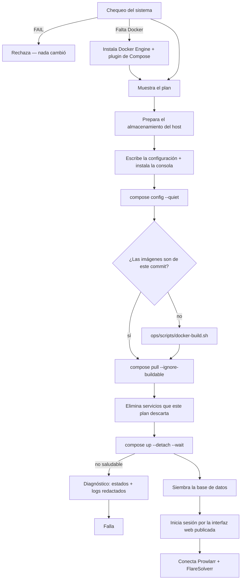

# Instalador guiado (`ultratorrent-install`)

## Resumen

`ultratorrent-install` es un solo binario estático que hace por ti toda la
[instalación con Docker Compose](/install/docker-compose): inspecciona el host,
imprime el plan exacto que va a aplicar, genera cada archivo de configuración —
secretos incluidos — y luego construye, arranca, **siembra** y **verifica** el stack.

Existe porque un stack que levantó no es lo mismo que un sistema funcionando. La ruta
manual termina con una lista de cosas por hacer: generar cinco secretos, sembrar la base
de datos, buscar la contraseña de primer arranque del engine, pegar el API key de
Prowlarr en Ajustes, añadir FlareSolverr como proxy de indexer. Ahí es donde la gente se
queda. El instalador lo hace.

:::info Es opcional, y no es magia
Todo lo que hace está documentado y se puede hacer a mano — eso es la
[guía de Docker Compose](/install/docker-compose). Nada aquí es un stack distinto: el
instalador nunca bifurca el `docker-compose.yml` del proyecto. Escribe un `.env` y, solo
cuando tus decisiones de verdad lo requieren, un `docker-compose.override.yml` pequeño al
lado, y luego maneja `docker compose` con ambos.
:::

:::warning El asistente interactivo todavía no existe
Este build toma sus respuestas de **banderas**, no de preguntas. Llenan el mismo objeto
de plan que llenará el asistente, así que nada cambia río abajo cuando llegue — pero hoy
una instalación es una línea de comandos, no una conversación.
:::

## Consigue el binario

**No hay nada que bajar.** `clients/installer/dist/` está en `.gitignore`, ningún GitHub
Release carga el binario, y ningún registro lo sirve. Compílalo desde el mismo checkout
que vas a instalar — ve [Obtener UltraTorrent](/install/download).

```bash
cd clients/console   && ./build.sh     # compila la consola primero — el instalador la embebe
cd ../installer      && ./build.sh     # → dist/ + dist/SHA256SUMS
./dist/ultratorrent-install-linux-amd64 version
```

```
ultratorrent-install 0.85.9 (e4ebfccd), plan schema v1
console utconsole included (7.8 MB)
```

Compilarlo requiere [Go](https://go.dev/dl/); correrlo no requiere nada
(`CGO_ENABLED=0`), así que un binario sirve en un Debian actual y en un NAS cuya glibc
tiene años. Compílalo de forma cruzada en cualquier máquina y copia el archivo.

:::tip Viene con una consola de terminal
[`utconsole`](/operate/console) va embebida en el instalador y se escribe junto a la
instalación cuando despliega — así una instalación termina con una consola de solo
lectura funcional y sin una segunda descarga. `version` te dice si trae una.
:::

## Los tres comandos

Cada uno es un superconjunto estricto del anterior, y cada uno se detiene limpiamente
donde dice.

| Comando | ¿Toca el host? | Qué hace |
| --- | --- | --- |
| `plan` | **No** | Corre el chequeo del sistema e imprime la pantalla de revisión. No cambia nada. |
| `generate` | Escribe archivos | Todo lo de `plan`, y luego escribe la configuración — y no despliega nada. |
| `install` | Despliega | Todo lo de `generate`, y luego construye, arranca, siembra y verifica el stack. |

```bash
ultratorrent-install plan     --repo /opt/src/ultratorrent
ultratorrent-install generate --repo /opt/src/ultratorrent
ultratorrent-install install  --repo /opt/src/ultratorrent
ultratorrent-install install  --repo /opt/src/ultratorrent --dry-run   # vista previa completa
```

`generate` es genuinamente útil por sí solo: te da configuración correcta y completa —
secretos generados, un engine ya sembrado, los profiles correctos de Compose — sin
entregarle el control de tu stack al instalador. Termina imprimiendo los dos comandos que
te toca correr.

:::warning `--repo` nunca se adivina
Deducir el directorio del checkout es como un instalador termina adjuntándose a un stack
que no creó. Un `--repo` ausente o equivocado es un rechazo que nombra el archivo que
esperaba, no un intento a ciegas.
:::

## La instalación real más corta

```bash
# en el host, desde donde sea
ultratorrent-install install \
  --repo /opt/src/ultratorrent \
  --media-root /srv/ultratorrent/media \
  --puid 1000 --pgid 1000 \
  --prowlarr --flaresolverr
```

Eso te da: el stack base, qBittorrent incluido con credenciales ya sembradas, un
directorio de media en el host con dueño uid/gid 1000, Prowlarr y FlareSolverr
desplegados **y conectados a UltraTorrent**, la base de datos sembrada, y un inicio de
sesión probado por la interfaz web publicada antes de declarar éxito.

Córrelo con `--dry-run` primero. Cuesta segundos y te enseña la inspección de
almacenamiento, que es donde viven casi todas las sorpresas.

## Banderas

| Bandera | Por defecto | Notas |
| --- | --- | --- |
| `--dry-run` | apagado | Produce y muestra todo, no cambia nada. |
| `--output ARCHIVO` | — | Escribe el plan como JSON (modo `0600`, nunca contiene secretos). |
| `--json` | apagado | Imprime el plan como JSON en vez de la pantalla de revisión. |
| `--target SO` | este host | `linux` o `windows` — ve [Windows](#windows). |
| `--install-dir RUTA` | `/opt/ultratorrent` | Donde viven `.env`, el override, el estado, la config del engine y la consola. |
| `--repo RUTA` | `.` | El checkout que contiene `docker-compose.yml`. |
| `--port N` | `8080` | Puerto del host para la interfaz web — el único puerto base publicado. |
| `--engine NOMBRE` | `qbittorrent` | `qbittorrent`, `rtorrent`, `external`, `none`. |
| `--external-url URL` | — | Requerido por `--engine external`. |
| `--media-root RUTA` | — | Ruta del host detrás de `/downloads`. Omítela para usar un volumen `downloads` de Docker. |
| `--puid N` / `--pgid N` | sin definir | Dueño de los archivos descargados. Si das una, la otra la refleja. |
| `--public-url URL` | — | La dirección que la gente va a escribir; se convierte en `CORS_ORIGIN`. |
| `--bundled-proxy` | apagado | Despliega el proxy Caddy incluido. Toma los puertos 80 y 443. |
| `--prowlarr` | apagado | Despliega Prowlarr **y lo conecta** a UltraTorrent. |
| `--flaresolverr` | apagado | Despliega FlareSolverr. Requiere `--prowlarr`. |
| `--publish-prowlarr` | apagado | Publica la interfaz web de Prowlarr. Arranca **sin autenticación**. |
| `--no-publish-webui` | apagado | Mantiene la interfaz web del engine fuera de la red del host. Requiere Compose ≥ 2.24. |
| `--rebuild` | apagado | Construye las imágenes aunque ya correspondan a este checkout. |
| `--skip-checks` | apagado | Omite el chequeo del sistema. Solo para planificar — `install` siempre chequea. |

### `--puid` / `--pgid`

Ponlas al **dueño de tu directorio de media**. Aplican al engine incluido *y* al backend,
que escribe en el mismo árbol — si defines solo un lado, los archivos caen donde el otro
no los puede manejar. Pasar una bandera sin la otra la refleja, porque un par a medias
casi siempre es un error de tecleo.

### `--publish-prowlarr`

:::danger La interfaz web de Prowlarr no tiene autenticación cuando se publica
Está apagada por defecto por evidencia, no por precaución. Medido contra Prowlarr 2.4.0,
no existe una configuración de autenticación que sea a la vez segura y usable con la
interfaz publicada: *desactivada para direcciones locales* la sirve sin autenticación por
el puerto publicado, porque toda petición por esa vía llega desde el gateway de Docker —
una dirección privada — y activar la autenticación redirige a una pantalla de login sin
forma de crear una cuenta.

En la red interna de Docker el API key es la única credencial que importa, y UltraTorrent
la tiene. Publica solo si entiendes que cualquiera que alcance ese puerto es dueño de la
configuración de tus indexers.
:::

## El chequeo del sistema

Es de solo lectura, y en `install` corre **antes** de imprimir el plan — un plan no vale
la pena revisarlo en un host que no lo puede correr.

```
System Check

  Operating system  Ubuntu 26.04 LTS       OK
  Architecture      amd64                  OK
  Privileges        dayala (sudo)          OK
  Docker            not installed          WILL INSTALL
  Docker Compose    not installed          WILL INSTALL
  Memory            7.2 GB                 OK
  CPU               4 core(s)              OK
  Disk free (/opt)  128 GB                 OK
  Docker registry   reachable              OK
  Port 8080         UltraTorrent web UI    OK
  Port 8081         qBittorrent web UI     OK
  Compose file      docker-compose.yml     OK
```

- **Los puertos salen de tu plan**, así que el chequeo prueba lo que *esta* instalación
  va a ocupar y no una lista fija que se desactualiza. Un puerto ocupado por los
  containers de esta misma instalación sale OK, no FAIL — volver a correr sobre un stack
  que ya está arriba es la forma normal de arreglar uno.
- **`WILL INSTALL` es una promesa que cumple.** En Debian o Ubuntu instala Docker Engine
  y el plugin de Compose desde el repositorio del propio Docker, paso por paso con
  nombre, y cae al script de `get.docker.com` para una versión cuyo codename Docker aún
  no empaqueta. `apt` corre totalmente no interactivo — un instalador que se detiene en
  un prompt de conffile se cuelga para siempre en una corrida desatendida.
- **Docker ≥ 20.10 y Compose v2 ≥ 2.0** son pisos duros. Compose v1 (`docker-compose`,
  con guion) falla de plano.
- **Memoria, CPU y disco son consultivos y nunca bloquean** — avisos bajo 2 GB de RAM,
  2 núcleos, o 10 GB libres. El proyecto no documenta un mínimo, e inventar uno
  rechazaría instalaciones que funcionan.
- **Un registro inalcanzable es fatal**, y el hallazgo distingue "el DNS no resolvió" de
  "el DNS resolvió pero la conexión no completó", porque los arreglos no tienen relación.

Cualquier cosa en `FAIL` detiene la corrida *sin haber cambiado nada*.

## El plan

La pantalla de revisión se genera desde el mismo objeto que aplica el ejecutor, así que
no puede describir otra cosa.

```
Installation Plan

UltraTorrent
  Target        linux
  Install path  /opt/ultratorrent
  Web port      8080

Torrent engine
  qBittorrent (bundled)

Core services
  PostgreSQL  internal only
  Redis       internal only

Storage
  Media root  /srv/ultratorrent/media (host path)

Optional services
  Prowlarr       yes
  FlareSolverr   yes
  Bundled proxy  no

Security
  Database password  generated
  JWT secrets        generated
  Encryption key     generated
  Admin password     generated

Compose profiles
  qbittorrent, prowlarr, flaresolverr

Ports published on this host
  8080  UltraTorrent web UI
  8081  qBittorrent web UI
```

`--output plan.json` guarda lo mismo como JSON para revisarlo, compararlo o versionarlo.
**Un plan nunca contiene secretos** — hay una prueba que lo verifica serializando un plan
lleno y buscando los valores — y aun así se escribe `0600`, porque describe la topología
de tu servidor.

La validación es *pura*: contesta "¿es este plan coherente consigo mismo?" — puertos que
chocan, un engine externo sin URL, FlareSolverr sin Prowlarr, un directorio de
instalación relativo, un `--public-url` sin esquema — y reporta **todos** los problemas,
no el primero.

## Qué escribe

Todo cae en el directorio de instalación (por defecto `/opt/ultratorrent`), nunca en tu
checkout. El `docker-compose.yml` del repositorio queda intacto.

| Archivo | Modo | Cuándo se escribe |
| --- | --- | --- |
| `.env` | `0600` | Siempre — puertos, base de datos, Redis, cuatro secretos generados, el administrador inicial, `COMPOSE_PROFILES` |
| `docker-compose.override.yml` | `0644` | Solo cuando tus decisiones lo requieren (media root montado del host, el proxy incluido, una interfaz web sin publicar). Se borra cuando una corrida posterior ya no lo necesita |
| `qbittorrent/qBittorrent.conf` | `0644` | `--engine qbittorrent` — credenciales ya sembradas, así que nunca se emite una contraseña temporal |
| `engine-credentials.txt` | `0600` | Con lo anterior — el acceso al engine, y lo que hay que darle a UltraTorrent |
| `prowlarr/config.xml` | `0644` | `--prowlarr` — carga el API key que usa el paso de conexión |
| `Caddyfile` | `0644` | `--bundled-proxy` |
| `installer-state.json` | `0644` | Siempre — la forma no secreta del despliegue, arrastrada entre corridas |
| `utconsole` + lanzador | `0755` | Cuando hay una consola embebida |

:::tip `COMPOSE_PROFILES` se escribe en `.env` a propósito
Docker **no** recuerda `--profile` entre comandos, así que un `docker compose up -d`
simple más adelante en ese directorio *detendría* tu engine y tus companions. Definirlo en
`.env` hace que cualquier comando normal de Compose levante el mismo stack que desplegó el
instalador.
:::

:::danger La contraseña del administrador nunca se imprime
Está en `.env` con modo `0600`. Hacerle echo la pondría en tu scrollback, en una grabación
de terminal, y en lo que pegues en un issue. Léela del archivo, y cámbiala después del
primer inicio de sesión.
:::

**El almacenamiento se prepara antes que nada.** Un volumen montado del host cuyo
dispositivo no existe no falla en `compose config` y no se crea solo — el *container*
falla al arrancar, con un error que nombra una ruta interna de Docker y nunca menciona el
directorio que falta. Por eso los directorios se inspeccionan completos primero (tres
problemas deben salir como tres, no de una corrida fallida a la vez), luego se crean, y
luego pasa todo lo demás.

## Qué hace `install` realmente



El orden no es arbitrario:

- **`config --quiet` primero** atrapa un override malformado o una ruta irresoluble en un
  segundo; esas mismas fallas cuestan minutos cuando ya hay medio stack arriba.
- **El build se omite solo cuando se puede probar que no hace falta**: el checkout es un
  repositorio git con un HEAD resoluble, el árbol de trabajo está **limpio**, la imagen
  del backend registra ese mismo commit, y la imagen del frontend existe. Toda
  incertidumbre se resuelve hacia construir. `--rebuild` lo fuerza.
- **`pull --ignore-buildable`**, porque el backend y el frontend no tienen imagen
  publicada — pedírselas a un registro fallaría siempre. Que el pull falle no es fatal;
  con las imágenes que ya están locales basta.
- **Los servicios que tu plan nuevo descarta se eliminan antes del `up`**, no después. Si
  se dejan, un engine de un plan anterior sigue escribiendo en el mismo volumen
  `/downloads` y ocupa el puerto de la interfaz web que el nuevo está por pedir. Sus datos
  se conservan.
- **`up --detach --wait`** deja que el `HEALTHCHECK` de cada imagen defina qué es
  saludable. Al fallar, el instalador *diagnostica* — estados de servicio más las últimas
  40 líneas de log — porque "algo no llegó a saludable" no es una causa, y la verdadera
  (casi siempre una migración fallida) vive solo en los logs. La salida se redacta con los
  valores **reales** de los secretos, no con un patrón que adivine su forma.
- **Sembrar es distinto de arrancar.** El `CMD` del backend aplica migraciones y ahí para;
  sin la siembra te queda un esquema completo, cero usuarios, y todo inicio de sesión
  fallando.
- **El inicio de sesión se verifica por la interfaz web publicada**, no por el loopback
  del backend. Probar la API contra sí misma una vez certificó un despliegue cuya
  interfaz devolvía 502 a todo. Un despliegue sirve cuando abre su puerta principal.
- **Conectar los companions nunca tumba el despliegue.** Un stack corriendo al que puedes
  entrar vale más que desmontarlo por un gestor de indexers que aún hay que conectar a
  mano — así que una falla ahí se reporta con suficiente detalle para terminarlo en
  **Ajustes → Integraciones**.

## Volver a correrlo

Volver a correrlo sobre una instalación existente es seguro, y es la forma normal de
cambiar algo — encender Prowlarr, mover el media root, cambiar el puerto.

:::danger Los secretos se conservan, nunca se regeneran
Regenerarlos contra un despliegue vivo es catastrófico y silencioso: la contraseña de la
base de datos deja de coincidir con el volumen que ya tiene tus datos, toda sesión queda
invalidada, y un `ENCRYPTION_KEY` cambiado vuelve indescifrable cada secreto de doble
factor guardado. Un `.env` existente se lee y sus secretos se reutilizan — y el instalador
lo dice en voz alta: `Existing secrets found in .env and kept unchanged.`
:::

Si esos secretos son *inservibles* — muy cortos, o no distintos, que son las restricciones
que el backend exige al arrancar — el instalador se niega en vez de desplegar un stack que
va a fallar por una razón que tú nunca escogiste. Mueve el archivo a un lado para que se
genere uno nuevo.

`up` es una operación nula cuando no cambió nada: sin `--force-recreate`, sin
`--renew-anon-volumes`, sin `-V`. Y nada en la ruta de despliegue puede borrar datos — usa
`stop`, nunca `down`, y nunca pasa `-v`.

El API key de Prowlarr se recupera de su propio `config.xml` cuando una corrida no generó
uno, que es lo que te permite encender un companion en una instalación cuyos secretos se
están reutilizando.

## Windows

`--target windows` **planifica** pero no **genera**.

Un plan es un documento, así que redactar, imprimir, guardar, comparar y revisar una
instalación de Windows desde cualquier máquina funciona, y la validación le aplica las
reglas de rutas de Windows. Generar se niega, con la razón: cada volumen que escribe este
instalador monta una ruta del host con el driver local de Docker
(`driver_opts: { type: none, o: bind, device: … }`), que es un `mount(2)` de Linux
ejecutado *dentro* de la VM de Docker. `D:\Media` no es una ruta ahí adentro. Emitir ese
YAML para un host Windows produciría un stack que levanta y guarda todo, en silencio, en
el lugar equivocado — el peor resultado posible, y la razón por la que prefiere negarse.

El binario de Windows se sigue compilando con el mismo comando que el de las demás
plataformas, así que un cambio que rompa el build de Windows rompe el script de build en
vez de descubrirse en la laptop de alguien.

## Resolución de problemas

| Dice | Qué significa | Arreglo |
| --- | --- | --- |
| `this host cannot run UltraTorrent yet` | El chequeo del sistema tiene un FAIL. No se cambió nada. | Resuelve los hallazgos nombrados y vuelve a correr. |
| `Compose file: not found in <dir>` | `--repo` no apunta a un checkout con `docker-compose.yml`. | Pasa el directorio del checkout. |
| `the generated configuration is not valid` | `docker compose config` rechazó el conjunto de archivos combinado. | Lee la primera línea citada — casi siempre un override editado a mano. |
| `the stack did not become healthy` | Un servicio nunca llegó a saludable en 5 minutos. | El diagnóstico de abajo trae el estado de cada servicio y sus últimas 40 líneas de log. Las fallas de migración salen ahí. |
| `the deployment is running but not usable` | Saludable, pero el inicio de sesión por la web falló. `502` significa que la interfaz no alcanza la API. | Revisa el proxy del frontend y la salud del backend. |
| `the secrets in .env are not usable` | Un `.env` existente tiene secretos que el backend rechazaría al arrancar. | Arréglalos ahí, o mueve el archivo a un lado. |
| `plan schema N is not supported` | El JSON del plan viene de otra versión del instalador. | Usa el instalador que lo escribió, o vuelve a planificar. |
| `Prowlarr is deployed but its API key is unknown` | La conexión no pudo correr. El despliegue está bien. | Conéctalo en **Ajustes → Integraciones**. |

La consola instalada al lado es la forma más rápida de ver qué está haciendo una
instalación que batalla — corre `<install-dir>/utconsole`, y ve
[Consola de terminal](/operate/console).

## Lista de verificación

- [ ] `ultratorrent-install version` corre y reporta una consola a bordo
- [ ] `plan --repo <checkout>` muestra un chequeo del sistema sin ningún `FAIL`
- [ ] Los puertos, el media root y los profiles de la pantalla de revisión son los que quería
- [ ] `install --dry-run` muestra las acciones de almacenamiento que espero
- [ ] `install` terminó con `sign-in verified through …`
- [ ] Leí la contraseña del administrador de `<install-dir>/.env` y la cambié
- [ ] `<install-dir>/engine-credentials.txt` existe (qBittorrent incluido)
- [ ] Prowlarr aparece conectado en **Ajustes → Integraciones** (si lo desplegué)
- [ ] `<install-dir>/utconsole` arranca

## Preguntas frecuentes

**¿Tengo que usarlo?**
No. La [guía de Docker Compose](/install/docker-compose) es la instalación autoritativa y
siempre lo será.

**¿Puedo correrlo desatendido?**
Sí — nunca pregunta nada. Cada respuesta es una bandera, y `apt` corre no interactivo
cuando instala Docker.

**¿Va a machacar mi `.env` ajustado a mano?**
Reescribe `.env` desde el plan, pero **reutiliza los secretos que ya están ahí**. Los
valores no secretos que editaste a mano se regeneran desde el plan, así que pásalos como
banderas en vez de editar el archivo.

**¿Puedo usarlo contra una instalación que hice a mano?**
Apunta `--install-dir` al directorio que tiene ese `.env` y adoptará los secretos. Pero ojo:
el instalador siempre usa el nombre de proyecto de Compose `ultratorrent`, y no hay bandera
para cambiarlo — si tu stack hecho a mano corre bajo otro nombre de proyecto (Compose lo
deriva de la carpeta donde lo corriste), vas a terminar con un *segundo* stack en vez del
que ya tienes. Revisa `docker compose ls` primero.

**¿Hace prune de imágenes o limpia disco?**
No. Elimina containers de servicios que tu plan nuevo descarta (conservando sus datos) y
nada más. El prune es tuyo: `docker image prune -f`.

**¿Actualiza una instalación?**
Volver a correrlo contra un checkout más nuevo recompila y reinicia, que es la mayor parte
de una actualización — pero lee [Actualización y reversión](/install/upgrading) primero
por el tema de respaldos y migraciones.

**¿Funciona en Synology, QNAP o Unraid?**
Es un binario de Linux que necesita Docker, un shell y un directorio persistente — así que
en principio sí, y el diseño de dejar la consola junto a la instalación existe justamente
por el sistema de archivos raíz en RAM de QTS. Tu
[página de plataforma](/install/platforms/linux) sigue siendo la dueña de las diferencias
específicas del host.

## Ver también

- [Obtener UltraTorrent](/install/download) — cómo conseguir el código que instala
- [Instalación con Docker Compose](/install/docker-compose) — la misma instalación, a mano
- [Escoge tu método de instalación](/install/) — qué ruta le queda a tu host
- [Consola de terminal](/operate/console) — `utconsole`, que te instala él mismo
- [Prowlarr](/modules/prowlarr) — el companion que conecta
- [Actualización y reversión](/install/upgrading)
- [Resolución de problemas](/operate/troubleshooting)
