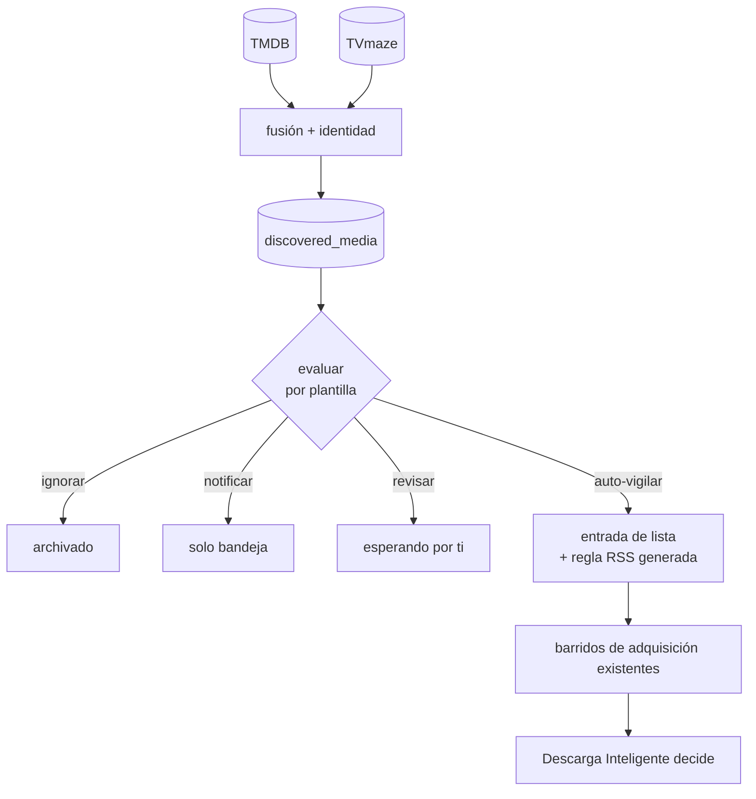

# Descubrimiento de Medios

## Resumen

El Descubrimiento de Medios responde una sola pregunta: **¿qué debería estar vigilando UltraTorrent?**

Encuentra películas próximas y series nuevas o que regresan a partir de proveedores de metadatos, decide cuáles vale la pena esperar, y convierte las que califican en una **entrada de lista de seguimiento** más una **regla RSS generada**. Todo lo que pasa después le pertenece a sistemas que ya existían — los barridos de adquisición vigilan la lista de seguimiento, y [Descarga Inteligente](/modules/smart-download) decide si un lanzamiento en particular vale la pena.

:::danger El Descubrimiento nunca descarga nada
No puntúa lanzamientos, no habla con un indexador, y no tiene opinión sobre si un archivo dado es lo bastante bueno. En este producto hay exactamente **un** motor de coincidencias y **un** motor de decisiones de adquisición, y el Descubrimiento de Medios no es ninguno de los dos. Si alguna vez parece necesitar uno, la respuesta es llamar al motor existente — no hacer crecer un segundo.
:::

## Por qué / cuándo usarlo

El resto de la pila de adquisición es **reactiva**: algo tiene que aparecer en una fuente antes de que pase nada. Eso funciona bien para una serie que ya sigues, y nada bien para una película que sale en tres meses.

Usa el Descubrimiento de Medios cuando quieras dejar de enterarte de los lanzamientos después del hecho. Formas típicas:

- *"Vigila cada serie de ciencia ficción nueva en inglés, pero de los documentales solo avísame."*
- *"Sigue películas cuando lleguen a **digital**, no cuando lleguen al cine."*
- *"Muéstrame lo que viene y déjame elegir — no automatices nada."* (Una configuración perfectamente válida; ver la decisión `notify`.)

Si prefieres añadir cada título a mano, puedes dejar este módulo apagado para siempre sin perder nada más.

## Requisitos previos

- **[Gestor de Medios](/modules/media-manager)** y **[Descarga Inteligente](/modules/smart-download)** activados — el Descubrimiento declara ambos como dependencias duras, junto con `media_intake` y `rss`.
- **Al menos una fuente RSS**, porque una regla generada tiene que pertenecer a una.
- **Un perfil de almacenamiento**, que decide dónde se prepara y se archiva el medio.
- **Una clave de API de TMDB** si quieres cobertura de películas. Es la misma clave que usa el Gestor de Medios; TVmaze no necesita credenciales.

## Nada pasa hasta que tú lo digas

Hay **tres puertas** entre una instalación nueva y una descarga automática, y las tres están cerradas:

1. **El módulo está desactivado.** El Descubrimiento de Medios es el único módulo que trae `enabledByDefault: false`. Activarlo es que tú digas que el sistema puede adquirir medios por su cuenta, y un módulo que llegara encendido convertiría eso en un accidente en vez de una decisión.
2. **Los proveedores están en silencio.** No se hace ninguna llamada a terceros hasta que actives un proveedor. Una instalación nueva no contacta a nadie.
3. **Las plantillas están desactivadas.** Una plantilla se guarda apagada y hay que activarla explícitamente, después de que hayas previsualizado lo que haría.

:::info ¿"Desactivado por un administrador"? No.
Como este módulo viene apagado, una instalación nueva lo muestra desactivado con la razón **"off by default — never enabled on this installation"**. Ese es el estado de reposo previsto, no una falla, y no es algo que hizo un administrador. Ver [Estado del módulo](/modules/#estado-del-módulo).
:::

## Conceptos

| Término | Significado |
|---------|-------------|
| **Título descubierto** | Un registro fusionado de una obra, armado a partir de cada proveedor que la reportó. |
| **Plantilla de descubrimiento** | Una instrucción permanente que decide *qué vigilar*. |
| **Plantilla de regla de adquisición** | Una escalera ordenada que decide *qué características de lanzamiento* se prefieren, una vez que algo se vigila. |
| **Decisión** | Lo que el evaluador concluyó para un título bajo una plantilla: `auto_monitor`, `notify`, `needs_review`, `ignore` o `not_applicable`. |
| **Confianza de identidad** | Qué tan seguro está el motor de *qué es* un título — medido por ids externos, no por lo rica que se ve la metadata. |
| **Regla generada** | Una regla RSS que creó el Descubrimiento, sellada con la plantilla y el título de los que vino. |

Los dos tipos de plantilla están separados porque las preguntas están separadas. *"¿Vale la pena seguir esta serie?"* y *"¿cuál de estos seis lanzamientos quiero?"* tienen respuestas distintas y audiencias distintas.

## Cómo funciona



Dos programaciones lo mueven, ambas sobre el planificador existente de la plataforma:

| Tarea | Intervalo | Qué hace |
|-------|-----------|----------|
| `media_discovery_provider_sync` | tic cada hora; refresca un proveedor dado cada 6 h | Trae catálogos, fusiona, guarda. **No decide nada.** |
| `media_discovery_evaluate` | cada hora | Corre las plantillas activadas sobre los títulos guardados y actúa según el resultado. |

Un refresco de catálogo escribe filas y actualiza contadores. Por sí solo no puede causar una adquisición — esa separación es la razón por la que un sync puede correr programado sin que nadie se preocupe por lo que podría iniciar.

### La identidad, y por qué lo controla todo

Los títulos llegan de más de un proveedor y hay que fusionarlos en un solo registro. La fusión trata **un id externo compartido como prueba**, un **id contradicho como prueba de lo contrario**, y **título + año como una pista** que solo puede unir registros de proveedores *distintos*.

La confianza mide la identidad, **no** la riqueza de la metadata. Un registro con sinopsis completa, cartel y 5,000 votos pero sin id externo puntúa `0.1`, porque sigue sin identificarse.

Puedes bajar el piso de confianza. **No** puedes configurar por encima de una identidad *ambigua* — dos obras que genuinamente comparten título y año se retienen para revisión pase lo que pase. TMDB tiene tres películas distintas de 2026 llamadas *The Odyssey*; un id externo equivocado se propagaría a la detección de duplicados y a cada búsqueda posterior, mientras que un título sin vigilar simplemente te espera.

## Configuración

### Activar el módulo

**Sistema → Módulos → Descubrimiento de Medios.**

### Activar un proveedor

**Adquisición de Medios → Descubrir → Proveedores.**

| Proveedor | Cubre | Credenciales |
|-----------|-------|--------------|
| **TVmaze** | Televisión | Ninguna |
| **TMDB** | Películas y televisión | Reutiliza la clave del Gestor de Medios |

Los proveedores reportan tres estados, y solo uno es una falla:

| Estado | Significado | Qué hacer |
|--------|-------------|-----------|
| **Sin configurar** | No hay credencial en esta instalación | Sigue la pista en la tarjeta |
| **Configurado pero apagado** | En silencio por decisión — el estado normal de una instalación nueva | Nada |
| **Encendido y con problemas** | El refresco de catálogo falló | Lee la razón de la falla en la tarjeta |

La salud viene de lo que registró el último sync, **no** de sondear cuando abres la página. Una carga de página nunca debe esperar por un tercero, y un fallo pasajero no es la condición de un proveedor.

**Un refresco fallido conserva el catálogo anterior.** "No pudimos preguntar" y "no está saliendo nada" son afirmaciones muy distintas.

### Construir una plantilla

La guía campo por campo completa está en el repositorio, en `docs/MEDIA_DISCOVERY_TEMPLATES.md`. Lo que conviene saber antes de empezar:

**La política de categorías son cuatro listas, no una.** Una sola lista de permitidos no puede expresar *"avísame de Drama pero nunca lo añadas por su cuenta"*, que es lo que la mayoría de la gente realmente quiere.

| Lista | Efecto |
|-------|--------|
| **Vigilar automáticamente** | Entrada de lista + regla de adquisición, sin preguntar |
| **Solo avisarme** | Aparece en la bandeja. No se crea nada. |
| **Ocultar** | Se archiva para que el mismo título no deseado deje de reaparecer |
| **Nunca automáticamente** | **Le gana a todas las listas de arriba** |

Un título etiquetado *Sci-Fi + Documental* no se auto-vigila cuando Documental está en la lista de "nunca", por bien que califique Sci-Fi — pero igual se muestra, para que lo añadas a mano.

Dos reglas que el formulario impone: **Vigilar y Ocultar no pueden solaparse** (veredictos opuestos, no hay lectura defendible), y **un título sin ninguna categoría nunca coincide bajo ningún modo** — buena parte de la programación de TVmaze son noticieros y programas de conversación sin etiquetas, y "toda categoría califica" es vacuamente cierto para una lista vacía.

**Los tipos de lanzamiento importan más de lo que parece.** "Películas cuando lleguen a streaming" es una consulta distinta de "películas en cines", y la fecha digital suele ser un año posterior a la de cine. Limitar por región importa por lo mismo: las fechas de lanzamiento son por país, y sin una región una sola emisión de TV extranjera puede calificar una película de hace cinco años.

**Los umbrales degradan, no descartan.** Un título por debajo de tu piso de popularidad o calificación pasa a `notify` en vez de desaparecer — es el tipo de título correcto, solo que no uno para añadir automáticamente. **Un valor desconocido no pasa un umbral**; tratar lo desconocido como satisfecho dejaría pasar cada título con metadata pobre por la única puerta puesta para retener cosas.

**Filtra por dónde se transmite una serie.** Las cadenas, los servicios de streaming y los estudios son **alternativas, no requisitos** — un título lleva a lo sumo uno o dos de los tres, así que exigir los tres no coincidiría con nada. Un título califica si *cualquiera* de las fuentes nombradas lo lleva, y dejar los tres vacíos acepta cualquier fuente.

El formulario sugiere los valores que tu catálogo realmente tiene, y eso importa: esto se compara contra lo que **escribió un proveedor**, así que escribir `AppleTV` cuando TMDB dice `Apple TV` produce un filtro que en silencio no coincide con nada. La comparación no distingue mayúsculas, y un título sin cadena no puede satisfacer una lista que nombra cadenas específicas.

**La automatización es opcional.** Apaga *"vigilar automáticamente los títulos que coincidan"* y cada título que califique queda retenido en **Necesita revisión**, donde tú decides. Importar uno desde ahí corre el **mismo** camino de creación que toma una vigilancia automática — entrada de lista de seguimiento, regla generada con su escalera completa y su ruta destino, directorio de entrada — así que un título aprobado queda configurado igual que uno sobre el que el motor actuó por su cuenta.

### Previsualiza antes de activar

La previsualización corre el **evaluador real** — no una copia de las reglas, que se desviaría de ellas de forma invisible — sobre el catálogo que ya tienes, y no escribe nada.

```
Si esta plantilla corriera ahora, sobre 870 títulos descubiertos:
   50 se vigilarían automáticamente
   24 generarían notificaciones
  233 se ignorarían
   13 necesitarían revisión
  550 quedan fuera de esta plantilla

20 de estos se retendrían para revisión — tu límite semanal es 30.
```

Esa última línea es la razón para previsualizar antes de activar y no después. En una previsualización los límites se **proyectan, no se aplican**: meter el presupuesto dentro de la evaluación haría que cada título después del décimo se leyera como "necesita revisión" y escondería la forma de la política que estás afinando.

## Gestionar el catálogo

### Quitar un título

Cada tarjeta trae una acción **Quitar**, y el diálogo pregunta a qué te refieres — porque «quitar esta serie» significa tres cosas distintas:

| Alcance | Quita |
|---------|-------|
| **Solo del catálogo** | El título descubierto y sus evaluaciones. La vigilancia sigue activa. |
| **…y dejar de vigilarlo** | Además la regla RSS generada, y archiva la entrada de lista de seguimiento. |
| **…y borrar los medios de la biblioteca** | Además los elementos, sus carátulas, subtítulos y archivos NFO — y opcionalmente el torrent y sus datos. |

El diálogo muestra **qué se llevaría cada alcance** antes de que confirmes, a partir del plan del propio servidor. El alcance menos destructivo es el predeterminado; escalar es un segundo clic deliberado.

:::danger Los medios se identifican solo por id externo
Título y año sirven para agrupar un listado y no alcanzan ni de lejos para borrar — dos películas comparten título y año de verdad. Un título sin id externo reporta que no se puede identificar, y no se tocan sus archivos.

Los archivos se mueven a la **Papelera** mediante el mismo servicio de rutas seguras que usa el Gestor de Archivos, no se desenlazan. No hay una segunda vía de borrado.
:::

**Un título quitado no regresa.** Su identidad se registra como una *supresión* y se comprueba en cada sync — si no, el próximo refresco lo recrearía en seis horas y la eliminación parecería un error.

### Editar una plantilla vuelve a decidir el catálogo

Una edición que cambia la **política** — categorías, umbrales, alcance o el destino con el que se construye una regla — borra las decisiones de esa plantilla, así que cada título guardado se juzga de nuevo. Renombrarla, o solo activarla y desactivarla, no.

**Refrescar catálogos** consulta a los proveedores *y* reevalúa todo, y luego reporta qué cambió. Ese es el botón que presionas después de una edición.

### Títulos que dejan de coincidir

Cuando una reevaluación encuentra que un título auto-vigilado ya no califica, se **retira** su vigilancia: se elimina la regla generada, se archiva la entrada de lista y — si el título quedó fuera de alcance o explícitamente ignorado — sale del catálogo. Cada retirada te notifica, porque deshace algo hecho en tu nombre.

Cuatro cosas que la retirada nunca hace:

- **Nunca borra medios ni torrents.** Corre desde un barrido en segundo plano que se disparó porque alguien editó una lista de géneros; borrar 40 GB de episodios como efecto secundario de eso sería irrecuperable e invisible.
- **Nunca toca una regla que editaste.**
- **Nunca pasa por encima de una entrada de lista que pausaste, archivaste o completaste.**
- **Nunca desmantela una serie que ya se está descargando.** Un título así ya superó al catálogo de todos modos, así que en vez de retirarse **se gradúa** — ver más abajo.

:::note Que pase el tiempo nunca es razón para dejar de vigilar
La ventana de lanzamiento, el filtro de estreno y el interruptor de vigilancia automática son controles de **admisión**. Deciden si *empezar* a seguir una serie, y no se vuelven a aplicar a una que ya se vigila.

El estreno de una serie vigilada pasa al pasado por sí solo. Volver a preguntar responde entonces "no" por lo único que le va a pasar a toda serie — y esa respuesta llega al camino de retirada, que borra la regla de una serie que se estaba descargando bien, a mitad de temporada. Leído como prueba de permanencia, el interruptor de automatización es todavía peor: desmarcar *"vigilar automáticamente los títulos que coincidan"* devolvería a revisión cada título vigilado y desmantelaría todo lo que la plantilla creó.

Todo lo demás de una plantilla **sí** se vuelve a aplicar. Un género que quitaste, una cadena que sacaste o un idioma que ya no califica son respuestas reales sobre el título, y la vigilancia termina.
:::

### Una serie que empieza a descargarse sale del catálogo

**Cuando una serie vigilada obtiene su primer lanzamiento, sale del Descubrimiento de Medios.** El registro de descubrimiento desaparece; su regla de adquisición y su entrada de lista de seguimiento quedan intactas, y sigue descargándose igual que antes. Desde ese momento es una adquisición común y se administra desde **Fuentes RSS**.

Esto es el catálogo respondiendo su propia pregunta. El Descubrimiento existe para decidir *qué empezar a seguir*; una vez que una serie se está descargando eso ya quedó resuelto, y conservar la fila haría que la lista de vigilados mezclara dos cosas distintas — series esperando a empezar y series ya andando. Solo la primera clase sigue siendo una decisión pendiente.

| Qué se va | Qué se queda |
|---|---|
| El registro de descubrimiento, sus evaluaciones y fechas de lanzamiento | La regla RSS generada, activada y sin cambios |
| Su lugar en el catálogo | La entrada de lista de seguimiento |
| | Todo archivo y torrent descargado |

"Obtuvo su primer lanzamiento" significa que la regla realmente bajó algo — evidencia, no una inferencia a partir de una fecha.

El título además queda **suprimido**, con la razón `graduated`. Sin eso, la próxima actualización del proveedor vuelve a listar la serie y una que ya estás descargando reaparece como hallazgo nuevo. No es un rechazo, y esa razón distinta es lo que permite que la lista de supresiones diga *ya tienes esto* en vez de *dijiste que no a esto*.

Las graduaciones se anuncian, porque una serie que desaparece calladamente de Descubrir se lee como una falla.

## Las preferencias de coincidencia son obligatorias para auto-vigilar

Una plantilla de descubrimiento que auto-vigile algo **debe** referenciar un perfil de preferencias de coincidencia con al menos un peldaño activo. La regla generada lleva entonces la escalera completa — cada peldaño en orden, los términos requeridos y excluidos de la plantilla fusionados en cada uno, y las reglas de calidad y tamaño intactas — activada y preparada mediante ingesta gestionada, lista para adquirir en cuanto aparezca un lanzamiento aceptable.

:::danger Una regla sin preferencias de coincidencia no coincide con nada
Una regla RSS se filtra por sus candidatos de coincidencia si tiene alguno, y por su regex de inclusión/exclusión si no. Una regla que no tiene **ninguno de los dos** se trata como que no coincide con nada — a propósito, para que una regla sin filtro no pueda capturar una fuente entera. El descubrimiento nunca escribe un regex.

Por eso una plantilla sin preferencias de coincidencia producía una regla activada, con descarga automática, y permanentemente inerte, sin que nada indicara la falla. Ahora se valida al activar la plantilla y otra vez al escribir la regla, y una plantilla que no puede construir una regla funcional retiene sus títulos para revisión en vez de crear una vigilancia que parece completa y no hace nada.
:::

:::note Los idiomas se comparan de forma canónica
Los proveedores no coinciden en cómo se llama un idioma — TMDB guarda `en`, TVmaze guarda `English` — y ambos acaban en el mismo catálogo. Los idiomas de una plantilla se comparan mediante una forma canónica, así que nombrar cualquiera coincide con un título guardado como el otro. Un idioma no reconocido sigue coincidiendo consigo mismo, y un título sin idioma no puede satisfacer una lista que nombra idiomas concretos.

Un título que una plantilla evaluó y dejó fuera de alcance muestra **Fuera de esta plantilla**, con la razón. Solo un título que ninguna plantilla ha alcanzado aún muestra *Sin evaluar*.
:::

## La bandeja

Cada tarjeta lleva **la razón por la que está ahí**. Un motor de descubrimiento que vigila cosas en silencio es uno en el que no puedes confiar ni corregir.

| Estado | Significado |
|--------|-------------|
| **Vigilado** | Existen una entrada de lista y una regla de adquisición, y todavía no se ha bajado nada. La adquisición ya es trabajo del motor existente. |
| **Notificar** | Se te muestra. No se creó nada. |
| **Necesita revisión** | El motor *habría* actuado y no pudo hacerlo con seguridad — identidad sin resolver o ambigua, proveedores que no coinciden en la fecha de estreno, el límite de altas automáticas ya gastado, o la vigilancia automática apagada para esa plantilla. |
| **Ignorado** | No es lo que la plantilla busca. Archivado para que deje de reaparecer. |

Un título vigilado sale de esta lista para siempre cuando obtiene su primer lanzamiento — ver [Una serie que empieza a descargarse sale del catálogo](#una-serie-que-empieza-a-descargarse-sale-del-catálogo).

**Necesita revisión no es notificar.** Uno dice "quizá quieras esto"; el otro dice "casi hacemos algo y nos detuvimos". Se atienden distinto, y por eso están separados.


## Qué te comunica

**Una notificación por corrida, no una por título.** Una evaluación que vigila quince series manda un solo mensaje que las lista todas — todas se atienden con la misma visita a la bandeja, así que quince correos aparte serían ruido y no información.

Cada título de ese mensaje lleva lo suficiente para juzgarlo sin abrir la aplicación: **póster, sinopsis, cadena, fecha de estreno, calificación y géneros**. Un resumen que no nombrara ningún título te mandaría a la aplicación a averiguar de qué se trataba, que es justo lo contrario de para qué se manda.

| Notificación | Cuándo |
|---|---|
| **Ahora vigilando** | Se vigilaron títulos automáticamente en esta corrida. |
| **Necesita tu revisión** | Se retuvieron títulos. Cada uno lleva *su propia* razón — una identidad sin resolver y un cupo agotado son problemas distintos con respuestas distintas. |
| **Se dejó de vigilar** | Títulos que dejaron de coincidir y se retiraron. Los nombra todos, porque una serie que calladamente ya no se adquiere es una pregunta esperando a hacerse. |
| **Ya se descarga por su cuenta** | Títulos que obtuvieron un primer lanzamiento y salieron del catálogo. |

En un mensaje se listan a lo sumo 20 títulos; el conteo siempre es el total real de la corrida, y el mensaje dice cuántos no alcanzó a listar. Mostrar los primeros veinte de doscientos como si fueran todos sería una mentira por omisión.

Dónde llegan — en la aplicación, correo, Telegram, Discord — se configura por destinatario en **Notificaciones**. Los pósters se muestran en el correo; las demás superficies llevan los mismos títulos y el mismo texto.

## Límites

`autoAddLimitPerDay` (por defecto 10) y `autoAddLimitPerWeek` (por defecto 30) marcan el paso de la adquisición. Usan **ventanas móviles**, no días de calendario: "10 por día" significa no más de diez en ninguna ventana de 24 horas, porque un límite de calendario deja aterrizar veinte alrededor de la medianoche — exactamente la ráfaga que el límite existe para evitar.

**El límite marca el paso de la adquisición nueva, y solo de esa.** Un título que esta plantilla ya vigila no vuelve a competir por el cupo, y el presupuesto se gasta únicamente cuando de verdad se *crea* una entrada de lista — no cuando se encuentra una existente y se deja como está.

Ambas mitades importan porque editar la política borra todas las decisiones, así que una reevaluación vuelve a juzgar el catálogo entero. Sin ellas, una instalación con 17 series vigiladas y un límite de 10 empujaba a **Necesita revisión** a las siete que llegaron de último, diciendo *"Se alcanzó el umbral de altas automáticas"* mientras seguían siendo vigiladas.

- **Un título fuera de presupuesto se retiene para revisión, nunca se descarta.** El límite marca el paso; perder el título sería otra funcionalidad y peor.
- **Solo cuentan las altas que de verdad ocurrieron.** Una decisión cuya generación de regla luego falló no produjo vigilancia, así que no gasta presupuesto — si no, una racha de fallos agotaría la cuota en silencio.
- **Un límite de `0` significa ninguno**, no ilimitado.
- Un tope semanal por debajo del diario se rechaza: la cuota diaria se agotaría primero siempre.

## Qué protege tu trabajo

- **Una regla que editas pasa a ser tuya.** La primera vez que una persona edita una regla generada se sella `userModifiedAt` y nunca se borra. La reaplicación de plantillas solo toca reglas generadas donde ese campo es nulo.
- **Los choques de nombre nunca se resuelven adoptando.** Si el nombre de una regla generada chocaría con una que tú hiciste, el Descubrimiento omite la generación, enlaza la entrada de lista a *tu* regla, y reporta por qué.
- **No reactivará algo que pausaste.** Una entrada `paused`, `archived` o `completed` es una decisión que tomaste, y un barrido en segundo plano que la deshiciera sería indistinguible de un error.
- **Las reglas que una persona tomó se listan, no se esconden**, para que un cambio de plantilla pueda decirte qué dejó deliberadamente sin tocar.

## Permisos

| Permiso | Otorga |
|---------|--------|
| `media_discovery.view` | Leer la bandeja, las plantillas y el estado de proveedores |
| `media_discovery.manage` | Actuar sobre la bandeja; correr una evaluación |
| `media_discovery.templates.manage` | Escribir plantillas; correr previsualizaciones |
| `media_discovery.providers.manage` | Activar proveedores; pedir un sync |

Los usuarios de solo lectura y los normales reciben `view`; los avanzados añaden `manage`; los administradores reciben las cuatro. Ver qué se descubrió y decidir que el sistema puede adquirir medios por su cuenta son privilegios deliberadamente distintos.

## API

Ruta base `/api/media-discovery`. **Ningún endpoint llama a un proveedor** — un sync se encola contra el servicio en segundo plano y la bandeja lee la base de datos, así que una carga de página nunca espera por TMDB.

| Método | Ruta | Permiso |
|--------|------|---------|
| `GET` | `/providers` | `view` |
| `POST` | `/providers/:name/enable` | `providers.manage` |
| `GET` | `/inbox` | `view` |
| `GET` | `/items/:id` | `view` |
| `GET` | `/items/:id/removal-plan` | `view` |
| `DELETE` | `/items/:id` | `manage` |
| `GET` | `/suppressions` | `view` |
| `DELETE` | `/suppressions/:dedupeKey` | `manage` |
| `GET` `POST` `PATCH` `DELETE` | `/templates` | `view` / `templates.manage` |
| `GET` `POST` `PATCH` `DELETE` | `/acquisition-templates` | `view` / `templates.manage` |
| `GET` | `/template-options` | `templates.manage` |
| `POST` | `/preview` | `templates.manage` |
| `POST` | `/sync` | `providers.manage` |
| `POST` | `/evaluate` | `manage` |

## Resolución de problemas

| Síntoma | Causa | Arreglo |
|---------|-------|---------|
| No aparece nada en la bandeja | Ningún proveedor activado, o ningún sync ha corrido | Revisa la pestaña **Proveedores**; usa **Refrescar catálogos** |
| TMDB dice *Sin configurar* | El Descubrimiento reutiliza la clave TMDB del Gestor de Medios | Configúrala ahí; el proveedor se registra en el próximo arranque |
| Todo cae en **Necesita revisión** | Identidades débiles (las series solo de TVmaze a menudo no traen id de IMDb ni TVDB, lo que topa la confianza bajo el piso de 0.8), o el límite de altas está gastado | La razón en cada tarjeta dice cuál |
| Una plantilla no vigila nada | La política de categorías no coincide con los géneros que emiten tus proveedores — y un título **sin** categorías nunca coincide | Compara contra las etiquetas reales de la bandeja |
| Se ignoró un título que yo quería | Una plantilla solo vigila lo que nombra | Añade la categoría, o añade el título a mano |
| Encontró una película que ya tengo | El Descubrimiento no revisa tu biblioteca — reporta lo que se está *lanzando* | Nada; la lista de seguimiento y Descarga Inteligente manejan la pertenencia |
| Una serie que estaba vigilando desapareció del catálogo | Obtuvo su primer lanzamiento y se **graduó** — esto es normal | Adminístrala desde **Fuentes RSS**; su regla y su entrada de lista quedaron intactas |
| Series que ayer estaban vigiladas hoy aparecen en **Necesita revisión** | Una versión anterior volvía a cobrarle el límite diario a títulos que ya vigilaba, así que al editar la política volvían a competir | Actualiza; los títulos ya vigilados no consumen el cupo |
| Desmarcar una casilla de la plantilla parece no hacer nada | Una versión anterior descartaba cinco campos al guardar — vigilancia automática, elegibilidad de estreno, período de gracia, comportamiento ante estrenos pasados y ante series que regresan | Actualiza; el arreglo también evita que el interruptor retire lo que ya se vigila |
| Series vigiladas aparecen en **Episodios Faltantes** | Una versión anterior escaneaba series sin estrenar, y el respaldo por año registraba sus episodios como `missing` | Actualiza; las series sin estrenar ya no se escanean, y sus episodios llegan por la regla RSS generada |

## Buenas prácticas

- **Previsualiza cada plantilla antes de activarla**, y lee la línea de proyección de límites.
- **Empieza con una plantilla de solo notificar.** Observa una semana lo que saca antes de dejar que algo se auto-vigile.
- **Limita las películas por región y tipo de lanzamiento.** Sin eso, una sola emisión extranjera puede calificar una película de hace cinco años.
- **Deja el piso de confianza en 0.8** a menos que tengas una razón. Por debajo le estás pidiendo al sistema que adivine identidades.

## Errores comunes

- **Tratar "apagado de fábrica" como un error.** Es la tercera de tres puertas deliberadas.
- **Esperar que el Descubrimiento capture algo.** Crea la vigilancia. Si no se descarga nada, la pregunta es para [Descarga Inteligente](/modules/smart-download).
- **Poner una categoría en Vigilar y en Ocultar.** Se rechaza — son veredictos opuestos.
- **Poner un límite semanal por debajo del diario.** Se rechaza — la cifra semanal nunca haría nada.
- **Asumir que un umbral filtra.** Degrada a `notify`.

## Preguntas frecuentes

**¿Esto reemplaza mis reglas RSS?**
No. Las *crea*, usando el mismo modelo que usa una regla hecha a mano. Hay un solo motor de coincidencias.

**¿Sobrescribirá una regla que cambié?**
No. Tu primera edición sella la regla como tuya, de forma permanente.

**¿Puede descargar una película que aún no salió?**
Puede crear la vigilancia para una. Si alguna vez se captura algo es decisión de Descarga Inteligente, contra lanzamientos reales en una fuente real.

**¿Por qué un título con buen cartel y sinopsis completa tiene confianza 0.1?**
Porque la confianza mide *identidad*, no metadata. Sin id externo, sigue sin identificarse.

**¿Activar un proveedor le envía mi biblioteca?**
No. Los proveedores son fuentes de catálogo de solo lectura; el Descubrimiento trae datos de próximos lanzamientos y no envía nada sobre tu instalación.

**Una serie desapareció de Descubrir. ¿Se rompió algo?**
Casi seguro que no — se graduó. Cuando una serie vigilada obtiene su primer lanzamiento se elimina el registro de descubrimiento y la serie sigue descargándose por su regla, que queda intacta. Habrás recibido una notificación *Ya se descarga por su cuenta* diciéndolo.

**¿La vigilancia se detiene cuando la serie por fin se estrena?**
No. El filtro de estreno decide si *empezar* a seguir algo y nunca se vuelve a aplicar a un título ya vigilado — si no, toda serie terminaría fallándolo, por lo único que les va a pasar a todas.

**¿Por qué mis series vigiladas no tienen episodios faltantes listados?**
Porque no se han transmitido. Un escaneo de episodios faltantes pregunta *"¿qué se transmitió que yo no tengo?"*, y para una serie sin estrenar la respuesta es nada; los episodios llegan por la regla RSS generada según se van lanzando. Una serie ya empezada que importes a mano desde revisión **sí** se escanea, porque ahí la pregunta tiene respuesta real.

**¿Por qué un solo correo en vez de uno por serie?**
Porque una corrida que vigila quince series plantea una sola cosa que atender, no quince. El resumen lista cada título con su póster y su sinopsis, así que consolidar no te cuesta nada.

## Lista de verificación

- [ ] Activa el módulo en **Sistema → Módulos**. Esperado: la entrada Descubrir aparece bajo Adquisición de Medios.
- [ ] Activa TVmaze y presiona **Refrescar catálogos**. Esperado: la bandeja se llena en unos segundos; nada queda vigilado.
- [ ] Crea una plantilla con categorías de **Solo avisarme** y previsualízala. Esperado: un conteo de `notify` distinto de cero, y `auto_monitor` en cero.
- [ ] Guárdala activada y espera una evaluación. Esperado: tarjetas en estado `notify`, sin reglas RSS nuevas.
- [ ] Cambia una categoría a **Vigilar automáticamente** y previsualiza otra vez. Esperado: la proyección se mueve, y la línea de límites reporta qué se retendría.

## Ver también

- [Descarga Inteligente](/modules/smart-download) — lo que realmente decide sobre un lanzamiento.
- [Automatización RSS](/modules/rss) — las reglas que el Descubrimiento genera, y las fuentes a las que pertenecen.
- [Gestor de Medios](/modules/media-manager) — bibliotecas, identidad y la clave de TMDB.
- [Referencia de módulos](/reference/modules) — la entrada de manifiesto generada.
- [Referencia de permisos](/reference/permissions) — cada cadena de permiso.
