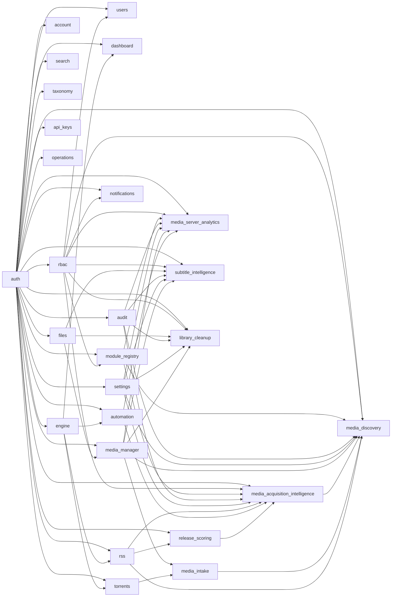

# Referencia de módulos

:::info Generado automáticamente
Esta página se genera desde `apps/backend/src/modules/module-registry/manifests.ts` durante el build. **No la edites a mano** — cambia la fuente y reconstruye. Esto garantiza que la referencia siempre coincida con el código que se publica.
:::

UltraTorrent está construido como un **registro de módulos**. Cada módulo declara un manifiesto — su id,
si es obligatorio, sus dependencias, los permisos que introduce y las rutas de API que le pertenecen. El
registro resuelve el grafo de dependencias al arrancar y se niega a iniciar ante una
dependencia desconocida o circular, así que un módulo roto nunca puede quedar a medio cargar.

- **27 módulos** — 23 obligatorios, 4 opcionales.
- Los módulos **obligatorios** siempre están activos y no se pueden desactivar. Los módulos
  **opcionales** se pueden activar o desactivar, y algunos vienen desactivados de fábrica.

## Grafo de dependencias

## Todos los módulos

| Módulo | Id | Tier | Activo por defecto | Depende de |
| --- | --- | --- | :---: | --- |
| **Authentication** | `auth` | ✅ | ✅ | — |
| **Access control (RBAC)** | `rbac` | ✅ | ✅ | `auth` |
| **Account & security** | `account` | ✅ | ✅ | `auth` |
| **Users** | `users` | ✅ | ✅ | `auth`, `rbac` |
| **Torrent engine** | `engine` | ✅ | ✅ | `auth` |
| **Dashboard** | `dashboard` | ✅ | ✅ | `auth`, `engine` |
| **Torrents** | `torrents` | ✅ | ✅ | `auth`, `engine` |
| **Search** | `search` | ✅ | ✅ | `auth` |
| **Categories & tags** | `taxonomy` | ✅ | ✅ | `auth` |
| **RSS automation** | `rss` | ✅ | ✅ | `auth`, `engine` |
| **Automation** | `automation` | ✅ | ✅ | `auth`, `engine` |
| **File manager** | `files` | ✅ | ✅ | `auth` |
| **API keys** | `api_keys` | ✅ | ✅ | `auth` |
| **Notifications** | `notifications` | ✅ | ✅ | `auth`, `rbac` |
| **Audit log** | `audit` | ✅ | ✅ | `auth` |
| **System health** | `system` | ✅ | ✅ | — |
| **Settings** | `settings` | ✅ | ✅ | `auth` |
| **Operations (Console API)** | `operations` | ✅ | ✅ | `auth` |
| **Module registry** | `module_registry` | ✅ | ✅ | `auth`, `rbac` |
| **Media Manager** | `media_manager` | — | ✅ | `auth`, `files` |
| **Release Scoring** | `release_scoring` | — | ✅ | `auth`, `rss` |
| **Media Acquisition Intelligence** | `media_acquisition_intelligence` | — | ✅ | `auth`, `rbac`, `module_registry`, `audit`, `settings`, `rss`, `automation`, `release_scoring` |
| **Media Discovery** | `media_discovery` | — | — | `auth`, `rbac`, `module_registry`, `audit`, `settings`, `media_manager`, `media_acquisition_intelligence`, `media_intake`, `rss` |
| **Media Server Analytics** | `media_server_analytics` | ✅ | ✅ | `auth`, `rbac`, `module_registry`, `audit`, `settings`, `media_manager`, `automation` |
| **Subtitle Intelligence** | `subtitle_intelligence` | ✅ | ✅ | `auth`, `rbac`, `files`, `audit`, `settings`, `media_manager` |
| **Library Cleanup Center** | `library_cleanup` | ✅ | ✅ | `auth`, `rbac`, `files`, `audit`, `settings`, `media_manager` |
| **Media Intake Engine** | `media_intake` | ✅ | ✅ | `media_manager`, `torrents` |

## Autenticación

`auth` · required · activo por defecto

Inicio de sesión, sesiones, rotación del refresh token.

**Rutas propias:** `/api/auth`

## Control de acceso (RBAC)

`rbac` · required · activo por defecto

Roles, permisos y guards de ruta.

**Depende de:** `auth`

**Introduce permisos:** `roles.manage`

## Cuenta y seguridad

`account` · required · activo por defecto

Perfil de autoservicio, contraseña y 2FA.

**Depende de:** `auth`

**Rutas propias:** `/api/account`

## Usuarios

`users` · required · activo por defecto

Gestión de usuarios y asignación de roles.

**Depende de:** `auth`, `rbac`

**Introduce permisos:** `users.view`, `users.manage`

**Rutas propias:** `/api/users`

## Motor de torrents

`engine` · required · activo por defecto

Abstracción del proveedor de motor (rTorrent) + registro.

**Depende de:** `auth`

**Introduce permisos:** `system.view`, `engines.manage`

**Rutas propias:** `/api/engines`

## Panel

`dashboard` · required · activo por defecto

Estadísticas agregadas y actividad reciente.

**Depende de:** `auth`, `engine`

**Introduce permisos:** `torrents.view`

**Rutas propias:** `/api/dashboard`

## Torrents

`torrents` · required · activo por defecto

Lista de torrents, detalle, ciclo de vida, acciones masivas.

**Depende de:** `auth`, `engine`

**Introduce permisos:** `torrents.view`, `torrents.add`, `torrents.delete`

**Rutas propias:** `/api/torrents`

## Búsqueda

`search` · required · activo por defecto

Busca en las instantáneas de torrents guardadas.

**Depende de:** `auth`

**Introduce permisos:** `torrents.view`

**Rutas propias:** `/api/search`

## Categorías y etiquetas

`taxonomy` · required · activo por defecto

Organiza los torrents con categorías y etiquetas.

**Depende de:** `auth`

**Introduce permisos:** `categories.manage`, `tags.manage`

**Rutas propias:** `/api/categories`, `/api/tags`

## Automatización RSS

`rss` · required · activo por defecto

Feeds, candidatos de coincidencia rankeados, y el Constructor de Coincidencias Inteligentes.

**Depende de:** `auth`, `engine`

**Introduce permisos:** `rss.view`, `rss.manage`, `rss.show_status.lookup`, `rss.show_status.refresh`, `rss.show_status.override`

**Rutas propias:** `/api/rss`

## Automatización

`automation` · required · activo por defecto

Motor de reglas de disparador/condición/acción.

**Depende de:** `auth`, `engine`

**Introduce permisos:** `automation.view`, `automation.manage`

**Rutas propias:** `/api/automation`

## Gestor de archivos

`files` · required · activo por defecto

Navegación segura por rutas y operaciones de archivos.

**Depende de:** `auth`

**Introduce permisos:** `files.view`, `files.manage`

**Rutas propias:** `/api/files`

## Claves API

`api_keys` · required · activo por defecto

Emisión/listado/revocación de claves API personales.

**Depende de:** `auth`

**Introduce permisos:** `apikeys.manage`

**Rutas propias:** `/api/api-keys`

## Notificaciones

`notifications` · required · activo por defecto

Notificaciones personales. Cada usuario elige qué eventos quiere y dónde le llegan — en la app, por email, Telegram o Discord. Los destinatarios están fijados en el código por evento; no hay constructor de reglas, diseñador de audiencias ni editor de plantillas.

**Depende de:** `auth`, `rbac`

**Introduce permisos:** `notifications.view_own`, `notifications.manage_own`, `notifications.channels_manage_own`

**Rutas propias:** `/api/account/notifications`

## Registro de auditoría

`audit` · required · activo por defecto

Rastro de auditoría de solo-anexado de las acciones sensibles.

**Depende de:** `auth`

**Introduce permisos:** `audit.view`

**Rutas propias:** `/api/audit`

## Salud del sistema

`system` · required · activo por defecto

Sondas de liveness/readiness e informes de salud.

**Introduce permisos:** `system.view`

**Rutas propias:** `/api/system`

## Configuración

`settings` · required · activo por defecto

Configuración de la aplicación en pares clave/valor.

**Depende de:** `auth`

**Introduce permisos:** `settings.view`, `settings.manage`

**Rutas propias:** `/api/settings`

## Operations (Console API)

`operations` · required · activo por defecto

Instantánea agregada de solo lectura y flujo de eventos para UltraTorrent Console.

**Depende de:** `auth`

**Introduce permisos:** `console.view`

**Rutas propias:** `/api/operations`

## Registro de módulos

`module_registry` · required · activo por defecto

Activa/desactiva módulos opcionales.

**Depende de:** `auth`, `rbac`

**Introduce permisos:** `modules.view`, `modules.manage`

**Rutas propias:** `/api/modules`

## Gestor de Medios

`media_manager` · optional · activo por defecto

Escanea, identifica, enriquece y organiza tus bibliotecas de medios: escaneo de bibliotecas, identificación por nombre de archivo, metadatos/carátulas/subtítulos, detección de duplicados, generación de NFO, renombrado/movimiento para servidores de medios, y un panel de salud.

**Depende de:** `auth`, `files`

**Introduce permisos:** `media_manager.view`, `media_manager.manage_libraries`, `media_manager.scan`, `media_manager.match`, `media_manager.edit_metadata`, `media_manager.manage_artwork`, `media_manager.manage_subtitles`, `media_manager.rename`, `media_manager.move_files`, `media_manager.generate_nfo`, `media_manager.manage_integrations`, `media_manager.delete`, `media_manager.admin`, `media_manager.imdb.view`, `media_manager.imdb.configure`, `media_manager.imdb.import_dataset`, `media_manager.imdb.search`, `media_manager.imdb.match`

**Rutas propias:** `/api/media`

## Puntuación de Releases

`release_scoring` · optional · activo por defecto

Puntuación explicable de 0 a 100 de los releases de RSS, con razones, advertencias y una recomendación.

**Depende de:** `auth`, `rss`

**Introduce permisos:** `release_scoring.view`, `release_scoring.manage`

**Rutas propias:** `/api/release-scoring`

## Inteligencia de Adquisición de Medios

`media_acquisition_intelligence` · optional · activo por defecto

Decide qué medios adquirir a partir de huecos en la biblioteca, calidad del release, riesgo de duplicados, listas de seguimiento, perfiles de adquisición y contexto de automatización — decisiones explicables, nunca operaciones directas sobre archivos.

**Depende de:** `auth`, `rbac`, `module_registry`, `audit`, `settings`, `rss`, `automation`, `release_scoring`

**Introduce permisos:** `media_acquisition.view`, `media_acquisition.manage_watchlist`, `media_acquisition.manage_profiles`, `media_acquisition.evaluate`, `media_acquisition.approve`, `media_acquisition.reject`, `media_acquisition.override`, `media_acquisition.history`, `media_acquisition.export`, `media_acquisition.settings`

**Rutas propias:** `/api/media-acquisition`

## Media Discovery

`media_discovery` · optional · off by default

Descubre películas próximas y series nuevas o que regresan a partir de proveedores de metadatos, y decide qué debe vigilarse — creando entradas de lista de seguimiento y reglas RSS generadas sobre las que actúa el motor de adquisición existente. Nunca descarga nada por su cuenta.

**Depende de:** `auth`, `rbac`, `module_registry`, `audit`, `settings`, `media_manager`, `media_acquisition_intelligence`, `media_intake`, `rss`

**Introduce permisos:** `media_discovery.view`, `media_discovery.manage`, `media_discovery.templates.manage`, `media_discovery.providers.manage`

**Rutas propias:** `/media-acquisition/discover`

## Analíticas del Servidor de Medios

`media_server_analytics` · required · activo por defecto

Monitoreo y analíticas del servidor de medios, añadidos recientemente, historial de reproducción, actividad en vivo, estadísticas de usuarios/bibliotecas, boletines programados, e importación de analíticas de Tautulli — en Plex, Jellyfin, Emby y Kodi.

**Depende de:** `auth`, `rbac`, `module_registry`, `audit`, `settings`, `media_manager`, `automation`

**Introduce permisos:** `media_server_analytics.view`, `media_server_analytics.manage_connections`, `media_server_analytics.manage_mappings`, `media_server_analytics.view_live_activity`, `media_server_analytics.view_users`, `media_server_analytics.view_history`, `media_server_analytics.view_reports`, `media_server_analytics.export`, `media_server_analytics.manage_newsletters`, `media_server_analytics.send_newsletters`, `media_server_analytics.manage_imports`, `media_server_analytics.run_imports`, `media_server_analytics.manage_settings`, `media_server_analytics.admin`

**Rutas propias:** `/api/media-server-analytics`

## Subtitle Intelligence

`subtitle_intelligence` · required · activo por defecto

El motor de subtítulos definitivo: toma la huella de cada archivo de medios (hash de película + metadatos técnicos), busca en varios proveedores con una estrategia progresivamente más laxa (hash → release → id externo → título), puntúa y valida cada candidato, instala el mejor como sidecar correcto para servidores de medios (sin sobrescribir nunca un original), y puede sincronizarlo con el audio. Política de idioma por biblioteca, automatización y monitoreo en segundo plano.

**Depende de:** `auth`, `rbac`, `files`, `audit`, `settings`, `media_manager`

**Introduce permisos:** `subtitle_intelligence.view`, `subtitle_intelligence.search`, `subtitle_intelligence.download`, `subtitle_intelligence.synchronize`, `subtitle_intelligence.manage`, `subtitle_intelligence.providers`, `subtitle_intelligence.settings`, `subtitle_intelligence.admin`

**Rutas propias:** `/api/subtitle-intelligence`

## Library Cleanup Center

`library_cleanup` · required · activo por defecto

Recuperación de almacenamiento de la biblioteca guiada por políticas. Los usuarios construyen políticas de limpieza versionadas a partir de un catálogo de condiciones de metadatos, reproducción, técnicas, de almacenamiento y de seguridad; una ejecución convierte las coincidencias en CANDIDATOS, nunca en borrados. No se elimina nada salvo mediante un plan persistido y aprobado cuyas huellas por archivo sigan coincidiendo con la realidad, y los archivos protegidos, bloqueados, en reproducción activa, en tránsito, ambiguos o no medidos se rechazan en el servidor. La eliminación pasa por cuarentena o Papelera a través de los servicios de archivos con rutas seguras ya existentes; el borrado permanente es una operación manual con permiso aparte.

**Depende de:** `auth`, `rbac`, `files`, `audit`, `settings`, `media_manager`

**Introduce permisos:** `library_cleanup.view`, `library_cleanup.policy.create`, `library_cleanup.policy.edit`, `library_cleanup.policy.publish`, `library_cleanup.policy.enable`, `library_cleanup.policy.delete`, `library_cleanup.run`, `library_cleanup.simulate`, `library_cleanup.approve`, `library_cleanup.cancel`, `library_cleanup.protection.view`, `library_cleanup.protection.create`, `library_cleanup.protection.revoke`, `library_cleanup.protection.legal_hold`, `library_cleanup.trash`, `library_cleanup.restore`, `library_cleanup.permanent_delete`, `library_cleanup.settings`, `library_cleanup.audit`

**Rutas propias:** `/api/media/cleanup`

## Media Intake Engine

`media_intake` · required · activo por defecto

Tubería de importación basada en un área de preparación. Una descarga completada se verifica, identifica, enriquece y puntúa por calidad en un área de preparación, y luego se coloca en una biblioteca mediante la estrategia más barata que el almacenamiento admita realmente — hardlink, reflink, reubicación del proveedor o copia — para que el torrent siga sembrando. Los Perfiles de Almacenamiento guardan las raíces lógicas y referencian bibliotecas existentes en vez de repetir sus rutas; un Registro de Mapeo de Rutas traduce cada ruta al espacio del componente que está a punto de recibirla. Es opcional por regla RSS y nunca se aplica automáticamente a una existente: las reglas creadas antes de este módulo usan legacy_direct y se comportan exactamente igual que antes.

**Depende de:** `media_manager`, `torrents`

**Introduce permisos:** `media_intake.view`, `media_intake.manage`, `media_intake.operate`, `media_intake.migrate`

**Rutas propias:** `/api/media/intake`

## Ver también

- [Referencia de permisos](/reference/permissions)
- [Referencia de la API REST](/reference/api)
- [Escribir un módulo](/develop/creating-modules)
